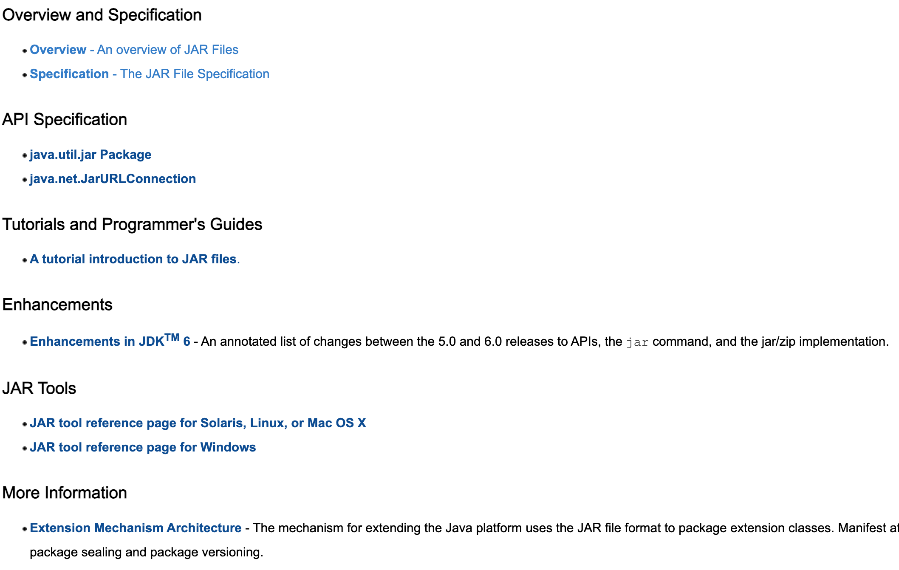
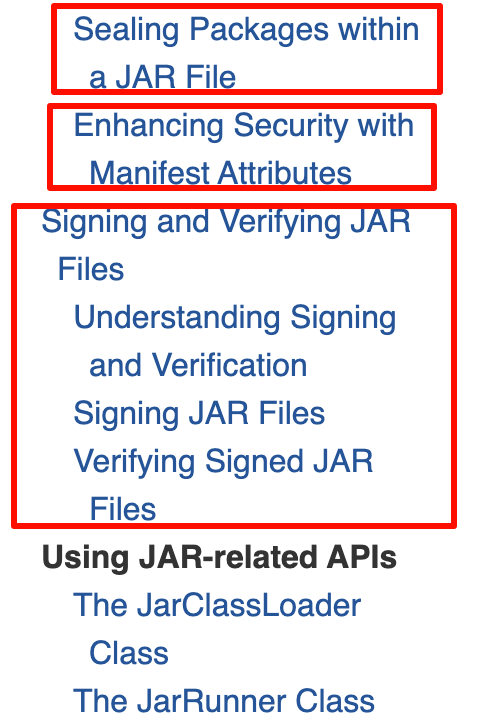

tags:: [[Java SE]]
alias:: [[Java Archive]]
---

- ## 学习路线
	- [[JAR Concept]]
	  logseq.order-list-type:: number
	- [[JAR Command]]
	  logseq.order-list-type:: number
	- [[JAR API]]
	  logseq.order-list-type:: number
- ## 学习进度
	- [Java SE 8 Documentation](https://docs.oracle.com/javase/8/docs/)
	  logseq.order-list-type:: number
		- -> {:height 108, :width 441}
			- -> {:height 360, :width 564}
		- 看完 Overview
		- [JAR File Specification](https://docs.oracle.com/javase/8/docs/technotes/guides/jar/jar.html) 看完了 `The META-INF directory` , 后面未看。
		- [A tutorial introduction to JAR files](http://docs.oracle.com/javase/tutorial/deployment/jar/)
			- 教程中除了图中框选的内容，其他的都看了。
			- {:height 395, :width 238}
		-
		-
-
-
- ## 参考