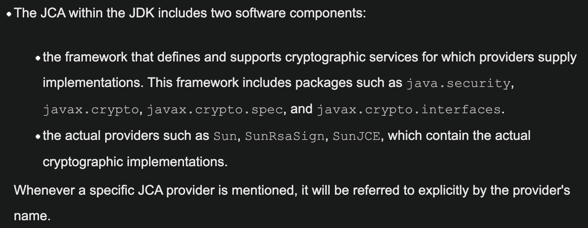
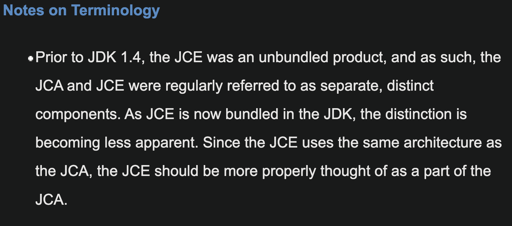

alias:: [[Java Cryptography Architecture]]
tags:: [[Java Security]], [[Cryptography]]
---

- ## 官方资料
	- [Java Cryptography Architecture (JCA) Reference Guide](https://docs.oracle.com/javase/8/docs/technotes/guides/security/crypto/CryptoSpec.html)
	-
- ## JCA两大组件
	- Framework
		- 定义 与 支持 **加密服务(cryptographic services)** (具体实现由 Providers 提供 )
		- 包含的包路径有: `java.security` , `javax.crypto` , `javax.crypto.spec` , and `javax.crypto.interfaces` 等。
	- Providers
		- 提供 **加密服务(cryptographic services)** 的具体实现。
		- 包含的包路径有 `Sun` , `SunRsaSign` , `SunJCE` 等。
	- {:height 242, :width 606}
- ## JCA与JCE
	- JCE是JCA的一部分
		- https://docs.oracle.com/javase/8/docs/technotes/guides/security/crypto/CryptoSpec.html#Architecture
		- {:height 154, :width 499}
	-
	-