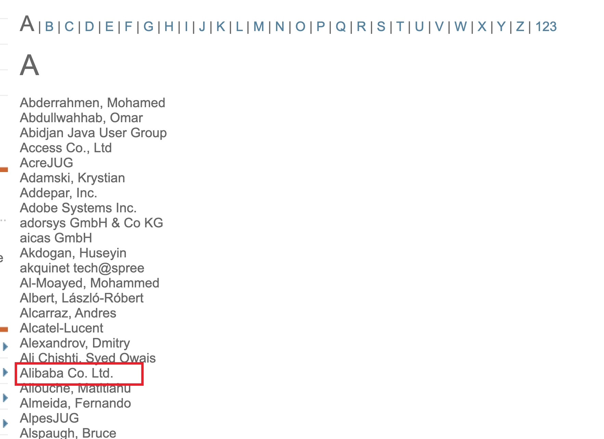

tags:: [[JCP]]
---

- ## 什么是 JCP
	- **JCP, 即 Java Community Process, 是国际 Java 社区的一个组织**, 它的目标是执行 JCP Program (JCP 计划)。
	- [JCP 成员](https://jcp.org/en/participation/members) , 可以看到 阿里巴巴 在列：
	- {:height 686, :width 931}
- ## 什么是 JCP Program
	- > The Java Community Process (JCP) Program is the process by which the international Java community standardizes and ratifies the specifications for Java technologies. 
	  -- 引自 [JCP Overview](https://jcp.org/en/procedures/overview)
	- > As an open, inclusive organization of active members and non-member public input, it primarily guides the development and approval of Java technical specifications. Anyone can register and join the JCP and have a part in its process, and you don't even have to join to contribute as a public participant.
	  -- 引自 [Introduction Overview](https://jcp.org/en/introduction/overview)
	- **JCP Program 是 JCP 组织发起的一个计划** , 旨在 **推进国际 Java 社区制定标准化的 Java 技术规范** 。
	- ==即便不是 JCP 的成员, 也可以参与到这个计划中。==
- ## 什么是 JSR
	- 参见: [[JSR Concept]]
- ## 什么是 JCP Procedure
	- **JCP Procedure 是制定 Java 技术规范的标准化流程** , 参见 [JCP 流程文档](https://jcp.org/en/procedures/jcp2_11) 。
	- JCP Procedure 本身也是由 [[JSR]] 来确定。
	-