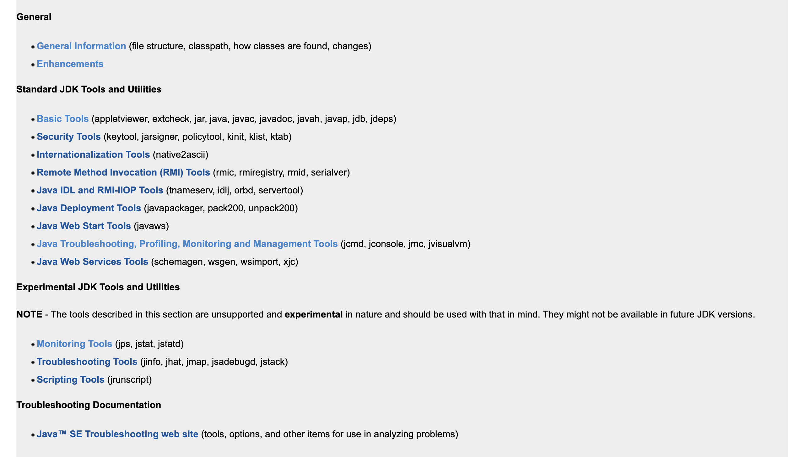
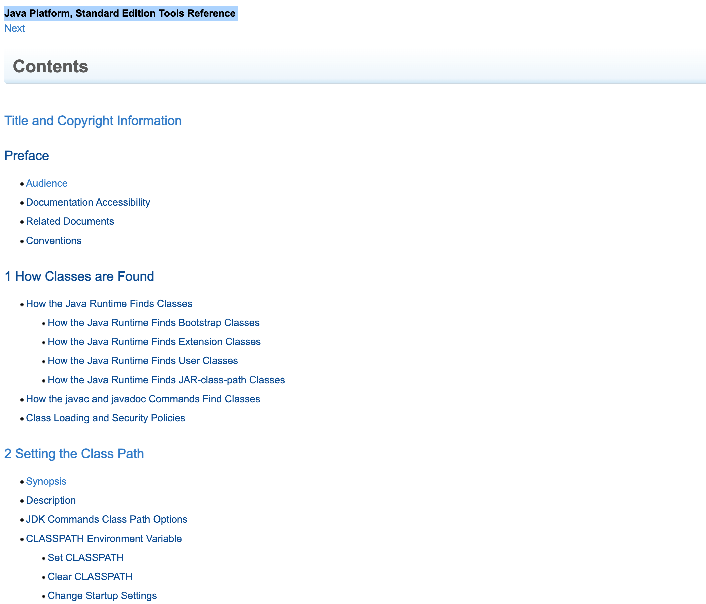

tags:: [[Java SE]]
---

- ## 学习路线
	- Concept
		- [[Java 如何查找 Class]]
	- Basic Tool
		- [[JAR]]
		- [[javac]]
		- [[java command]]
- ## 官方资料
	- [JDK Tools and Utilities](https://docs.oracle.com/javase/8/docs/technotes/tools/index.html#enhancements)
		- {:height 263, :width 705}
	- [Java Platform, Standard Edition Tools Reference](https://docs.oracle.com/javase/8/docs/technotes/tools/unix/toc.html)
		- {:height 404, :width 896}
		- ==看完了 1 How Classes are Found==
		-