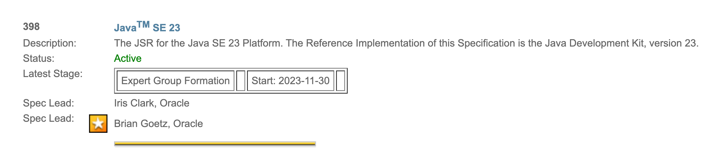
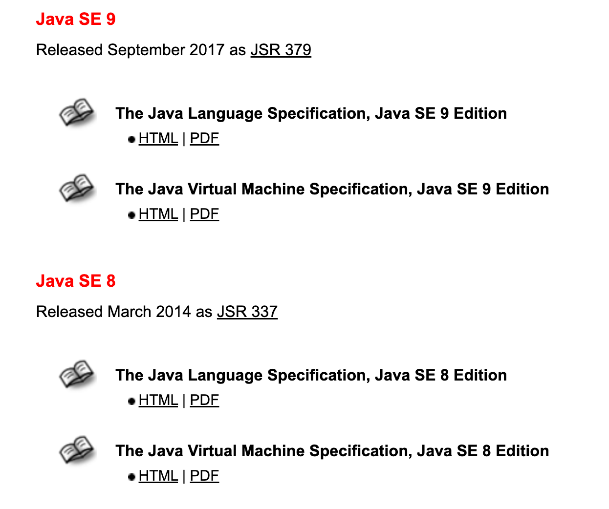

tags:: [[JSR]]
---

- ## 什么是 JSR
  id:: 66175a7e-d37c-47a9-832b-2169fb161298
	- 即 Java Specification Request , **Java 规范提案** 。
	- [List of All JSRs](https://jcp.org/en/jsr/all)
- ## JSR 长啥样
	- 一个 JSR 会列出如下内容：
	- 
	- 这里的 Spec Lead 表示标准的领导者。
	- 这里的 **星号标志** 表示他是一个 **Star Spec Lead** (做出过重大贡献) (参见 [Star Spec Lead Program](https://jcp.org/en/press/news/star) )。
- ## Java SE Specification 与 JSR
	- 参见 [Java SE Specifications](https://docs.oracle.com/javase/specs/index.html) 可以看到，所有的标准，都分别对应着一个 JSR。
	- {:height 620, :width 512}