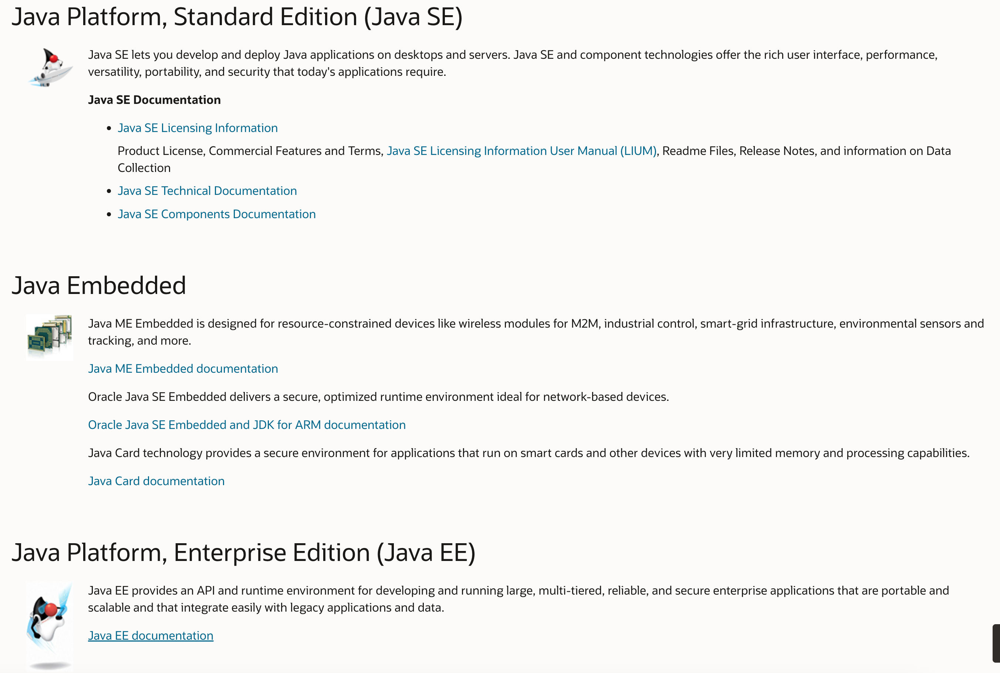

tags:: [[Java]]
---

- ## Java 技术版本
	- ### 三种 Edition
		- 
		- 图片来源: [Oracle - Java docs](https://docs.oracle.com/en/java/index.html)
		- Java 技术可分为三种版本：
			- Java Platform, Standard Edition ([[Java SE]])
			  logseq.order-list-type:: number
				- [Oracle - Java SE 主页](https://www.oracle.com/java/technologies/java-se-glance.html)
				- Java 标准版本。
				- 安装 JDK 即可使用。
			- Java Platform, Micro Edition ([[Java ME]])
			  logseq.order-list-type:: number
				- [Oracle - Java ME 主页](https://www.oracle.com/java/technologies/javameoverview.html)
				- Java 嵌入式版本 (传感器、电视机顶盒、手机等)。
				- 基于 JDK , 需要下载额外的包才能使用。
			- Java Platform, Enterprise Edition ([[Java EE]])
			  logseq.order-list-type:: number
				- [Oracle - Java EE 主页](https://www.oracle.com/java/technologies/java-ee-glance.html)
				- Java 企业版本 (Web 相关) 。
				- 基于 JDK , 需要下载额外的包才能使用。
	- ### Java Embedded
		- 如下几种技术又组成了 **Java Embedded** (Java 嵌入式) 技术:
			- Java ME Embedded
				- [Oracle - Java ME Embedded 主页](https://www.oracle.com/java/java-me-embedded/)
				- 包含在 Java ME 中，Java ME 基本可以等同于 Java ME Embedded 。
				- 基于 JDK , 需要下载额外的包才能使用。
			- Java SE Embedded
				- [Oracle - Java SE Embedded 主页](https://www.oracle.com/java/java-se-embedded/)
				- 基于 JDK , 需要下载额外的包才能使用。
			- Java Card
				- [Oracle - Java Card 主页](https://www.oracle.com/java/java-card/)
				- 基于 JDK , 需要下载额外的包才能使用。
	- ==**注意: Java  ME 与 Java Embedded 无需关注, 因为它们现在并不流行；只需要关注 Java SE 和 Java EE 即可。**==
- ## JCP 相关概念
	- 参见: [[JCP Concept]]
- ## JDK 相关概念
	- 参见: [[JDK Concept]]
- ## OpenJDK 相关概念
	- 参见: [[OpenJDK Concept]]
- Oracle , JCP 与 OpenJDK 的关系?
-
-