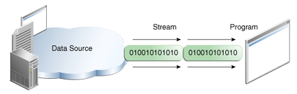

tags:: [[Java IO]]
---

- ## IO 体系
	- `io` : 在 [java.io](https://docs.oracle.com/javase/8/docs/api/java/io/package-summary.html) 包中,
	- `nio`: 在 [java.nio](https://docs.oracle.com/javase/8/docs/api/java/nio/package-summary.html) 包中.
	- 三大板块:
		- I/O Streams
		  logseq.order-list-type:: number
		- Serialization
		  logseq.order-list-type:: number
		- File I/O
		  logseq.order-list-type:: number
- ## 什么是 I/O Streams
	- ### 什么是 Stream
		- 一个 *I/O Stream* 代表了一个 **输入源** 或者 **输出目标** 。
		- 这些源或目标可能是 磁盘文件(disk files) , 设备(devices), 其他程序(other programs) 和 存储阵列(memory arrays) 。
		- 一个 stream 就是一串数据序列。(A stream is a sequence of data)
	- ### 什么是输入
		- 
		- **程序读入数据** 。
	- ### 什么是输出
		- {:height 263, :width 487}
		- **程序写出数据** 。
- ## I/O Streams 的分类
	- 处理 **字节** 输入输出的 [[Java Byte Streams]] (其他所有流都建立在字节流之上)
	  logseq.order-list-type:: number
	- 处理 **字符** 输入输出的 [[Java Character Streams]]
	  logseq.order-list-type:: number
	- logseq.order-list-type:: number
- ## 参考
	- [The Java™ Tutorials - I/O Streams](https://docs.oracle.com/javase/tutorial/essential/io/streams.html)
	  logseq.order-list-type:: number
	- logseq.order-list-type:: number
	-
-