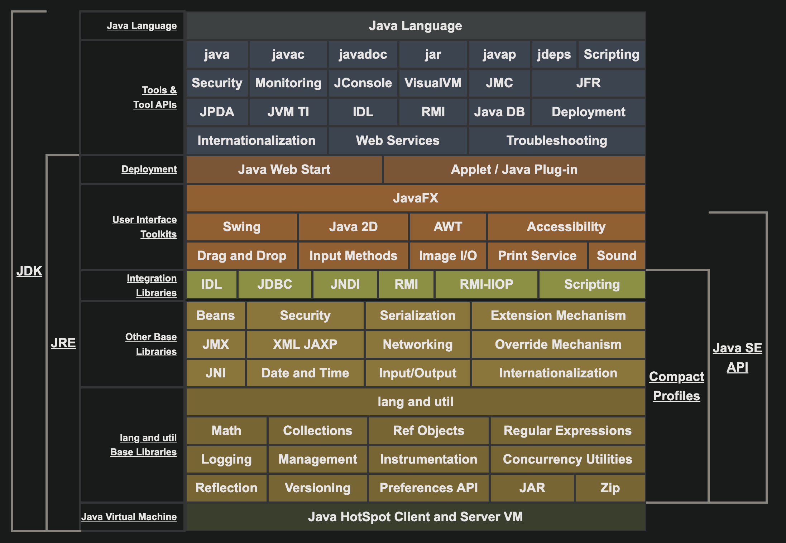

tags:: [[Java]]
---

- ## Java SE 8 体系结构图
	- {:height 465, :width 661}
	- [图片来源](https://docs.oracle.com/javase/8/docs/)
- ## JDK、JRE与JVM的关系
	- `JDK` (Java SE Development Kit)
	- `JRE` (Java SE Runtime Environment)
	- `JVM` (Java Virtual Machine)
	- `JDK` 是 `JRE` 的超集 (superset), `JRE` 包含 `JVM` 。
	- JDK = JRE + Tools (包含 compilers, debuggers 等工具)
	- JRE = JVM + Libraries + 其它组件
	- 注意: JRE 中包含 `Java SE specification` 中没有规定的组件。
	- 如果只需要运行编译好的 Java 程序，则只需要 `JRE` 。
- ## JDK 产品及其安装
	- [[JDK]]
-