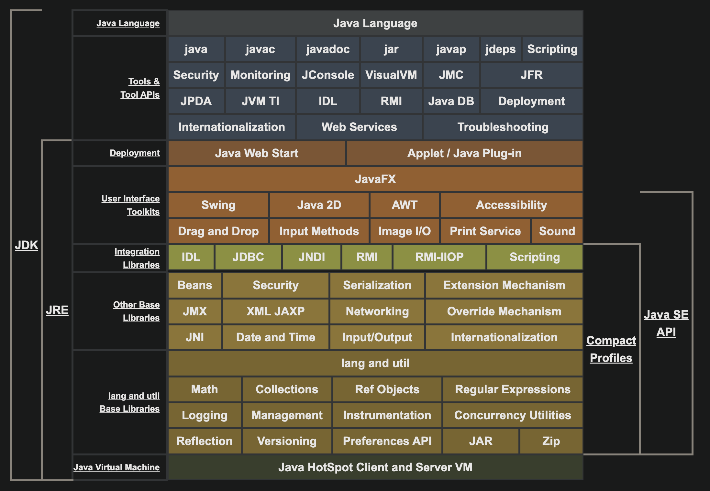

tags:: [[Java]]
---

- ## Java SE 8 体系结构图
	- {:height 465, :width 661}
	- [图片来源](https://docs.oracle.com/javase/8/docs/)
- ## JDK、JRE与JVM的关系
	- `JDK` (Java SE Development Kit)
		- JDK = JRE + Tools (包含 compilers, debuggers 等工具)
	- `JRE` (Java SE Runtime Environment)
		- JRE = JVM + Libraries (Java SE API) + 其它组件 ( [[Java SE specification]] 中未规定)
		- ==如果只是运行 **编译好** 的 Java 程序，则只需要 `JRE` 。==
	- `JVM` (Java Virtual Machine)
- ## JDK 产品及其安装
	- [[JDK]]
-