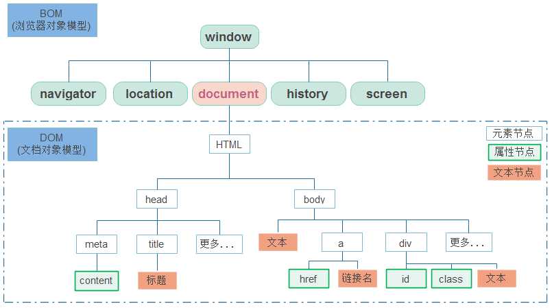

tags:: [[JavaScript]]
---

- ## 什么是 JavaScript
	- 参见: [What is JavaScript](https://developer.mozilla.org/en-US/docs/Web/JavaScript/Guide/Introduction#what_is_javascript)
	- JavaScript 是一种 跨平台的面向对象脚本语言 (cross-platform, object-oriented scripting language) .
- ## JavaScript 的组成及其规范
	- 参见: [What is JavaScript](https://developer.mozilla.org/en-US/docs/Web/JavaScript/Guide/Introduction#what_is_javascript)
	- 我们常说的 JavaScript 可能是如下几种：
		- `Core JavaScript`
		  logseq.order-list-type:: number
		- `Client-side JavaScript`
		  logseq.order-list-type:: number
		- `Server-side JavaScript`
		  logseq.order-list-type:: number
	- ### Core JavaScript
		- 即 JavaScript 语言核心。
		- 包含一组标准对象 (如 `Array` ， `Map` ，和 `Math` ) , 以及一组核心语言元素 (如 运算符、控制结构和语句) 。
		- `Core JavaScript` 的规范由 `ECMAScript` 定义  (具体参见 [[ECMAScript Concept]] ) .
	- ### Client-side JavaScript
		- 运行在 浏览器 环境中。
		- 相当于 `Core JavaScript` + `通用 Web APIs` + `浏览器特定 API`
		- #### 通用 Web APIs
			- `Document Object Model (DOM)`  APIs : 操作页面元素。
			  logseq.order-list-type:: number
				- [[DOM Spec]]
			- `Browser Object Model (BOM)` APIs : 操作浏览器。
			  logseq.order-list-type:: number
				- `window`、`location`、`history`、`navigator` 等对象，
				  logseq.order-list-type:: number
					- 规范定义在 [HTML Living Standard ](https://html.spec.whatwg.org/)
				- `screen` 对象及其他与视口和滚动相关的 API。
				  logseq.order-list-type:: number
					- 规范定义在 [w3 - CSSOM View Module Spec](https://www.w3.org/TR/cssom-view-1/#the-screen-interface)
				- 其他 BOM APIs。
				  logseq.order-list-type:: number
					- 有些有规范。
					- 有些暂未形成规范。
				- ==BOM 的规范比较分散==
			- 其他 Web APIs。
			  logseq.order-list-type:: number
				- 有些有规范。如 [[XMLHttpRequest]]
				- 有些暂未形成规范。
			- ==如需要使用和学习指定 Web APIs，可以查阅 [MDN - Web APIs](https://developer.mozilla.org/en-US/docs/Web/API)==
		- #### 浏览器特定 API
			- 特定浏览器才有的 API，如 Chromium 的 `chrome.*` 扩展 API。
	- ### Server-side JavaScript
		- 运行在 Node.js/Deno/Bun 等服务端环境中
		- 相当于 `Core JavaScript` + `服务端环境 API`
		- 服务端 API ，包括 文件、网络、系统 等模块。
	- ### JavaScript 与 ECMAScript
		- 准确来说, `ECMAScript` 只是 `Core JavaScript` 的规范。
	- ### JavaScript 没有标准实现
		- `JavaScript` (包括 `Core JavaScript` 及其所在环境的扩展) 并没有一个标准实现。
		- 每款浏览器/服务端环境，都有其自己的 `JavaScript` 引擎，用于解释并运行 `JavaScript` 代码 (包括 `Core JavaScript` 及其所在环境的扩展) 。
	- ### BOM 与 DOM 的关系
		- `window` 是 BOM 的顶层对象，它有一些属性，这些属性包含 BOM 相关 API。
			- {:height 335, :width 568}
			- 图片来源: [BOM 和 DOM](https://heptaluan.github.io/2017/11/17/JavaScript/16/)
		- 其中 `document` 属性，就包含 DOM 相关 API 。
		- 到目前为止，BOM 并没有一个统一规范，图中对 BOM 的描述，来自史前 `Netscape` 浏览器标准。
- ## Interpreted VS compiled
	- JavaScript 采用 **just-in-time compiling (即时编译)** 技术，在代码被使用时，会被编译成 binary 格式执行，以提高性能。
	- 但是，由于编译是在 **run time** 发生的 (而不是事先执行) ，所以 JavaScript 仍然被认为是 `Interpreted Language` 。
- ---
- ## 参考
	- [MDN - What is JavaScript?](https://developer.mozilla.org/en-US/docs/Learn/JavaScript/First_steps/What_is_JavaScript)
	  logseq.order-list-type:: number
	- [MDN - JavaScript Introduction](https://developer.mozilla.org/en-US/docs/Web/JavaScript/Guide/Introduction)
	  logseq.order-list-type:: number
	- AI
	  logseq.order-list-type:: number