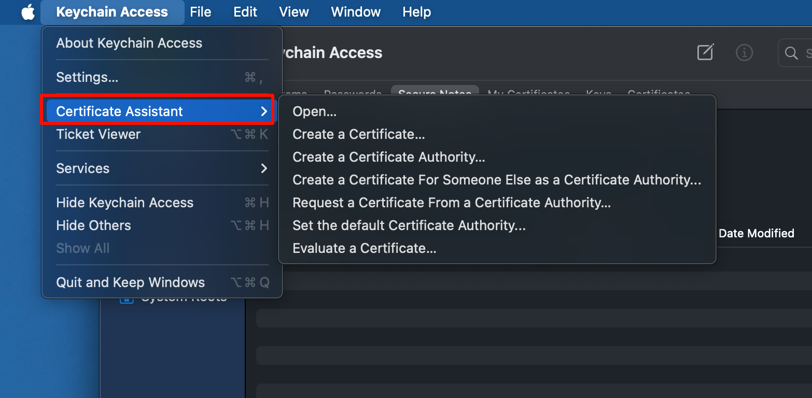
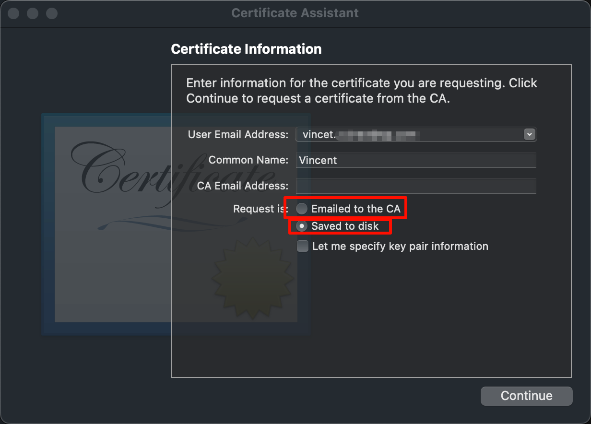
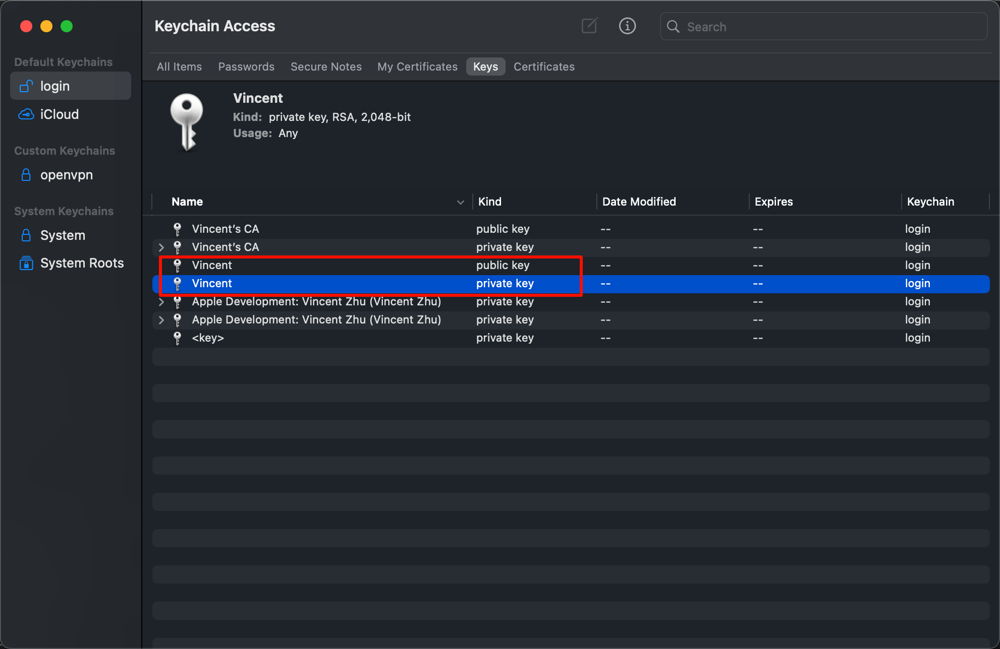
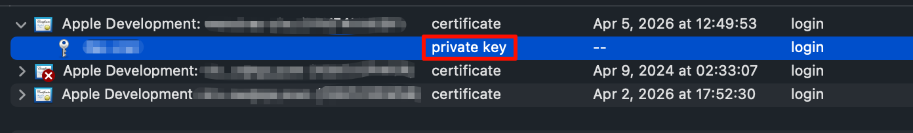
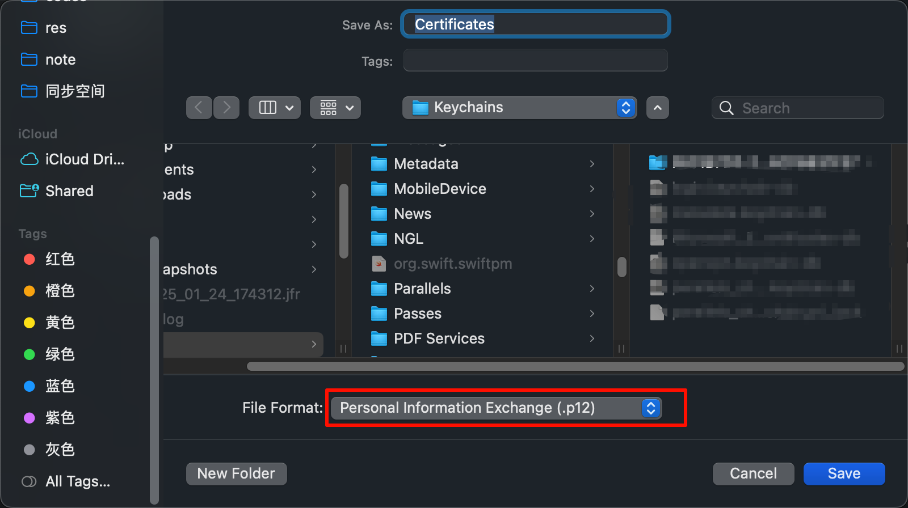
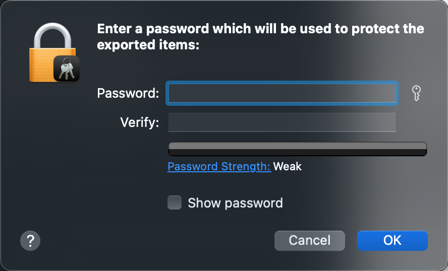
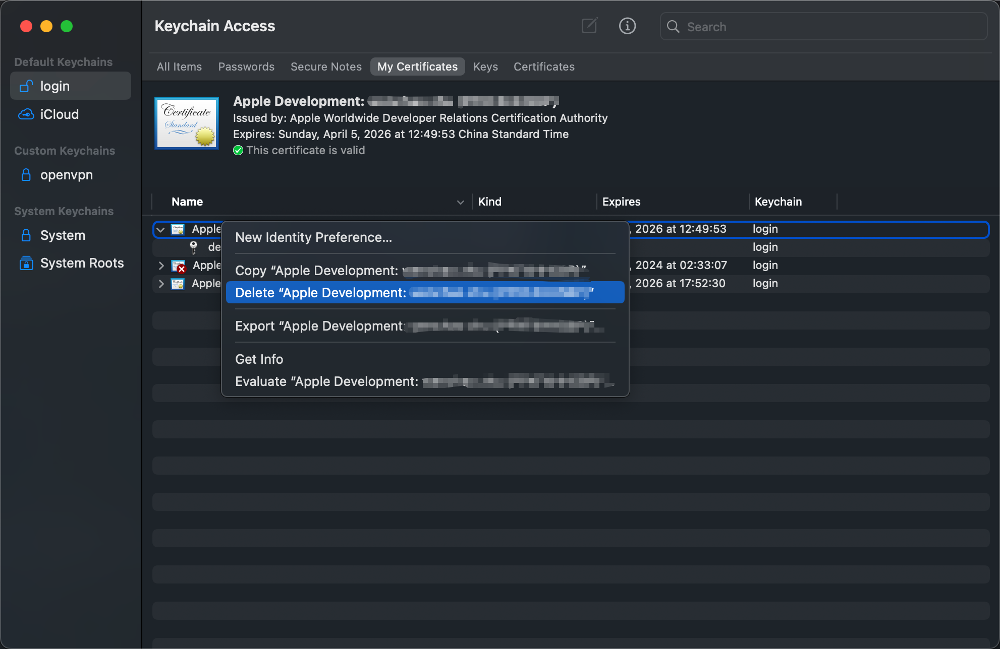
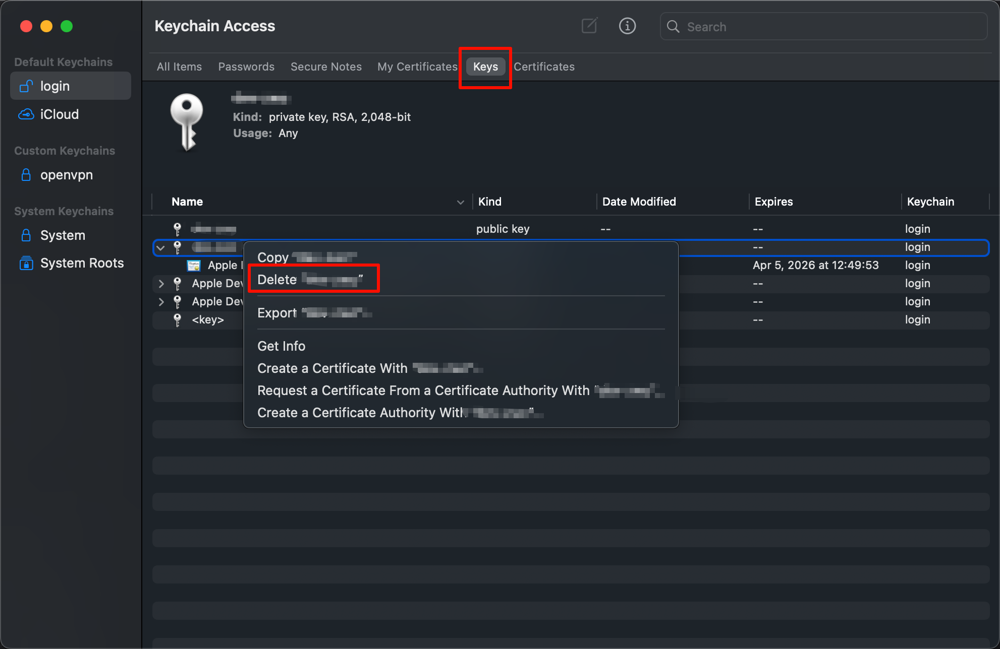

tags:: [[Keychain Access]]
---

- ## Certificate Assistant (证书助手)
	- 我们可以点击 Keychain Access 顶部菜单栏 > Keychain Access > Certificate Assistant , 访问证书助手.
	- 证书助手可以用于创建 Certificate 和 Certificate Authority.
	- {:height 419, :width 713}
- ## Request a Certificate From a Certificate Authority (向证书发布机构申请证书)
	- ### 创建 CSR 文件
		- 参考:
			- [Request a certificate from a certificate authority in Keychain Access on Mac](https://support.apple.com/guide/keychain-access/request-a-certificate-authority-kyca2793/mac)
			  logseq.order-list-type:: number
			- [Apple Developer - Create a certificate signing request](https://developer.apple.com/help/account/certificates/create-a-certificate-signing-request)
			  logseq.order-list-type:: number
		- ==其本质上, 就是生成一个用于申请证书的文件, 文件后缀为 `.certSigningRequest`  (CSR 文件) .==
		- 点击 Certificate Assistant > Request a Certificate From a Certificate Authority
		  logseq.order-list-type:: number
		- 填写自己的邮件和证书名称 (如 Vincent Dev Key) .
		  logseq.order-list-type:: number
		- 选择申请文件的处理方式.
		  logseq.order-list-type:: number
			- 将申请文件发送给 CA (CA 如果同意, 则会回复邮件, 附上证书) .
			  logseq.order-list-type:: number
			- 将申请文件保存到磁盘上 (后续在需要此文件的地方上传) .
			  logseq.order-list-type:: number
			- {:height 377, :width 514}
			- 注: 勾选 `Let me specify key pair information` 可以定义密钥对的一些参数.
	- ### 创建 CSR 文件时发生了什么
		- 参考: `DeepSeek`
		- 生成一个密钥对 (RSA 或 ECC) , 公钥和私钥都被保存在 Keychain 中.
		  logseq.order-list-type:: number
			- 点击 login  > Keys 可以看到
			- {:height 650, :width 688}
		- 生成 `.certSigningRequest` 文件 (CSR 文件) .
		  logseq.order-list-type:: number
			- CSR 文件遵循 `PKCS#10` 规范.
			- 文件格式如下:
				- ``` zsh
				  -----BEGIN CERTIFICATE REQUEST-----
				  MIICijCCAXIwDQYJKoZIhvcNh+oEq9yZ5ONdGHkH5TYexq0Nx4wp+2Ixn3GIFQeR
				  MIICijCCAXIwDQYJKoZIhvcNh+oEq9yZ5ONdGHkH5TYexq0Nx4wp+2Ixn3GIFQeR
				  MIICijCCAXIwDQYJKoZIhvcNh+oEq9yZ5ONdGHkH5TYexq0Nx4wp+2Ixn3GIFQeR
				  MIICijCCAXIwDQYJKoZIhvcNh+oEq9yZ5ONdGHkH5TYexq0Nx4wp+2Ixn3GIFQeR
				  MIICijCCAXIwDQYJKoZIhvcNh+oEq9yZ5ONdGHkH5TYexq0Nx4wp+2Ixn3GIFQeR
				  MIICijCCAXIwDQYJKoZIhvcNh+oEq9yZ5ONdGHkH5TYexq0Nx4wp+2Ixn3GIFQeR
				  MIICijCCAXIwDQYJKoZIhvcNh+oEq9yZ5ONdGHkH5TYexq0Nx4wp+2Ixn3GIFQeR
				  MIICijCCAXIwDQYJKoZIhvcNh+oEq9yZ5ONdGHkH5TYexq0Nx4wp+2Ixn3GIFQeR
				  MIICijCCAXIwDQYJKoZIhvcNh+oEq9yZ5ONdGHkH5TYexq0Nx4wp+2Ixn3GIFQeR
				  MIICijCCAXIwDQYJKoZIhvcNh+oEq9yZ5ONdGHkH5TYexq0Nx4wp+2Ixn3GIFQeR
				  MIICijCCAXIwDQYJKoZIhvcNh+oEq9yZ5ONdGHkH5TYexq0Nx4wp+2Ixn3GIFQeR
				  MIICijCCAXIwDQYJKoZIhvcNh+oEq9yZ5ONdGHkH5TYexq0Nx4wp+2Ixn3GIFQeR
				  MIICijCCAXIwDQYJKoZIhvcNh
				  -----END CERTIFICATE REQUEST-----
				  ```
			- 文件中包含 公钥 信息.
			- 执行 `openssl req -in CSR文件 -text -noout` 命令可以查看 CSR 文件信息.
	- ### 安装 CA 签发的证书
		- 一般为 `.cer` 文件的证书.
		- 双击证书文件, Keychain Access 会被打开, 并自动安装证书.
			- 这个证书会与我们之前创建 CSR 文件时生成的私钥关联上.
			- {:height 117, :width 687}
- ## 导出证书为 .p12 文件
	- 参考: `DeepSeek`
	- 右击证书, 点击 `Export ...` 选项.
	  logseq.order-list-type:: number
	- 选择 `.p12` 文件格式.
	  logseq.order-list-type:: number
		- {:height 354, :width 617}
	- 输入 `.p12` 文件的密码.
	  logseq.order-list-type:: number
		- {:height 381, :width 492}
	- `.p12` 文件主要包含如下信息:
		- ​证书 (即 我们向 CA 申请到的证书, 包含我们的公钥信息)
		  logseq.order-list-type:: number
		- 证书中公钥对应的私钥.
		  logseq.order-list-type:: number
		- ​​​证书链​​ (可选)
		  logseq.order-list-type:: number
- ## 重新安装证书
	- ### 只是删除证书
		- 如果我们只是删除了证书, 那么通过 `.cer` 证书文件, 我们还可以重新安装回来.
		- {:height 623, :width 675}
	- ### 删除了公私密钥对
		- 如果我们删除了公私密钥对:
			- {:height 668, :width 734}
		- 如果有 `.p12` 文件, 则可以双击 `.p12` 文件重新安装回来 ( ==但是貌似 公钥 安装不回来?== ).
		- 如果没有, 则无力回天, 因为我们的私钥信息丢失了, 需要重新创建证书.
- ## Create a Certificate (创建自己签名的证书)
	- 点击 Certificate Assistant > Create a Certificate
-