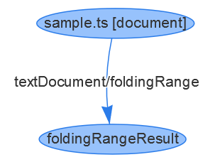

tags:: [[LSIF]]
---

- ## 什么是 LSIF
	- 即 **Language Server Index Format** , 语言服务器索引格式 (LSIF 发音类似 “else if” ) .
	- LSIF 定义了 **标准格式** , 供 **Language Server** 或 **开发工具 (客户端)** 读取代码空间的信息.
- ## LSP 与 LSIF
	- [[LSP]] Language Server 在提供 **智能代码功能 (intelligent code features)** 时, 需要所有源代码都在本地磁盘, 可能还需要将部分或全部文件读入内存.
	- 而 [[LSIF]] 无需运行 **Language Server** , 即可使用 事先生成的 符合 LSIF 格式的 文件内容 来响应 LSP 请求.
		- 所以, 可以实现: 在 Web 端阅读代码时, 使用这些 **智能代码功能 (intelligent code features)** .
	- LSIF 采用与 LSP 相同的数据类型.
- ## LSIF 格式
	- LSIF 使用 **图结构 (graph)** 来存储代码相关信息.
		- 使用 **边 (Edge)** 表示 `LSP 请求` .
		- 使用 **顶点 (Vertex)** 表示 `Documents` , `Ranges` , `Request results (比如 hover)` 信息.
	- 使用 **图结构 (graph)** 的好处:
		- 一个 `Documents` 或 `Ranges` , 可以关联多个 `Request results` .
		  logseq.order-list-type:: number
		- 通过新增 **边** 的类型, 可以增加 `LSP 请求` 类型; 通过增加 **顶点** 的类型, 可以新增  `Request results` 类型.
		  logseq.order-list-type:: number
		- 数据一旦生成即可理解输出, 这就能支持流式处理了.
		  logseq.order-list-type:: number
	- 示例:
		- 如下代码:
			- ``` js
			  function bar(): void {
			    console.log('Hello World!');
			  }
			  ```
		- 输出:
			- ``` json
			  // a vertex representing the document
			  { id: 1, type: "vertex", label: "document", uri: "file:///Users/username/sample.ts", languageId: "typescript" }
			  // a vertex representing the folding result
			  { id: 2, type: "vertex", label: "foldingRangeResult", result: [ { startLine: 0, startCharacter: 20, endLine: 2, endCharacter: 1 } ] }
			  // an edge connecting the folding result to the document.
			  { id: 3, type: "edge", label: "textDocument/foldingRange", outV: 1, inV: 2 }
			  ```
			- {:height 209, :width 265}
- ## 参考
	- [LSIF Overview](https://microsoft.github.io/language-server-protocol/overviews/lsif/overview/)
	  logseq.order-list-type:: number