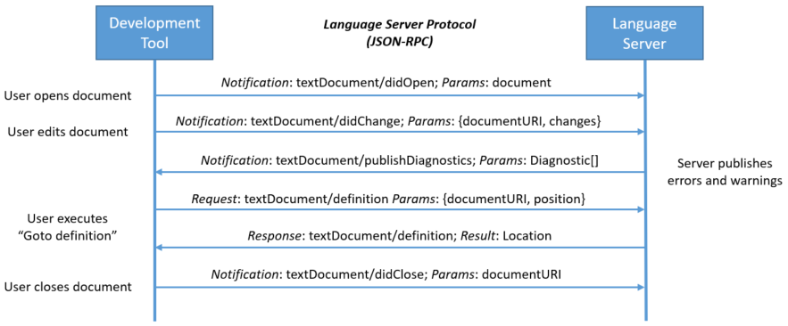
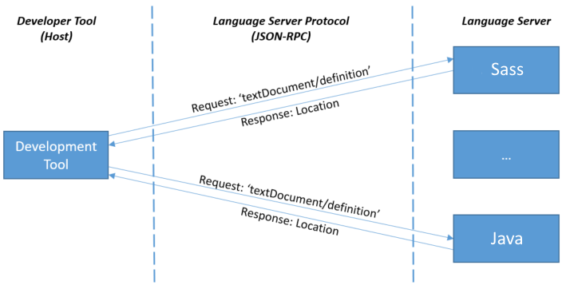

tags:: [[LSP]]
---

- ## LSP 交互示例
	- 在 **常规编辑会话 (routine editing session)** 中, **开发工具 (客户端)** 与 **Language Server** 的交互流程如下:
		- 
		- [图源](https://microsoft.github.io/language-server-protocol/overviews/lsp/overview/)
	- **Language Server** 以独立进程运行.
	  logseq.order-list-type:: number
		- **开发工具 (客户端)** 会为每个语言都启动一个 **Language Server** 进程.
		- {:height 284, :width 521}
		- [图源](https://microsoft.github.io/language-server-protocol/overviews/lsp/overview/)
	- **开发工具 (客户端)** 通过基于 JSON-RPC 的 LSP 与 **Language Server** 进行通信.
	  logseq.order-list-type:: number
- ## Capabilities
	- **开发工具 (客户端)**  和 **Language Server** 都可以通过 **Capabilities** 来声明自己支持的 LSP 功能.
	  id:: 68fb9872-d500-49c9-b6b0-b89538491265
- ## 参考
	- [LSP Overview](https://microsoft.github.io/language-server-protocol/overviews/lsp/overview/)
	  logseq.order-list-type:: number
	-