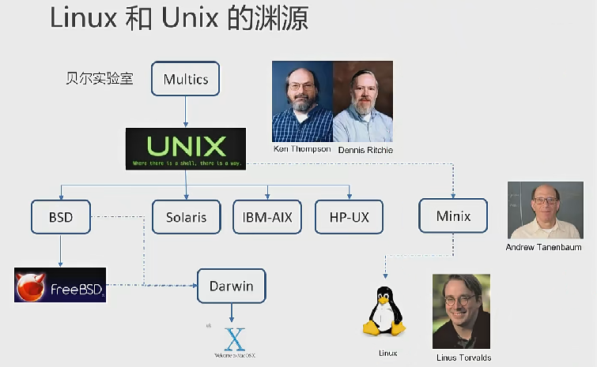
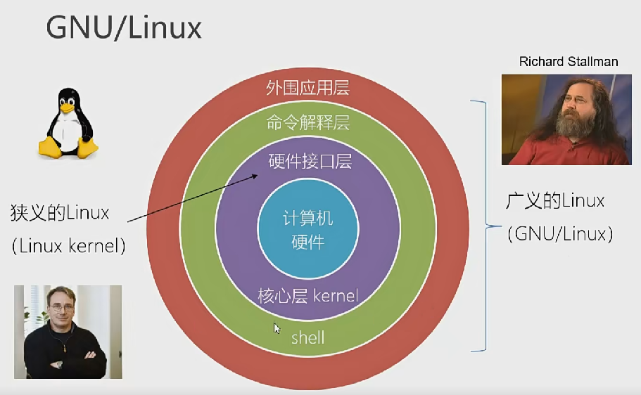

alias:: [[Linux 历史]]
tags:: [[Linux]], [[History]]
---

- ## Linux与Unix
	- {:height 449, :width 716}
	- Unix 由开源转向闭源，芬兰教授 Andrew Tanenbaum 仿照 Unix 开发了 Minix 用于教学，并开源。
	- Linus 基于 Minix 开发了 Linux 。
- ## GNU/Linux
	- 
	- 狭义的 `Linux` 只是指 `Linux kernel` 。
	- 广义的 `Linux` 是指在使用 `Linux kernel` 的基础上，开发自己的 `shell` 和 `外围应用程序` 的完整的操作系统，即 `GNU/Linux` ，也即 **Linux的发行版本** 。
	- 我们常说的安装 `Linux` ，就是指 **广义的Linux** 。
- ## 常见的Linux发行版
	- Red Hat 系列
		- Red Hat Enterprise Linux ( **企业版本** ，简写为 RHEL)
		- fedora ( **测试版本** ，更新很快，不够稳定；功能稳定后会添加到 **企业版本** )
		- CentOS (基于已经发布的 **企业版本** ，除去商标信息、有版权的代码等内容， **免费** )
	- debian 系列 （社区类 Linux 典范，最遵循 GNU 规范的 Linux 系统；debian 有是三个分支： stable、testing 和 unstable）
		- Raspbian ( 树莓派官方的 OS )
		- ubuntu ( 基于 unstable 分支，做一些改进优化；有最新的软件包，bug 较多；对 debian 的桌面进行了优化，桌面很漂亮； **免费** )
			- mint (基于 ubuntu，外观像早期Windows)
		- deepin (国产)
	- SUSE ( **企业版本** ，简写为 SEL ，号称世界最华丽的操作系统，桌面使用漂亮的 KDE )
		- open SUSE (社区版，免费)
	- gentoo Linux
	- arch Linux
		- manjaro
	- > 国内使用最多的是 CentOS 和 ubuntu 。
- ## Linux发行版本历史
	- [Linux 发行版本历史](https://commons.wikimedia.org/wiki/File:Linux_Distribution_Timeline.svg)
- ---
- ## 参考
	- 1. 尚硅谷Linux课程