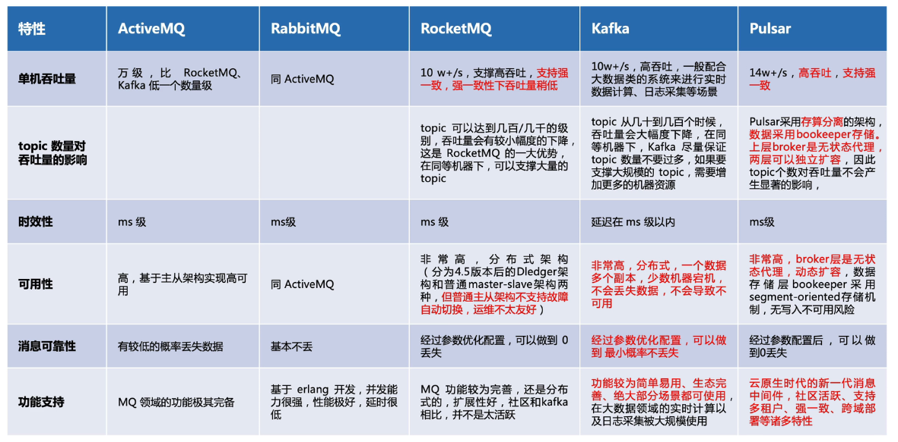
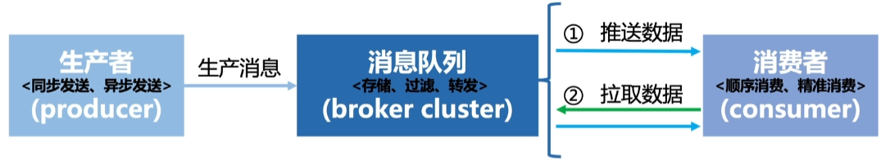
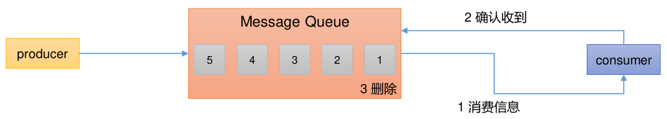
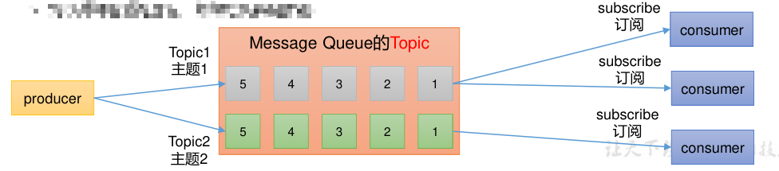

alias:: [[Message Middleware]]
tags:: [[Middleware]]
---

- ## 三大使用场景
	- 异步
	- 解耦
	- 削峰
- ## 主流消息队列产品
	- ### 官网
		- ActiveMQ : https://activemq.apache.org/
		- RabbitMQ : https://www.rabbitmq.com/
		- [[Kafka]] : https://kafka.apache.org/
		- [[RocketMQ]] : https://rocketmq.apache.org/
		- Pulsar : https://pulsar.apache.org/
	- ### 对比
		- 
- ##  消息队列核心模型
	- ### 三大主体
		- 
		- **生产者** (producer) ：生产消息， **异步** 或 **同步** 。
		- **消息队列** (message queue) ：存储消息，消息分类（topic）。
		- **消费者** (consumer) ：取出消息， **主动拉取** 或 **被动等待** 。
	- ### 两种模式
		- **点对点模式** ： **消费者** 主动 拉取数据，消息收到后清除消息。
			- 
		- **发布/订阅模式** ：
			- 可以有多个主题，消费者可以订阅不同主题的数据。
			- 消费者消费数据后，不删除数据。
			- 每个消费者相互独立，都可以消费数据。
			- 
-
- ---
- ## 参考
	- 1. https://www.bilibili.com/video/BV1ia411k7oo
	  2. https://www.bilibili.com/video/BV1vr4y1677k