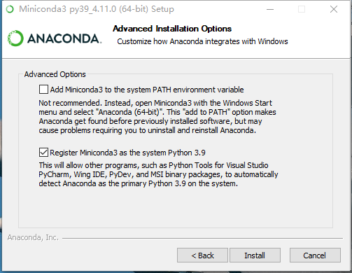

tags:: [[Miniconda]]
---

- ## 安装方式
	- 参见:
		- [Installing Miniconda](https://www.anaconda.com/docs/getting-started/miniconda/install)
		- [Conda Install](https://docs.conda.io/projects/conda/en/stable/)
		- [Installing conda](https://docs.conda.io/projects/conda/en/stable/user-guide/install/index.html)
	- Miniconda 有如下几种安装方式:
		- GUI 安装包
		  logseq.order-list-type:: number
		- 命令行脚本 ( ==倾向使用此方式== )
		  logseq.order-list-type:: number
		- 包管理工具 (如 Homebrew)
		  logseq.order-list-type:: number
	- 前两种方式的安装文件可以在这里下载: [Miniconda 历史版本下载](https://repo.anaconda.com/miniconda/)
- ## 卸载 Miniconda
	- 参见: [Uninstalling Miniconda](https://www.anaconda.com/docs/getting-started/miniconda/uninstall)
	- 使用 命令行脚本 安装的 Miniconda 默认在 `~/miniconda3` 目录下.
	- ``` zsh
	  ➜  / whereis conda
	  conda: /Users/vincent/miniconda3/bin/conda
	  ```
- ## Windows 安装 Miniconda
	- 到此地址下载 [Miniconda Installers](https://www.anaconda.com/download/success#miniconda)。
	  logseq.order-list-type:: number
	  id:: 67e96214-a8d4-4369-bddc-b7a0c047146d
	- 双击安装，选择安装位置，到这里有两个复选框。
	  logseq.order-list-type:: number
		- 
		- 这里如果勾选了这个两个复选框，则会在系统环境变量 `PATH` 中加入 Anaconda 相关路径.
		- 建议取消这两个复选框的勾选, 采用手动配置的方式. (具体见下文: 配置环境变量)
- ## 配置环境变量
	- ### macOS
		- 使用命令行脚本安装时, 默认会在 `~/.zshrc` 文件中加入如下内容:
			- ``` zsh
			  # >>> conda initialize >>>
			  # !! Contents within this block are managed by 'conda init' !!
			  __conda_setup="$('/Users/vincent/miniconda3/bin/conda' 'shell.zsh' 'hook' 2> /dev/null)"
			  if [ $? -eq 0 ]; then
			      eval "$__conda_setup"
			  else
			      if [ -f "/Users/vincent/miniconda3/etc/profile.d/conda.sh" ]; then
			          . "/Users/vincent/miniconda3/etc/profile.d/conda.sh"
			      else
			          export PATH="/Users/vincent/miniconda3/bin:$PATH"
			      fi
			  fi
			  unset __conda_setup
			  # <<< conda initialize <<<
			  ```
		- 如果没有上述内容, 则执行如下脚本:
			- ``` zsh
			  source <PATH_TO_CONDA>/bin/activate
			  conda init zsh
			  ```
			- 效果是会在 `~/.zshrc` 文件中加上如上内容.
	- ### Windows
		- ``` zsh
		  # 新增 CONDA_HOME 
		  CONDA_HOME = E:\devtools\sdk\conda\miniconda4.11.0
		  
		  # 在 Path 中新增如下几项：
		  %CONDA_HOME%\Scripts;%CONDA_HOME%\Library\bin;%CONDA_HOME%\Library\mingw-w64\bin;%CONDA_HOME%\Library\usr\bin
		  ```
		- 其实, 也就是加了如下几个路径到 PATH 上:
			- ``` zsh
			   # 此项是把conda自带的python加入环境变量
			   E:\devtools\sdk\conda\miniconda4.11.0 
			   E:\devtools\sdk\conda\miniconda4.11.0\Library\mingw-w64\bin
			   E:\devtools\sdk\conda\miniconda4.11.0\Library\usr\bin
			   E:\devtools\sdk\conda\miniconda4.11.0\Library\bin
			   # 此项可以把conda加入环境变量
			   E:\devtools\sdk\conda\miniconda4.11.0\Scripts 
			  ```
		- 如果不加 `%CONDA_HOME%\Library\bin` ，则下载依赖包时，会报如下的错误。
			- ```sh
			  PS E:\codes\python\start\EIN-SELD> conda env create -f environment.yml
			  Collecting package metadata (repodata.json): failed
			  - CondaHTTPError: HTTP 000 CONNECTION FAILED for url <https://conda.anaconda.org/pytorch/win-64/repodata.json>
			  Elapsed: -
			  - An HTTP error occurred when trying to retrieve this URL.
			  HTTP errors are often intermittent, and a simple retry will get you on your way.
			  'https://conda.anaconda.org/pytorch/win-64'
			  ```
			- 因为下载依赖包时，需要用到此目录中的 `libcrypto-1_1-x64.dll` 和 `libssl-1_1-x64.dll` 两个文件；
			- 如果不加此项，需要将这两个文件复制进 `\DLLs` 目录中。
- ## 验证是否安装成功
	- 执行 `conda list` 和 `conda --version` .
- ## 配置 Conda Channel
	- 参见: [[Conda Channel]]
- ## Miniconda 升级
	- 执行 `conda update conda`
- ## 安装问题
	- 参见: [[Anaconda 与 Miniconda 安装疑难杂症]]
-