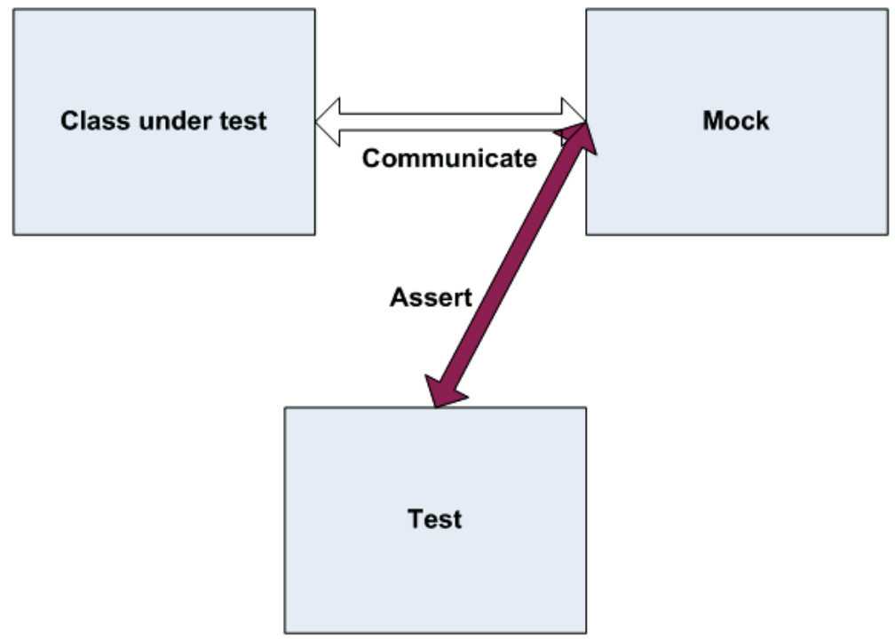
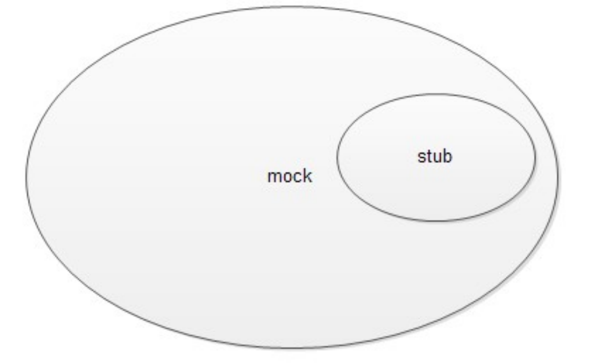

tags:: #[[Unit Testing]]

- ---
- ## 概念
	- ### 什么是 Mock
		- 即“模拟”，系统中的一个伪对象，用来决定一个单元测试是通过还是失败。
		- 它通过验证被测试对象和伪对象之间是否进行预期的交互来判断。
		- 通常每个测试只有一个伪对象。
		- 被测试类与模拟对象通信，模拟对象记录所有的消息。测试使用 **模拟对象** 来验证测试是否通过。
		- 
	- ### Mock 与 Stub
		- Stub 和 Mock 都是模拟外部依赖。Mock 侧重于对功能的模拟；Stub 侧重于对功能的测试重现。
			- 比如对于 List 接口，Mock 会直接对 List 进行模拟，而 Stub 会新建一个实现了 List 的 TestList ，在其中编写测试的代码。
		- Mock 是一种功能丰富的 Stub。Stub 是完全模拟一个外部依赖， 而 Mock 还可以用来判断测试通过还是失败。
			- 
	- ### 什么场景需要 Mock
		- 1. 真实对象的行为是不确定的（例如，当前的时间或当前的温度）；
		  2. 真实对象很难搭建起来；
		  3. 真实对象的行为很难触发（例如，网络错误）；
		  4. 真实对象速度很慢（例如，一个完整的数据库，在测试之前可能需要初始化）；
		  5. 真实的对象是用户界面，或包括用户界面在内；
		  6. 真实的对象使用了回调机制；
		  7. 真实对象可能还不存在；
		  8. 真实对象可能包含不能用作测试（而不是为实际工作）的信息和方法。
	- ### Mock 的好处
		- 1. 由于其他系统模块出错引起本模块的测试错误，我们可以采用mock隔离，避免干预。
		  2. 开发过程中，只要交互双方定义好接口，团队之间可以并行工作，进程互不影响；
		  3. 依赖系统无法响应，或者响应异常时，可以用mock Object代替，快速反应，不会影响测试进度；
		  4. 提前接入测试，提供测试效率，当接口定义好后，测试人员就可以创建Mock，把接口添加到
		  5. 动化测试环境，提前开始测试，起到测试驱动开发效果；
		  6. 可以有效的增加覆盖，接口涉及入参，或者业务逻辑复杂的情况，某些场景无法通过正常手段进行操作，可以通过mock虚拟模拟。
	- ### Mock 的隐患
		- 1. 大量使用Mock，mock测试的场景失去了真实性，可能会导致在后续的系统性测试时才发现bug，使得缺陷发现的较晚，可能会造成后续修复成本更大；
- ## Mock 框架
	- ### 常用 Java Mock 框架
		- [jMock](http://jmock.org/) 不推荐
		  id:: 64362a9c-6675-47e3-90ab-ffdb9d48b07b
		- [EasyMock](https://easymock.org/) 不推荐
		- [[Mockito]] 推荐
		- [[PowerMock]] 推荐
		-
	-
	-
-