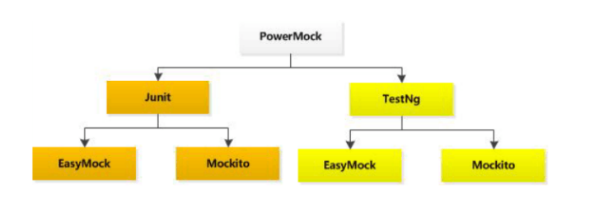

tags:: #PowerMock

-
- # PowerMock 概念
	- ## 介绍
		- 1. PowerMock是一个扩展了其它如 Mockito 等mock框架的、功能更加强大的框架
		  2. PowerMock集成了 EasyMock、Mockito
		  3. PowerMock能够完美的弥补Mockito的不足，能mock静态方法，构造函数，final类和方法，私有方法，去除静态初始化器等等
		- 
	-