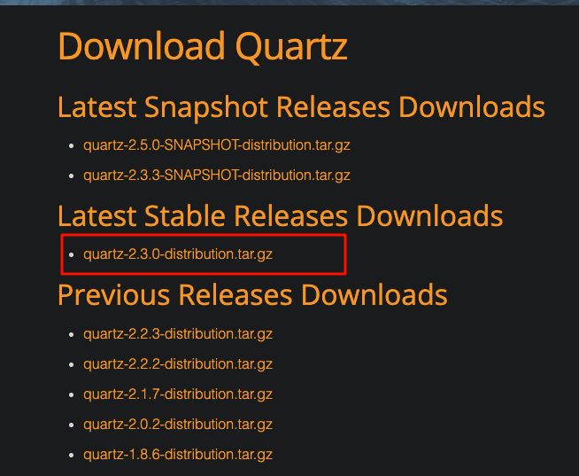
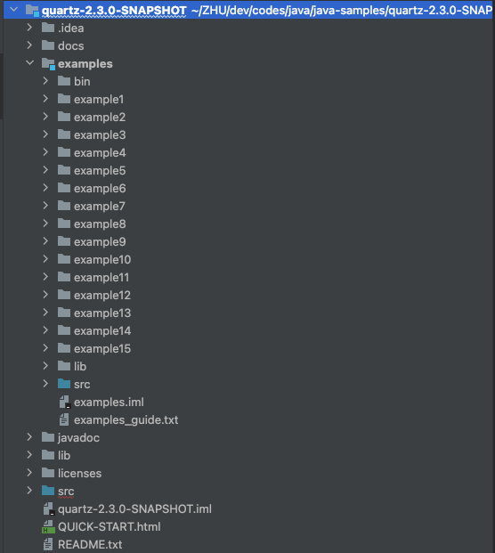

tags:: [[Quartz]]
---

- ## 如何下载 Examples
	- [Download Quartz](https://www.quartz-scheduler.org/downloads/)
	- {:height 281, :width 430}
- ## 目录结构
	- 解压目录结构如下：
		- 
	- ``` sh
	  .
	  ├── QUICK-START.html
	  ├── README.txt
	  ├── docs
	  ├── examples
	  ├── javadoc
	  ├── lib
	  ├── licenses
	  └── src
	  ```
	- `examples/` : 我们要看的 examples
	- `javadoc/` : Java API 文档
	- `lib` : 包含 `Quartz 依赖的 Jar` 和 `打包好的 Quartz 本身`
	- 无需关注的：
		- `docs/` : 只存了图片。
		- `licenses/` : 开源证书。
		- `src/` : 源码。
		- `QUICK-START.html` : 没啥内容。
		- `README.txt` : 没啥重要内容。
- ## examples 目录
	- ``` sh
	  .
	  ├── bin
	  ├── example1
	  ├── example2
	  ├── example3
	  ├── ......
	  ├── example15
	  ├── examples_guide.txt
	  ├── lib
	  └── src
	  ```
	- `bin` : 各个 `example` 执行可能需要用到的脚本 (无需我们主动执行)
	- `examplen/` : 我们要看的 example
		- 每个 example 下都有 `readme` 文件，先看这个文件。
		- 每个 example 都是通过脚本去调用已经编译好的 example 代码。
	- `lib` : 包含 `example 运行依赖的 Jar` 和 `打包好的 examples 项目本身` ( 各个 example 运行就是用这个打包好的 Jar ) 。
	- `examples_guide.txt` : example 介绍
		- ``` sh
		  example1 -  Your first Quartz Program
		  example2 -  Simple Triggers
		  example3 -  Cron Triggers
		  example4 -  Job State and Job Parameters
		  example5 -  Job Misfires
		  example6 -  Handling Job Exceptions
		  example7 -  Interrupting Jobs
		  example8 -  How to use Quartz Calendars
		  example9 -  Using Job Listeners
		  example10 - Using Quartz Plug-Ins
		  example11 - Loading Up Quartz with Many Jobs
		  example12 - Remoting with Quartz using RMI
		  example13 - Clustering Quartz and JDBC Job Stores
		  example14 - Quartz Trigger Priorities
		  example15 - Clustering Quartz and Terracotta Job Store
		  ```
	- `src/` : 各个 `example` 的源码。
	-