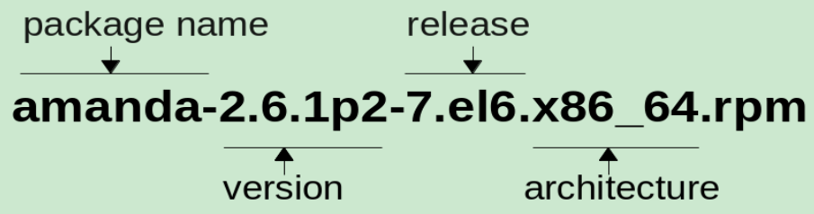

## 什么是 RPM
	- ### 一句话解释
		- 是一款 Linux 系统使用的包管理工具。
	- ### 名称由来
		- 原全称为 `Red Hat Package Manager` (因为最初是为 Red Hat 系列 Linux 开发的)，后来由于一些非 Red Hat 系列的 Linux 发行版本也在使用 RPM，所以把全称改为了 `RPM Package Manager` ([[Recursive acronym]]) 。
	- ### 使用 RPM 的系统
		- Red Hat 系列。如 Fedora 、 CentOS
		- SUSE 系列。
		- ……
- ## 什么是 RPM Package File
	- RPM Package ，即，可以使用 RPM 安装的一个个软件 (或称为包)。
	- 我使用 RPM 安装软件，需要通过一个包文件，称为 RPM Package File ，使用 rpm 命令安装时，需要指定这个文件的位置 (可以是本地路径，也可以是 url 地址)。
	- ### RPM Package File 名称
	  id:: 66093f53-593a-47ed-9581-f1a46556fcf4
		- 以 `amanda-2.6.1p2-7.el6.x86_64.rpm` 为例
		- 
		- `release` 是打包者添加的发布信息。
			- 这里的 `7` 表示这个包发布了 7 次 (可能要修复 bug)
			- `el6` 表示 **Red Hat Enterprise Linux 6** 。
- ## 使用 RPM 命令安装 package 会发生什么
	- 将 package 中的文件放置到系统中的相应位置。
	  logseq.order-list-type:: number
	- 将 package 的 metadata 储存到本地 RPM 数据库。
	  logseq.order-list-type:: number
	- 在某些情况，会执行脚本以配置这个 package 。
	  logseq.order-list-type:: number
-
- ## 参考
	- [rpm_tutorial_20120831.pdf](https://access.redhat.com/sites/default/files/attachments/rpm_tutorial_20120831.pdf)
	  logseq.order-list-type:: number
	-
-