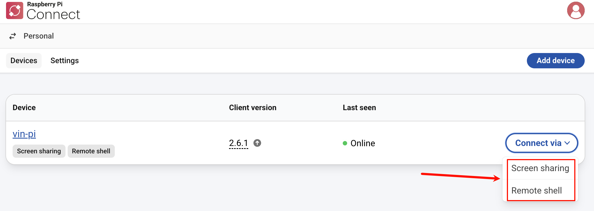

tags:: [[Raspberry Pi Connect]]
---

- ## Raspberry Pi Connect 与 Raspberry Pi Connect Lite
	- **Raspberry Pi Connect** :
		- 支持 **Screen sharing** 和 **Remote shell** 两种连接方式.
		- **Raspberry Pi OS Desktop** 和 **Raspberry Pi OS Full** 默认安装了 **Raspberry Pi Connect** .
	- **Raspberry Pi Connect Lite** 是  **Raspberry Pi Connect** 的精简版, 只支持  **Remote shell** .
		- **Raspberry Pi OS Lite** 默认安装了 **Raspberry Pi Connect Lite** .
	- {:height 318, :width 865}
- ## Connect 安全性
	- Connect 采用 [[DTLS]] 安全加密连接.
	- 默认情况下, **树莓派** 和 **浏览器** 之间进行直连通信.
	- 当 **树莓派** 和 **浏览器** 之间无法直连时, Connect 会使用 **中继服务器 (relay server)** (需要用到 [[TURN]] 技术)
		- **中继服务器 (relay server)** , 仅保留运行 Connect 所需的元数据.
	- Connect 服务已通过 [[Cure53]] 的安全评估.
- ## 系统要求
	- 参考:
		- [Bookworm — the new version of Raspberry Pi OS](https://www.raspberrypi.com/news/bookworm-the-new-version-of-raspberry-pi-os/)
		- [Screen sharing](https://www.raspberrypi.com/documentation/services/connect.html#screen-sharing)
	- **Screen sharing** 需要系统支持 [[Wayland]] window server。
		- Raspberry Pi OS Bookworm 及更高版本默认使用 Wayland .
		- Raspberry Pi OS Lite 使用 [[X Window System]] , 所以无法 **Screen sharing** .
- ## 参考
	- [Raspberry Pi Connect#Introduction](https://www.raspberrypi.com/documentation/services/connect.html#introduction)
	  logseq.order-list-type:: number
	- [Raspberry Pi Connect#Security](https://www.raspberrypi.com/documentation/services/connect.html#security)
	  logseq.order-list-type:: number
-