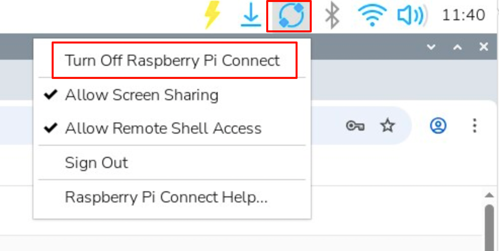
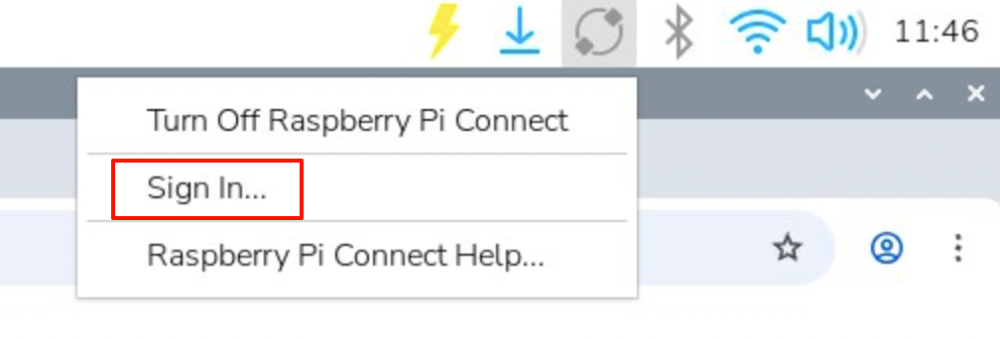
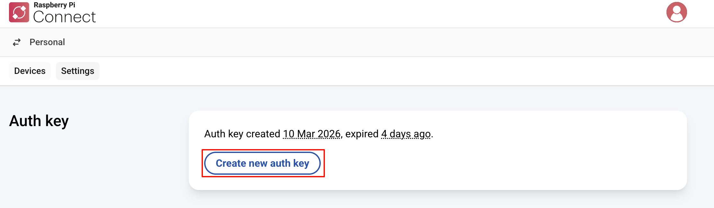
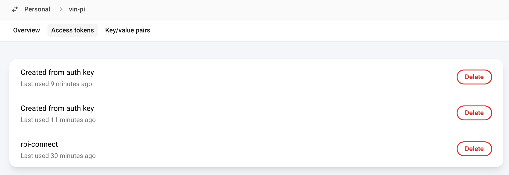

tags:: [[Raspberry Pi Connect]]
---

- ## 连接步骤
	- ### 1. 开启 Connect
		- #### 桌面
			- {:height 199, :width 366}
		- #### 命令行
			- ``` zsh
			  # 开启
			  rpi-connect on
			  
			  # 关闭
			  rpi-connect off
			  ```
	- ### 2. 关联 Raspberry ID
		- #### 桌面 + 浏览器登录
			- 点击 Sign In, 在浏览器登录 Raspberry ID , 没有就创建一个.
			- {:height 163, :width 370}
		- #### CLI + 浏览器登录
			- 执行 `rpi-connect signin` .
			  logseq.order-list-type:: number
				- ``` zsh
				  pi@vin-pi:~ $ rpi-connect signin
				  Complete sign in by visiting https://connect.raspberrypi.com/verify/xxxxx
				  ```
			- 在任意设备的浏览器, 访问命令输出的 URL 进行登录.
			  logseq.order-list-type:: number
		- ####  CLI + Auth Key 登录
			- ##### 什么是 Auth Key
				- Auth Key 是登录树莓派的临时凭证.
				- Auth Key 在创建后, 会在 6 小时候后过期, 无法使用.
					- 但一旦设备使用 Auth Key  登录, 并不会在 6 小时后登出.
			- ##### 创建 Auth Key
				- 进入 [Raspberry Pi - Settings](https://connect.raspberrypi.com/settings) 创建 Auth key , 并保存下来.
				- {:height 204, :width 617}
			- ##### 执行 CLI 登录
				- ``` zsh
				  # 使用 Auth Key 字符串登录
				  rpi-connect signin --auth-key=rpuak_Xxxx
				   
				  # 使用保存在文件中的 Auth Key 登录
				  rpi-connect signin --auth-key=@/path/to/file.key
				  ```
				- 注意:
					- 这里的 Auth Key 不会被写入 `~/.config/com.raspberrypi.connect/auth.key` .
					- 只是在安装系统启用 Connect 时, 会将填入的 Auth Key 写入 `~/.config/com.raspberrypi.connect/auth.key` .
		- #### Access token
			- 不管采用什么方式登录, Connect 都会创建一个长期有效的 Access Token .
			- 这个 Access Token 会被保存在 `~/.config/com.raspberrypi.connect/state.json`
				- `state.json` 文件格式为:
				- ``` json
				  {"accessToken":"rpdev_Pxxx","vncDisabled":false,"shellDisabled":false}
				  ```
			- 可以在设备的 **Access tokens** 页面删除已经创建的 **Access token** , 避免安全问题.
				- {:height 257, :width 606}
		- #### Auth Key 自动登录
			- Auth Key 自动登录:
				- 关闭 Connect .
				  logseq.order-list-type:: number
				- 将 `state.json` 删除.
				  logseq.order-list-type:: number
				- 在 `auth.key` 写入新创建的 Auth Key .
				  logseq.order-list-type:: number
				- 关闭 Connect .
				  logseq.order-list-type:: number
				- 等待一会儿,  Connect 会自动登录.
				  logseq.order-list-type:: number
- ## 参考
	- [Raspberry Pi Connect](https://www.raspberrypi.com/documentation/services/connect.html)
	  logseq.order-list-type:: number