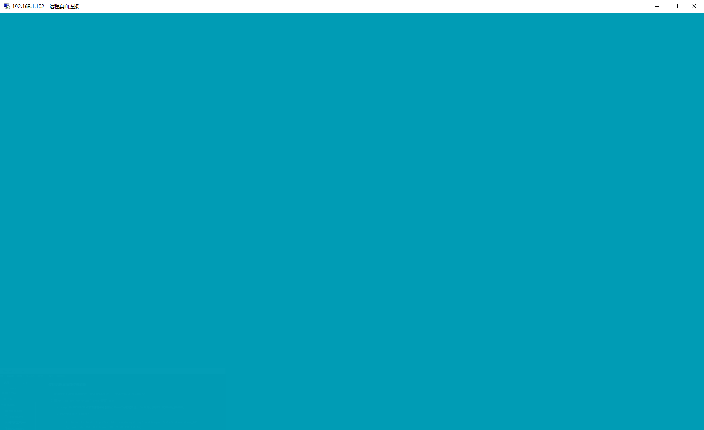
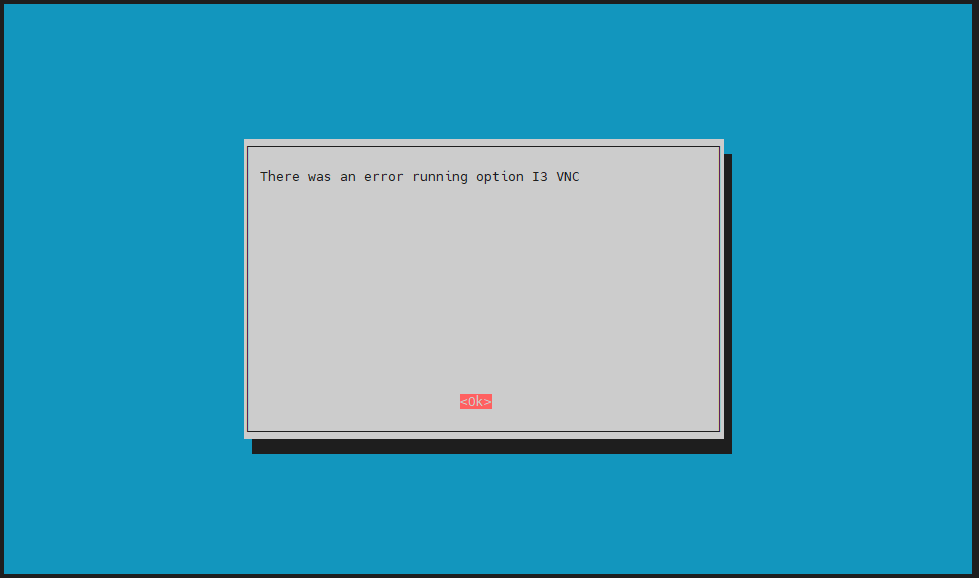

tags:: [[Raspberry Pi]], [[RDP]] 
---

- ## Microsoft Remote Desktop Client + xrdp server
	- 连接步骤:
		- 服务端: [[xrdp]] , Microsoft RDP 协议的开源实现.
		  logseq.order-list-type:: number
			- 树莓派执行 `sudo apt-get install xrdp` 安装 xrdp .
			- 若安装出现如下问题：
			- ```sh
			  E: Failed to fetch http://raspbian.raspberrypi.org/raspbian/pool/main/x/xterm/xterm_366-1_armhf.deb  404  Not Found [IP: 93.93.128.193 80]
			  E: Unable to fetch some archives, maybe run apt-get update or try with --fix-missing?
			  ```
			- 则先执行 `sudo apt-get update` 更新, 再执行上述安装命令即可.
		- 客户端: Microsoft Remote Desktop Client (for Windows, macOS, iOS and Android).
		  logseq.order-list-type:: number
			- Microsoft Remote Desktop Client  可以使用 `mstsc -admin` 打开.
- ## 常见问题
	- ### 黑屏问题
		- 远程连接树莓派桌面黑屏
		- 参考: [树莓派新操作系统xrdp远程桌面黑屏的问题](https://talk.quwj.com/topic/2660/)
		- ==下面的方法貌似不起作用==
		- 需要添加新用户, 用于 xrdp 连接：
			- ```sh
			  # 新增用户 remote
			  sudo useradd remote
			  # 为 remote 设置密码
			  sudo passwd remote
			  ```
	- ### 蓝屏问题
		- 可能在使用远程桌面连接树莓派时，会出现蓝屏问题：
			- {:height 379, :width 469}
			- {:height 444, :width 477}
		- ==下面的方法貌似不起作用==
		- **解决方法如下：**
			- 参考: https://blog.csdn.net/Yolanda_Salvatore/article/details/106439903
			- 1. 蓝屏问题：
				- https://superuser.com/questions/1701464/xrdp-only-showing-blue-green-background-screen-after-login
				- ```sh
				  deb http://mirrors.ustc.edu.cn/raspbian/raspbian/ buster main contrib non-free rpi
				  deb-src http://mirrors.ustc.edu.cn/raspbian/raspbian/ buster main contrib non-free rpi
				  ```