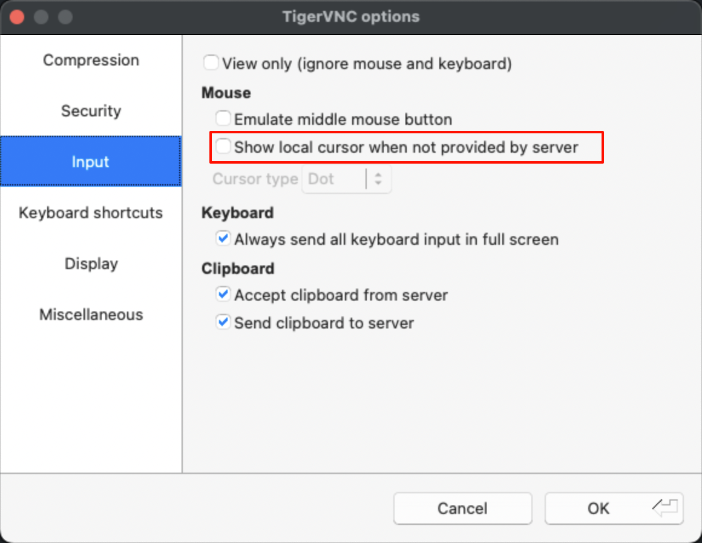

tags:: [[Raspberry Pi]]
---

- ## 开启 VNC Server 方法
	- ### 桌面开启
		- 桌面进入 `Preferences > Control Centre > Interfaces` .
		  logseq.order-list-type:: number
		- 勾选 `VNC`
		  logseq.order-list-type:: number
	- ### 命令行开启
		- 执行 `sudo raspi-config` .
		  logseq.order-list-type:: number
		- 选择 **Interface Options** , 回车.
		  logseq.order-list-type:: number
		- 选择 **VNC** , 回车.
		  logseq.order-list-type:: number
		- 选择 **Yes** , 回车.
		  logseq.order-list-type:: number
		- 按 **ESC** 退出.
		  logseq.order-list-type:: number
- ## 连接步骤
	- 树莓派开启了 VNC Server.
	  logseq.order-list-type:: number
	- 客户端设备, 安装 TigerVNC
	  logseq.order-list-type:: number
		- 参考: [[TigerVNC]]
	- 客户端和服务端连接到了同一个网络中.
	  logseq.order-list-type:: number
	- 使用树莓派的 hostname / ip, usernmae 和 password 连接即可.
	  logseq.order-list-type:: number
		- 建议勾选 **Options > Input > Show local cursor when not provided by server** , 确保没有光标时, 显示 点 (Dot) .
		- {:height 534, :width 460}
- ## 参考
	- [Screen share with VNC](https://www.raspberrypi.com/documentation/computers/remote-access.html#vnc)
	  logseq.order-list-type:: number
	- logseq.order-list-type:: number