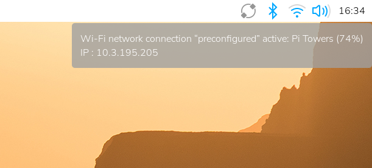

tags:: [[Raspberry Pi]]
---

- ## 连接显示器查看
	- ### 桌面系统启动
		- 右上角网络图标查看.
		- 
	- ### 命令行启动
		- 在启动输出内容的最后几行会出现 IP.
- ## 树莓派执行命令查看
	- ### hostname
		- `hostname -I`
	- ### nmcli
		- `nmcli device show`
		- 返回的内容按 **网络连接** , 分块展示.
		- 查看 `GENERAL.TYPE` 为我们已连接网络的类型的 IP.
- ## 网络中其他设备执行命令查看
	- ### mDNS
		- 在支持 [[mDNS]] 的局域网内设备, 执行 `ping <hostname>.local`
			- ``` zsh
			  ➜  ~ ping vin-pi.local     
			  
			  PING vin-pi.local (192.168.5.11): 56 data bytes
			  64 bytes from 192.168.5.11: icmp_seq=0 ttl=64 time=109.762 ms
			  64 bytes from 192.168.5.11: icmp_seq=1 ttl=64 time=9.521 ms
			  ```
		- `hostname` 如果在安装系统时没有指定, 则默认为 `raspberrypi` .
		- 如果忘记了 `hostname` , 可以在安装了 [[Avahi]] 服务的设备商, 使用 [`avahi-browse`](https://linux.die.net/man/1/avahi-browse) 查看局域网内所有的 host 和 service  .
	- ### Nmap
		- 执行 `sudo nmap -sn 192.168.5.0/24`
			- 找到名称包含 **Raspberry Pi** 的设备 (参考 [[Nmap]] )
- ## Wi-Fi 路由器管理界面查看
	- 登录 Wi-Fi 路由器管理界面, 查看连接的树莓派的 IP .
- ## 移动设备安装 Fing 查看 (不可用)
	- 参考: [[Fing]]
	- ==有点问题, 貌似找不到哪个设备是树莓派==
- ## 参考
	- [Find the IP address of your Raspberry Pi](https://www.raspberrypi.com/documentation/computers/remote-access.html#ip-address)
	  logseq.order-list-type:: number