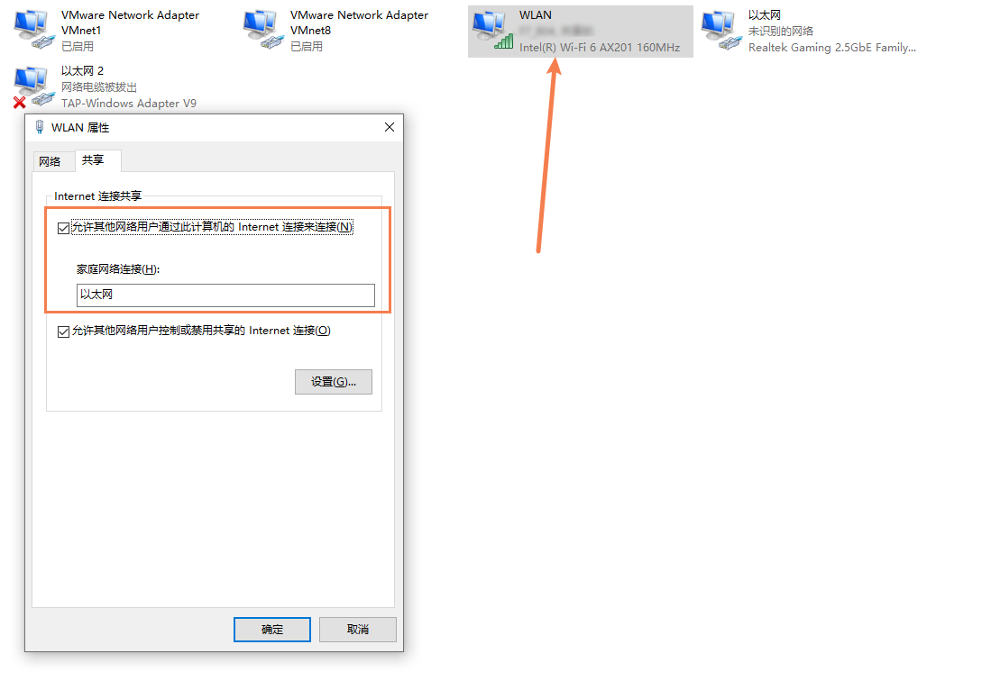
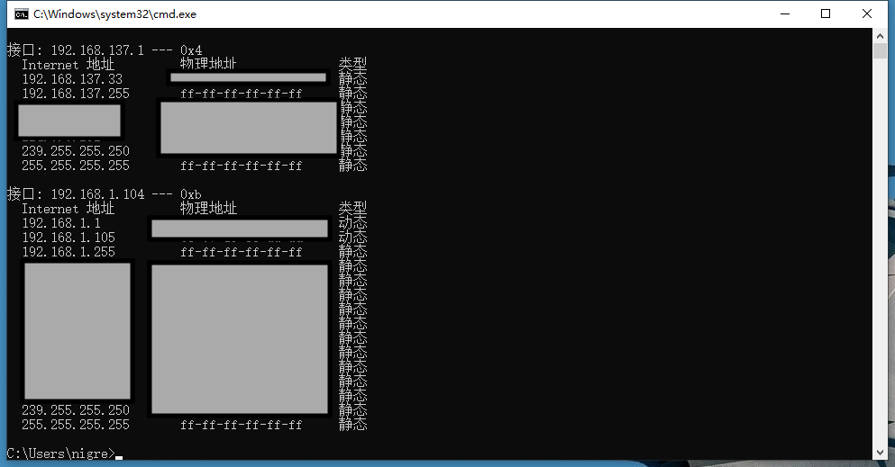

tags:: [[Raspberry Pi]]
---

- ## Desktop 连接无线网
	- 参照 [[Raspberry Pi: 外设连接]] , 使用外设连接树莓派, 在桌面连接无线网.
- ## 网线连接已接入网络的电脑
	- 用网线一端连接树莓派, 一端连接我们已有的电脑.
	  logseq.order-list-type:: number
	- 配置网络适配器.
	  logseq.order-list-type:: number
		- 右击电脑已连接的网络适配器 (这里是WLAN) .
		  logseq.order-list-type:: number
		- 进入 **共享** 标签页 .
		  logseq.order-list-type:: number
		- 勾选 "允许其他网络用户通过此计算机的Internet连接来连接(N)" .
		  logseq.order-list-type:: number
			- 如果已是勾选状态, 需要取消勾选重新选择一个 **家庭网络连接**  .
			- 必须是网线连接的那个接口 (这里连的是 **以太网** )，然后重启树莓派。
		- {:height 478, :width 705}
	- 查看  `ARP` 缓存 .
	  logseq.order-list-type:: number
		- 命令行输入 `arp -a` 根据上一步选择的接口的ip易知， `192.168.137.33` 即是树莓派的ip。
		- {:height 368, :width 630}
- ## 创建 wpa  文件连接无线网
	- 在已烧录系统的 SD 卡的根目录中, 新建一个名为 `wpa_supplicant.conf` 的文件 (这是旧标准, 现在已经不是这个名称了, 但仍兼容) .
	  logseq.order-list-type:: number
		- ```properties
		  country=CN
		  ctrl_interface=DIR=/var/run/wpa_supplicant GROUP=netdev
		  update_config=1
		  network={
		    ssid="wifi名称"
		    psk="wifi密码"
		    priority=10
		  }
		  ```
	- 将 SD卡 插到树莓派上, 给树莓派插上电源, 打开电源开关.
	  logseq.order-list-type:: number
	- 在路由器上查看树莓派是否连接上.
	  logseq.order-list-type:: number
		- 
	-