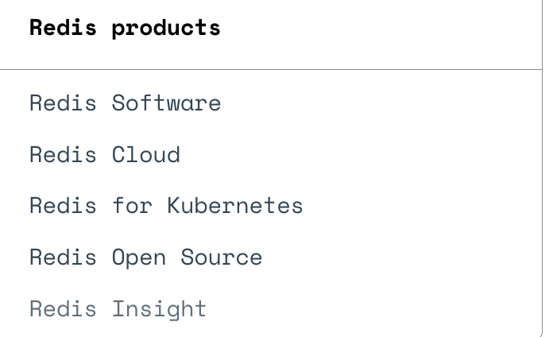

tags:: [[Redis]]
---

- ## Redis 产品
	- ### Redis 产品概览
		- [Redis products](https://redis.io/docs/latest/operate/)
			- {:height 158, :width 314}
		- [Redis 官网首页](https://redis.io/)
			- {:height 481, :width 809}
	- ### Redis 本身
		- #### Redis Open Source 与 Redis Enterprise Software
			- `Redis Open Source` (旧称: `Redis Community Edition` )
				- 即 Redis 开源版本.
			- `Redis Enterprise Software` / `Redis Software` / `Redis Enterprise`
				- 即 Redis 企业版本.
			- 二者区别:
				- Redis 企业版本, 其实就是在 开源版本 的基础上, 新增了企业级扩展功能;
				- Redis 企业版本, 是闭源收费的.
		- #### Redis 协议变更 (2024-03-20)
			- 参考: [Redis Adopts Dual Source-Available Licensing](https://redis.io/blog/redis-adopts-dual-source-available-licensing/)
			- 从 Redis 7.4 版本开始, Redis 采用 [Redis Source Available License (RSALv2)](https://redis.io/legal/rsalv2-agreement/) 和 [Server Side Public License (SSPLv1)](https://redis.io/legal/server-side-public-license-sspl/) 双协议.
			  logseq.order-list-type:: number
			- 此变更会影响谁?
			  logseq.order-list-type:: number
				- 受影响的只有: 提供 Redis 竞品 (competitive offerings) 的组织.
					- “competitive offerings” 是指源自 Redis 代码库, 与 Redis 商业产品的功能有显著重叠, 并销售给第三方的产品.
				- 因此, 托管 Redis 产品的云厂商, 将不再被允许免费使用 Redis 源代码.
				- 但, 允许在组织内部托管 Redis , 供组织内部使用.
			- Redis 7.2 及其之前的版本将被称为 `Redis OSS` , Redis 7.4 及其之后的版本将被称为 `Redis Community Edition` .
			  logseq.order-list-type:: number
		- #### Redis 协议变更 (2025-05-01)
			- 参考:
				- [Redis is now available under the AGPLv3 open source license](https://redis.io/blog/agplv3/)
				  logseq.order-list-type:: number
				- [Redis 8 is now GA, loaded with new features and more than 30 performance improvements](https://redis.io/blog/redis-8-ga/)
				  logseq.order-list-type:: number
			- 从 Redis 8 开始, 有如下变更:
				- 添加 `AGPLv3` 协议作为一个许可证选项 (licensing option)
				  logseq.order-list-type:: number
					- 因为, `AGPLv3` 是 [[OSI]] 认可的一个协议, 可以挽回开源社区的好感.
					- `AGPLv3` , 要求修改后必须开源.
				- `Redis Community Edition` 改称为 `Redis Open Source` .
				  logseq.order-list-type:: number
				- 新增特性 (Redis Stack 的功能, 之后都将可以在 Redis Open Source 上找到; Redis 官方将在 2025 年 9 月 15 日停止为 Redis Stack 6.2、7.2 和 7.4 发布补丁)
				  logseq.order-list-type:: number
					- 引入 8 种 数据结构.
					  logseq.order-list-type:: number
						- Vector set  [beta]
						  logseq.order-list-type:: number
						- JSON  (之前是单独的 Redis Module - [[RedisJSON]] )
						  logseq.order-list-type:: number
						- time series (之前是单独的 Redis Module - [[RedisTimeSeries]] )
						  logseq.order-list-type:: number
						- five probabilistic structures (之前是单独的 Redis Module - [[RedisBloom]] )
						  logseq.order-list-type:: number
							- Bloom filter
							  logseq.order-list-type:: number
							- cuckoo filter
							  logseq.order-list-type:: number
							- count-min sketch
							  logseq.order-list-type:: number
							- top-k
							  logseq.order-list-type:: number
							- t-digest
							  logseq.order-list-type:: number
					- Redis Query Engine (之前是单独的 Redis Module - [[RediSearch]] )
					  logseq.order-list-type:: number
					- Access Control Lists (ACLs)
					  logseq.order-list-type:: number
	- ### [[Redis Module]]
		- 就是 Redis 的插件, 提供一些额外的数据结构和功能.
	- ### Redis Stack
		- 参考: [GitHub - Redis Stack](https://github.com/redis-stack)
		- Redis Stack 是 Redis 开源版本的扩展.
		- Redis Stack 包含如下几部分:
			- ==Redis Stack Server==
			  logseq.order-list-type:: number
				- 在 Redis 开源版本基础上, 集成了如下 Redis Module :
					- [[RediSearch]]
					- [[RedisJSON]]
					- [[RedisTimeSeries]]
					- [[RedisBloom]]
			- ==Redis Stack Clients==
			  logseq.order-list-type:: number
				- 有如下几个 Redis 客户端库, 支持 Redis Stack :
				  logseq.order-list-type:: number
					- redis-py
					- node_redis
					- NRedisStack
					- Jedis
				- 有如下几个 对象映射 (object mapping) 库, 支持 Redis Stack :
				  logseq.order-list-type:: number
					- Redis OM .NET
					- Redis OM Node
					- Redis OM Python
					- Redis OM Spring
			- ==[[Redis Insight]]==
			  logseq.order-list-type:: number
				- Redis GUI 客户端工具.
	- ### Redis Data Integration (RDI)
		- 参考: [Redis Data Integration](https://redis.io/docs/latest/integrate/redis-data-integration/)
		- 一款同步 **慢速磁盘数据库** (slow disk based databases, 即一些基于磁盘存储的数据库) 数据 到 Redis 企业版本 的工具.
		- 可以通过 RDI CLI 或 Redis Insight 使用.
	- ### Redis Cloud
		- 参考: [Redis Cloud](https://redis.io/cloud/)
		- Redis 官方提供的 Redis 云服务.
		- #### Redis Flex
			- 参考: [Redis Flex](https://redis.io/solutions/flex/)
			- Redis Flex 是 Redis Cloud 提供的服务.
			- 通过使用固态硬盘（SSD）扩展数据库, 达到使用相同价格缓存 5 倍多数据的效果.
	- ### Redis Enterprise for Kubernetes
		- 将 Redis Enterprise Software 集成到 Kubernetes 的产品.
	- ### Redis AI 产品
		- [[Redis for AI]]
			- 基于 Redis 向量数据库集成的功能和服务包, 用于开发 AI 应用.
		- [[Redis LangCache]]
			- 通过 语义缓存 (semantic caching) , 降低延迟和 LLM 调用成本.