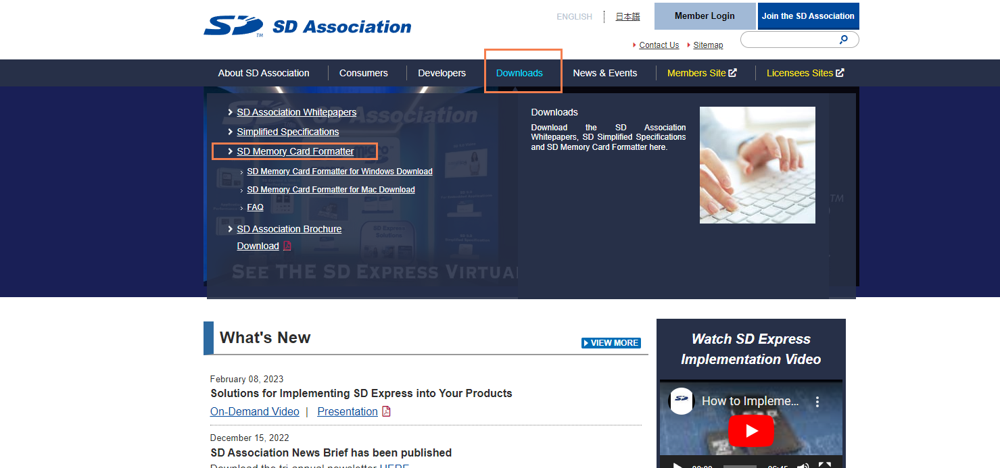
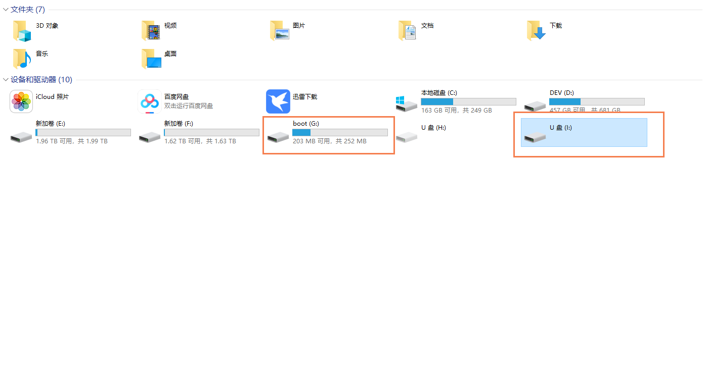
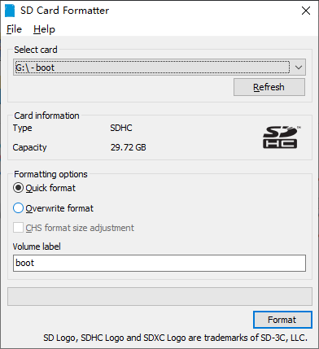
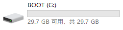

tags:: [[SD Card]]
---

- ## 什么是格式化
	- 所谓格式化，即将存储设备的数据清除。
	- 以下以 SanDisk 举例
- ## 使用 SD Memory Card Formatter 格式化
	- 官网: https://www.sdcard.org/
	- 下载 SD Memory Card Formatter .
	  logseq.order-list-type:: number
		- 
	- 解压、无脑安装.
	  logseq.order-list-type:: number
	- 打开工具，将SD卡插入读卡器，将读卡器接入电脑.
	  logseq.order-list-type:: number
	- 插入读卡器后，电脑显示增加了两个磁盘 ( macOS 只显示一个) .
	  logseq.order-list-type:: number
		- {:height 373, :width 687}
	- 选择 boot 盘，并选择 Quick format (Overwrite format 清除更彻底，但比较耗时)，点击 Format .
	  logseq.order-list-type:: number
		- 
	- 格式化完成后，只剩下一个 G 盘.
	  logseq.order-list-type:: number
		- 
- ## 参考
	- [树莓派上手前的准备工作（一）——格式化sd卡（sd卡格式化工具的使用）](https://blog.csdn.net/peng_YuJun/article/details/122618492)
	  logseq.order-list-type:: number