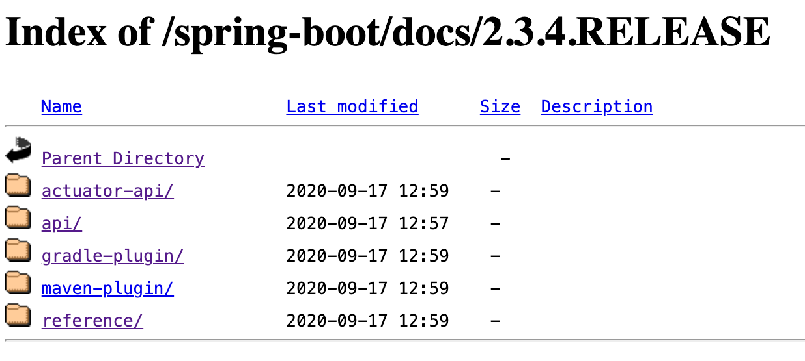

## 官方文档怎么使用
	- ### 学习 Spring Boot 的使用
		- 以 2.3.4.RELEASE 为例
		- 参考文档: [Spring Boot Docs](https://docs.spring.io/spring-boot/docs/) > [Spring Boot Docs - 2.3.4.RELEASE Reference](https://docs.spring.io/spring-boot/docs/2.3.4.RELEASE/reference/) > 建议看这个多页 html 版本: [Multi-page HTML](https://docs.spring.io/spring-boot/docs/2.3.4.RELEASE/reference/html/)
		  logseq.order-list-type:: number
		- 了解一些通用问题的解决方案: [How-to documents](https://docs.spring.io/spring-boot/docs/2.3.4.RELEASE/reference/html/howto.html#howto).
		  logseq.order-list-type:: number
	- ### 学习 maven-plugin 和 actuator-api
		- [Spring Boot Docs](https://docs.spring.io/spring-boot/docs/) > [Spring Boot Docs - 2.3.4.RELEASE ](https://docs.spring.io/spring-boot/docs/2.3.4.RELEASE/)
		- 
	- ### 了解 Spring Boot 各版本发布信息
		- [the project release notes section](https://github.com/spring-projects/spring-boot/wiki#release-notes)
	- ### 各版本支持情况
		- [Spring Boot Support](https://spring.io/projects/spring-boot#support)
- ## Spring Boot 的定位
	- > Spring Boot makes it easy to create stand-alone, production-grade Spring based Applications that you can "just run".
	  -- 引自 [Spring Boot Overview](https://spring.io/projects/spring-boot#overview)
	- Spring Boot 使创建 spring-based 应用更加容易。
- ## 如何使用 Spring Boot
  id:: 6620bd09-1085-4f98-8ffd-4011f497fe85
	- POM 中声明父依赖为 `spring-boot-starter-parent` 。
	  logseq.order-list-type:: number
		- ``` xml
		  <parent>
		      <groupId>org.springframework.boot</groupId>
		      <artifactId>spring-boot-starter-parent</artifactId>
		      <version>2.3.4.RELEASE</version>
		  </parent>
		  ```
		- `spring-boot-starter-parent` 的父依赖是 `spring-boot-dependencies` 。
		- `spring-boot-dependencies` 做了 Dependency Management
	- POM 中引入需要用到的 `spring-boot-starter-xxx` 。
	  logseq.order-list-type:: number
		- 比如开发 Web 应用时，引入 `spring-boot-starter-web` 。
		- ``` xml
		  <dependencies>
		      <dependency>
		          <groupId>org.springframework.boot</groupId>
		          <artifactId>spring-boot-starter-web</artifactId>
		      </dependency>
		  </dependencies>
		  ```
	- 编写启动类。
	  logseq.order-list-type:: number
		- ``` java
		  import org.springframework.boot.*;
		  import org.springframework.boot.autoconfigure.*;
		  import org.springframework.web.bind.annotation.*;
		  
		  @RestController
		  @EnableAutoConfiguration
		  public class Example {
		  
		      @RequestMapping("/")
		      String home() {
		          return "Hello World!";
		      }
		  
		      public static void main(String[] args) {
		          SpringApplication.run(Example.class, args);
		      }
		  
		  }
		  ```
		- `@EnableAutoConfiguration` 告诉 Spring Boot 根据引入的依赖做自动配置。
		- `SpringApplication.run(Example.class, args);` 方法用于启动 Spring 和 自动配置的 `Tomcat` , `args` 为命令行参数。
	- 执行 `mvn spring-boot:run` 可启动程序，访问 `http://localhost:8080` 测试。
	  logseq.order-list-type:: number
- ## Executable jar
  id:: 662108ab-1116-4b67-878b-9f02cd547f1c
	- 参考:
		- [4.5. Creating an Executable Jar](https://docs.spring.io/spring-boot/docs/2.3.4.RELEASE/reference/html/getting-started.html#getting-started-first-application-executable-jar)
		  logseq.order-list-type:: number
		- [The Executable Jar Format](https://docs.spring.io/spring-boot/docs/2.3.4.RELEASE/reference/html/appendix-executable-jar-format.html#executable-jar)
		  logseq.order-list-type:: number
	- 我们最终想要得到一个 `completely self-contained executable jar file` , 即 包含**我们编写的代码的 class 和 所有 jar 依赖**的 可执行 jar 文件，这样可以方便部署；有时也被称为 `fat jars` 。
	- 首先想到的思路是: **将所有依赖的 jar 文件嵌入到最终的 jar 文件中** 。
	  logseq.order-list-type:: number
		- 但是有个问题是, java 并没有一个标准的方法去加载这种 **内嵌 jar 文件的 jar 文件** 。
	- 所以又想到另一个办法: **将所有的 class 打进一个 jar 文件中 (这被称为 `uber jars` )** 。
	  logseq.order-list-type:: number
		- 但这又面临两个问题:
			- 无法区分不同依赖的类。
			  logseq.order-list-type:: number
			- 如果不同依赖存在同名的类，将会有冲突。
			  logseq.order-list-type:: number
	- 所以 Spring Boot 采用了别的方式，来解决这个问题: [The Executable Jar Format](https://docs.spring.io/spring-boot/docs/2.3.4.RELEASE/reference/html/appendix-executable-jar-format.html#executable-jar)
- ## 自动装配
	-
- ## 几个很少用的东西
	- ### Spring Boot CLI
		- > The Spring Boot CLI (Command Line Interface) is a command line tool that you can use to quickly prototype with Spring. It lets you run [Groovy](https://groovy-lang.org/) scripts, which means that you have a familiar Java-like syntax without so much boilerplate code.
		  -- 引自 [Installing the Spring Boot CLI](https://docs.spring.io/spring-boot/docs/2.3.4.RELEASE/reference/html/getting-started.html#getting-started-installing-the-cli)
		- Spring Boot CLI 是一个命令行工具，可以在开发 Spring 应用时减少一些 ((6620925c-0281-4b08-aeec-d8c8960b590d)) 的编写。
		- ==该工具用得不多，无需深入了解==
	- ### spring-boot-properties-migrator
		- 参见: [Upgrading from an Earlier Version of Spring Boot](https://docs.spring.io/spring-boot/docs/2.3.4.RELEASE/reference/html/getting-started.html#getting-started-upgrading-from-an-earlier-version)
		- Spring Boot 在升级时，可能一些 properties 会被改名或移除。spring-boot-properties-migrator 可以帮助做出诊断，并在运行时做一些临时性的 properties 迁移。
		- ==该工具用得不多，无需深入了解==
-
	-
	-
- ## 参考
	-