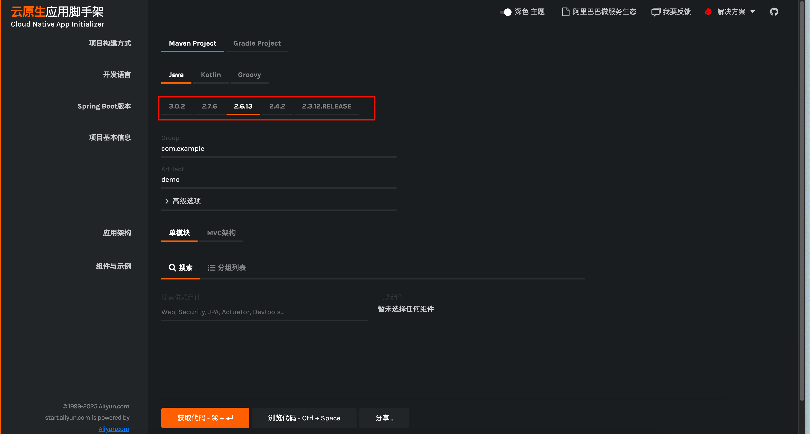
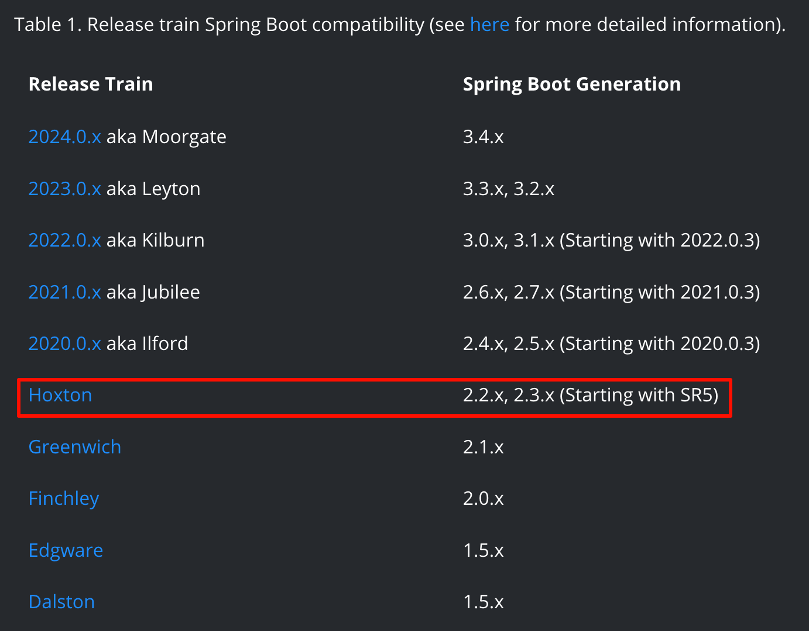
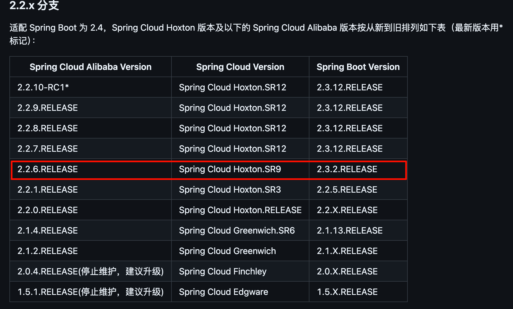

tags:: [[Spring Cloud]], [[Spring Cloud Alibaba]]
---

- ==问题点==
	- `spring-boot-starter-parent` 与  `spring-boot-dependencies` 的区别？
	  logseq.order-list-type:: number
		- 需要到官方库看看说明
- ## Spring Boot 版本
	- 参见: [Spring Cloud Alibaba - 版本说明](https://github.com/alibaba/spring-cloud-alibaba/wiki/%E7%89%88%E6%9C%AC%E8%AF%B4%E6%98%8E)
	- 目前 Spring Boot 版本可以分为如下几类：
		- Spring Boot 3.0
		- Spring Boot 2.7~2.4
		- Spring Boot 2.4 以下版本
	- 这三类版本差别较大，需要分别进行适配。
	- [阿里云云原生应用脚手架](https://start.aliyun.com/bootstrap.html)
		- (2025-01-11 截图)，可以看到大家常用的 Spring Boot 版本。
		- {:height 315, :width 738}
- ## 前司实践
	- 前司起初使用 `Spring Boot 2.3.4.RELEASE` 进行开发。
	  logseq.order-list-type:: number
	- 后来，项目需要引入 `spring-cloud-starter-gateway` 和  `spring-cloud-starter-openfeign` Spring Cloud 组件，所以需要引入 `spring-cloud-dependencies` 进行依赖版本管理。
	  logseq.order-list-type:: number
		- ``` xml
		      <dependencyManagement>
		          <dependencies>
		              <!-- ======================= Spring Cloud 依赖约束 ======================= -->
		  
		              <dependency>
		                  <groupId>org.springframework.cloud</groupId>
		                  <artifactId>spring-cloud-dependencies</artifactId>
		                  <version>${spring.cloud.version}</version>
		                  <type>pom</type>
		                  <scope>import</scope>
		              </dependency>
		          </dependencies>
		      </dependencyManagement>
		  ```
	- 后来，又需要使用 Nacos 组件，为了将 Nacos 集成到 Spring Cloud 中，需要引入 `spring-cloud-starter-alibaba-nacos-config` 和 `spring-cloud-starter-alibaba-nacos-discovery` ，因此需要引入 `spring-cloud-alibaba-dependencies` 进行依赖版本管理。
	  logseq.order-list-type:: number
	- 所以此时，就需要考虑 Spring Boot, Spring Cloud 和 Spring Cloud Alibaba 的兼容问题。
	  logseq.order-list-type:: number
		- 我们最终决定 `Spring Boot 2.3.4.RELEASE` 保持不变，采用 `Hoxton`版本的 `spring-cloud-alibaba-dependencies` 。
		  logseq.order-list-type:: number
			- {:height 375, :width 458}
			- [图片来源](https://spring.io/projects/spring-cloud)
		- 为了让三者尽可能兼容，参照下图，选择了下图中 `2.2.6.RELEASE` 版本的 `spring-cloud-alibaba-dependencies` ，并确定 `spring-cloud-alibaba-dependencies` 版本为 `Hoxton.SR9` 。
		  logseq.order-list-type:: number
			- {:height 194, :width 664}
			- [图片来源](https://github.com/alibaba/spring-cloud-alibaba/wiki/%E7%89%88%E6%9C%AC%E8%AF%B4%E6%98%8E#22x-%E5%88%86%E6%94%AF)
	- 所以，前司最终父项目的 POM 文件是：
		- ``` xml
		  <project xmlns="http://maven.apache.org/POM/4.0.0" xmlns:xsi="http://www.w3.org/2001/XMLSchema-instance"
		           xsi:schemaLocation="http://maven.apache.org/POM/4.0.0 http://maven.apache.org/xsd/maven-4.0.0.xsd">
		      <modelVersion>4.0.0</modelVersion>
		  
		      <groupId>xxx</groupId>
		      <artifactId>xxx-parent</artifactId>
		      <version>1.0.0</version>
		      <packaging>pom</packaging>
		  
		      <name>xxx-parent</name>
		  
		      <parent>
		          <groupId>org.springframework.boot</groupId>
		          <artifactId>spring-boot-starter-parent</artifactId>
		          <version>2.3.4.RELEASE</version>
		          <relativePath/>
		      </parent>
		  
		      <modules>
		  
		      </modules>
		  
		      <properties>
		          <java.version>1.8</java.version>
		          <project.build.sourceEncoding>UTF-8</project.build.sourceEncoding>
		  
		          <spring.boot.version>2.3.4.RELEASE</spring.boot.version>
		          <spring.cloud.version>Hoxton.SR9</spring.cloud.version>
		          <spring.cloud.alibaba.version>2.2.6.RELEASE</spring.cloud.alibaba.version>
		      </properties>
		  
		      <dependencyManagement>
		          <dependencies>
		              <!-- ======================= Spring Cloud 依赖约束 ======================= -->
		  
		              <dependency>
		                  <groupId>org.springframework.cloud</groupId>
		                  <artifactId>spring-cloud-dependencies</artifactId>
		                  <version>${spring.cloud.version}</version>
		                  <type>pom</type>
		                  <scope>import</scope>
		              </dependency>
		  
		              <dependency>
		                  <groupId>com.alibaba.cloud</groupId>
		                  <artifactId>spring-cloud-alibaba-dependencies</artifactId>
		                  <version>${spring.cloud.alibaba.version}</version>
		                  <type>pom</type>
		                  <scope>import</scope>
		              </dependency>
		          </dependencies>
		      </dependencyManagement>
		  </project>
		  ```
- ## `spring-boot-starter-parent` 与  `spring-boot-dependencies`
	- 可以不使用 `spring-boot-starter-parent` 作为父项目，而是直接使用 `spring-boot-dependencies` 进行依赖版本管理。
- ## 最佳实践
	- 参见: [Spring Cloud Alibaba - 版本说明](https://github.com/alibaba/spring-cloud-alibaba/wiki/%E7%89%88%E6%9C%AC%E8%AF%B4%E6%98%8E)
	- ### Spring Boot 2.4 以下版本
		- | Spring Cloud Alibaba Version | Spring Cloud Version | Spring Boot Version |
		  | ---- | ---- | ---- |
		  | 2.2.10-RC1 | Spring Cloud Hoxton.SR12 | 2.3.12.RELEASE |
		- ``` xml
		  <project xmlns="http://maven.apache.org/POM/4.0.0" xmlns:xsi="http://www.w3.org/2001/XMLSchema-instance"
		           xsi:schemaLocation="http://maven.apache.org/POM/4.0.0 http://maven.apache.org/xsd/maven-4.0.0.xsd">
		      <modelVersion>4.0.0</modelVersion>
		  
		      <groupId>xxx</groupId>
		      <artifactId>xxx-parent</artifactId>
		      <version>1.0.0</version>
		      <packaging>pom</packaging>
		  
		      <name>xxx-parent</name>
		  
		      <modules>
		      </modules>
		  
		      <properties>
		          <java.version>1.8</java.version>
		          <project.build.sourceEncoding>UTF-8</project.build.sourceEncoding>
		  
		          <spring.boot.version>2.3.12.RELEASE</spring.boot.version>
		          <spring.cloud.version>Hoxton.SR12</spring.cloud.version>
		          <spring.cloud.alibaba.version>2.2.10-RC1</spring.cloud.alibaba.version>
		      </properties>
		  
		      <dependencyManagement>
		          <dependencies>
		            
		              <!-- ======================= Spring Boot 依赖约束 ======================= -->
		  
		              <dependency>
		                  <groupId>org.springframework.boot</groupId>
		                  <artifactId>spring-boot-dependencies</artifactId>
		                  <version>${spring.boot.version}</version>
		                  <type>pom</type>
		                  <scope>import</scope>
		              </dependency>
		            
		              <!-- ======================= Spring Cloud 依赖约束 ======================= -->
		  
		              <dependency>
		                  <groupId>org.springframework.cloud</groupId>
		                  <artifactId>spring-cloud-dependencies</artifactId>
		                  <version>${spring.cloud.version}</version>
		                  <type>pom</type>
		                  <scope>import</scope>
		              </dependency>
		  
		              <dependency>
		                  <groupId>com.alibaba.cloud</groupId>
		                  <artifactId>spring-cloud-alibaba-dependencies</artifactId>
		                  <version>${spring.cloud.alibaba.version}</version>
		                  <type>pom</type>
		                  <scope>import</scope>
		              </dependency>
		          </dependencies>
		      </dependencyManagement>
		  </project>
		  ```
	- ### Spring Boot 2.7~2.4
		- | Spring Cloud Alibaba Version | Spring Cloud Version | Spring Boot Version |
		  | ---- | ---- | ---- |
		  | 2021.0.5.0 | Spring Cloud 2021.0.5 | 2.6.13 |
		- ==强烈建议使用此版本，使用尽可能高的 2.x 版本，同时避免 Spring Boot 2.7 有什么前瞻特性==
	- ### Spring Boot 3.0
		- 需要 JDK 17 ，由于现在很多公司都没升级到 JDK 17 ，所以可以暂时不考虑使用这个版本。
		-
- ## 参考
	- [Spring Cloud Alibaba - 版本说明](https://github.com/alibaba/spring-cloud-alibaba/wiki/%E7%89%88%E6%9C%AC%E8%AF%B4%E6%98%8E#22x-%E5%88%86%E6%94%AF)
	  logseq.order-list-type:: number
	- [Spring Cloud](https://spring.io/projects/spring-cloud)
	  logseq.order-list-type:: number
	- [Spring Cloud Supported Versions](https://github.com/spring-cloud/spring-cloud-release/wiki/Supported-Versions#supported-releases)
	  logseq.order-list-type:: number
-