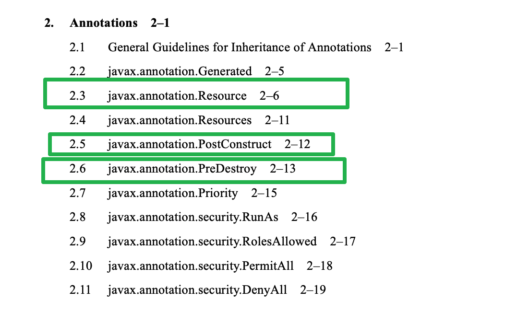

tags:: [[Spring Framework]]
---

- ## Spring 的架构
	- {:height 246, :width 742}
	- > At the heart are the modules of the core container, including a configuration model and a dependency injection mechanism.
	  -- 引自 [Spring Framework Docs - What We Mean by "Spring"](https://docs.spring.io/spring-framework/docs/5.2.9.RELEASE/spring-framework-reference/overview.html#overview-spring)
	- Spring 的核心是 `Core Container` , 包含：
	  logseq.order-list-type:: number
		- `configuration model` (配置模型) 
		  logseq.order-list-type:: number
		- `dependency injection mechanism` (依赖注入机制)
		  logseq.order-list-type:: number
	- 在  `Core Container` 之外, Spring 还提供了一些功能：
	  logseq.order-list-type:: number
		- messaging
		  logseq.order-list-type:: number
		- transactional data and persistence
		  logseq.order-list-type:: number
		- web
		  logseq.order-list-type:: number
			- `Spring MVC` web framework (基于 Servlet)
			  logseq.order-list-type:: number
			- `Spring WebFlux` reactive web framework (基于 Reactive Streams)
			  logseq.order-list-type:: number
		- 等等...
- ## Spring 对一些 Java 规范的支持
	- Spring 集成并支持了 [[Java EE]] 中的如下规范 (JDK 中没有这些内容，需要额外引入依赖)
		- Servlet API ([JSR 340](https://jcp.org/en/jsr/detail?id=340))
		  logseq.order-list-type:: number
		- WebSocket API ([JSR 356](https://www.jcp.org/en/jsr/detail?id=356))
		  logseq.order-list-type:: number
		- Concurrency Utilities ([JSR 236](https://www.jcp.org/en/jsr/detail?id=236))
		  logseq.order-list-type:: number
		- JSON Binding API ([JSR 367](https://jcp.org/en/jsr/detail?id=367))
		  logseq.order-list-type:: number
		- Bean Validation ([JSR 303](https://jcp.org/en/jsr/detail?id=303))
		  logseq.order-list-type:: number
		- JPA ([JSR 338](https://jcp.org/en/jsr/detail?id=338))
		  logseq.order-list-type:: number
		- JMS ([JSR 914](https://jcp.org/en/jsr/detail?id=914))
		  logseq.order-list-type:: number
		- 等等...
	- 另外，Spring 还允许用户使用如下规范 (而不是使用 Spring 自身提供的机制, 比如 `@Resource` 注解)：
		- Dependency Injection ([JSR 330](https://www.jcp.org/en/jsr/detail?id=330))
		  logseq.order-list-type:: number
			- 需要额外引入依赖
		- Common Annotations ([JSR 250](https://jcp.org/en/jsr/detail?id=250))
		  logseq.order-list-type:: number
			- JDK 中内置，内容包含我们比较熟悉的 `@Resource` , `@PostConstruct` 和 `@PreDestroy` 等。
			- {:height 194, :width 531}
	-
- ## 参考
	- [Spring Framework Docs - Spring Framework Overview](https://docs.spring.io/spring-framework/docs/5.2.9.RELEASE/spring-framework-reference/overview.html)
	  logseq.order-list-type:: number
	- logseq.order-list-type:: number