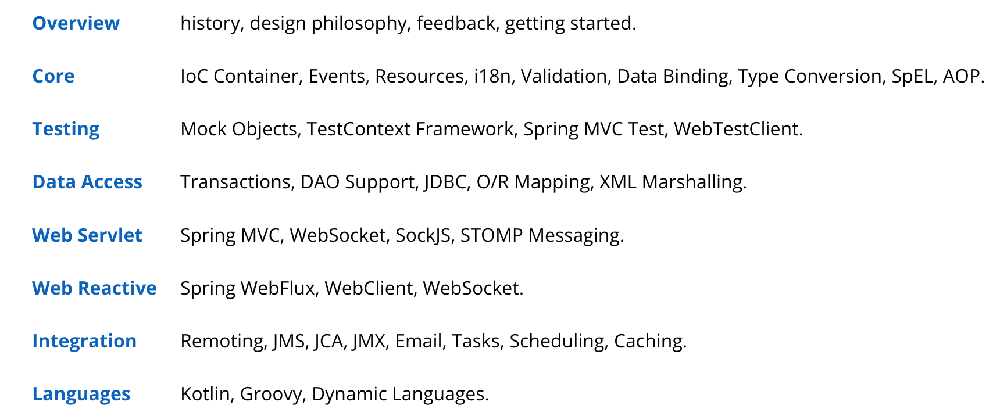

tags:: [[Spring]]
---

- ## 学习路线
	- [[Spring Framework Concept]]
	  logseq.order-list-type:: number
	- [[Spring 事务]]
	  logseq.order-list-type:: number
	- [[Spring 定时任务与异步任务]]
	  logseq.order-list-type:: number
- ## 学习进度
	- {:height 246, :width 742}
	- 看完了 Overview 2024-12-22
	-
- ## 官方资料
	- [官方 Talk - Demystifying Spring Internals](https://www.youtube.com/watch?v=LeoCh7VK9cg)
	  logseq.order-list-type:: number
	- ### Spring Framework Documentation
		- [Spring Framework 5.2.9.RELEASE](https://docs.spring.io/spring-framework/docs/5.2.9.RELEASE/spring-framework-reference/)
		  logseq.order-list-type:: number
		- logseq.order-list-type:: number