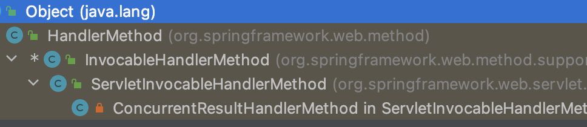

tags:: [[Spring MVC]], [[Source Code]]
---

-
- ## 关于全局异常处理
	- 查看的源码是: `spring-webmvc-5.2.9.RELEASE.jar`
	- ---
	- 首先定位到 `InvocableHandlerMethod` 的 `protected Object doInvoke(Object... args) throws Exception;` 方法中, 调用的 `getBridgedMethod()` 方法会得到处理异常需要 `执行的方法 (来自我们自己定义的全局异常处理方法)` .
	  logseq.order-list-type:: number
	- 进入该方法，我们可以发现该方法会返回其成员属性 `bridgedMethod` .
	  logseq.order-list-type:: number
	- 我们发现该属性来自 `InvocableHandlerMethod` 的父类 `HandleMethod` , 进而发现继承结构如下:
	  logseq.order-list-type:: number
		- 
	- 我们现在想知道 `bridgedMethod` 是什么时候被赋值的 .
	  logseq.order-list-type:: number
		- 重新 debug 发现在 `ExceptionHandlerExceptionResolver` 的 `protected ServletInvocableHandlerMethod getExceptionHandlerMethod(HandlerMethod handlerMethod, Exception exception)` 方法中, 有 new 过一个 `ServletInvocableHandlerMethod`对象 .
		  logseq.order-list-type:: number
			- ``` java
			  for (Map.Entry<ControllerAdviceBean, ExceptionHandlerMethodResolver> entry : this.exceptionHandlerAdviceCache.entrySet()) {
			    ControllerAdviceBean advice = entry.getKey();
			    if (advice.isApplicableToBeanType(handlerType)) {
			      ExceptionHandlerMethodResolver resolver = entry.getValue();
			      Method method = resolver.resolveMethod(exception);
			      if (method != null) {
			        return new ServletInvocableHandlerMethod(advice.resolveBean(), method);
			      }
			    }
			  }
			  ```
		- 我们进入该构造方法可以发现, 正是这个构造方法给 `bridgedMethod` 赋值了, 并且这个值和传入的 `method` 对象有关 .
		  logseq.order-list-type:: number
	- 那么我们现在的问题是, 这个 `method` 对象是怎么来的 ?
	  logseq.order-list-type:: number
		- 阅读上一步中的代码可以发现 `Method method = resolver.resolveMethod(exception);` 
		  logseq.order-list-type:: number
		- 那 `resolver` 又是啥? 继续阅读发现 `this.exceptionHandlerAdviceCache` 的类型是 `Map<ControllerAdviceBean, ExceptionHandlerMethodResolver>` 存了所有异常处理类的相关信息.
		  logseq.order-list-type:: number
		- 而 `ExceptionHandlerMethodResolver` 则存储了 `异常` 与 `处理异常的方法` 的映射关系 .
		  logseq.order-list-type:: number
		- 执行 `resolver.resolveMethod(exception)` 即是去获得可以处理这个异常的方法 .
		  logseq.order-list-type:: number
		- 继续深入, 发现 `public Method resolveMethodByThrowable(Throwable exception)` 方法用于解析处理异常的方法 . 
		  logseq.order-list-type:: number
		- 它会根据异常类本身, 和异常的 cause , 来决定匹配的方法 .
		  logseq.order-list-type:: number
		- 最终可定位到 `ExceptionHandlerMethodResolver` 的 `private Method getMappedMethod(Class<? extends Throwable> exceptionType)` .
		  logseq.order-list-type:: number
		- logseq.order-list-type:: number
-