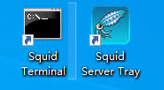

tags:: [[Network Proxy]]
---

- ## Windows 系统
	- ### 安装
		- [Squid 下载](https://www.squid-cache.org/Versions/) > [binary package of Squid](https://wiki.squid-cache.org/SquidFaq/BinaryPackages) > [Windows](https://wiki.squid-cache.org/KnowledgeBase/Windows) > 64-bit: [http://squid.diladele.com/](http://squid.diladele.com/) > Console APP Squid For Windows > **msi 无脑安装**
		- 
	- ### 使用
		- 安装后会生成如下两个图标:
		- 
		- Squid Terminal 用于执行命令 (最好 **以管理员身份运行** )。
		- Squid Server Tray 用于启动代理服务器。
- ## 配置
	- ### 隐藏客户端 IP
		- 参考: [Squid 配置高匿代理](https://xnathan.com/2017/03/01/squid-anony-proxy/)
		- squid.conf 中加入如下配置：
			- ``` conf
			  # 隐藏客户端 IP
			  request_header_access Via deny all
			  request_header_access X-Forwarded-For deny all
			  request_header_access From deny all
			  ```
		- 可访问 [httpbin.org/ip](http://httpbin.org/ip) 验证：
			- 如果是得到类似如下的结果，则表示未生效：
				- 192.168.1.10 表示客户端的 ip ，112.11.11.111 表示 squid 所在服务器的 ip 。
				- ``` json
				  {
				    "origin": "192.168.1.10, 112.11.11.111"
				  }
				  ```
			- 如果是得到类似如下的结果，则表示已生效：
				- ``` json
				  {
				    "origin": "112.11.11.111"
				  }
				  ```
	- ### 添加代理的端口
		- 如: `acl Safe_ports port 80`
	- ### 添加 HTTPS 安全端口
		- 默认配置中有: `acl SSL_ports port 443`
		- 如果 HTTPS 用的是其他端口，需要按上述格式添加。
- ## Squid Terminal
	- ### 重新加载配置
		- `squid -k reconfigure`
		- 注意: Windows 重启 Squid Server Tray 不一定能让配置生效，需要以管理员身份打开 Squid Terminal ，执行上述命令。