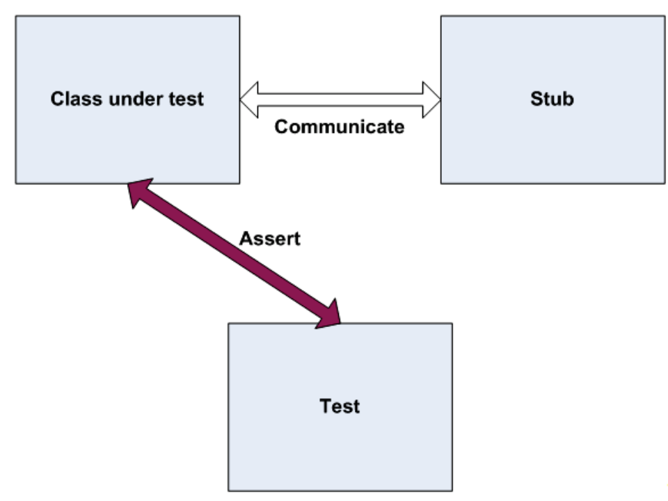

tags:: #[[Unit Testing]]

	-
-
- # Stub
	- ## 概念
		- Stub，称为“桩”，桩对象是对系统中现有依赖项的一个替代品，可以人为控制。通过使用桩对象，无需涉及依赖项，即可直接对代码进行测试。
		- 使用桩对象时，断言是针对 **被测试类** 执行的。借助于 **桩对象** ，能够确保测试顺利运行。
		- 
		- Stub Object 可以视为一种特殊的 Fake Object 。
		-
	-
-