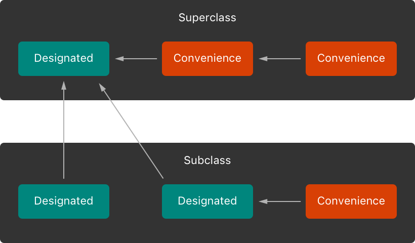
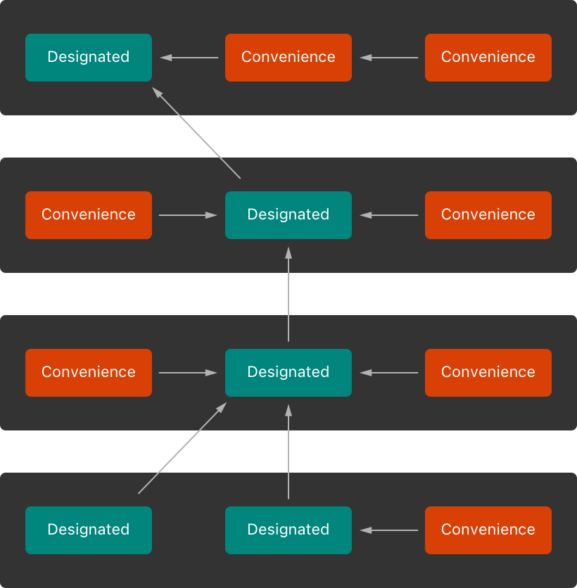

tags:: [[Swift Initialization]]
---

- ## 所有 Stored Properties 必须有初始值
	- 在初始化的过程中, 一个 `Class` 的所有 `Stored Property` 都必须被赋予 **初始值** , 包括其继承自 `Superclass` 的 `Stored Property` .
	- `Class` 使用如下两种 `Initializer` 确保所有 `Stored Property` 都被赋值:
		- Designated Initializer : `Class` 主要的 (Primary)  `Initializer` .
		  logseq.order-list-type:: number
		- Convenience Initializer : `Class` 次要的、辅助性的 (Secondary, Supporting) `Initializer` .
		  logseq.order-list-type:: number
- ## Designated Initializer & Convenience Initializer
	- ### 什么是 Designated Initializer
		- `Designated Initializer` 会:
			- 初始化该 `Class` 自身的所有 `Stored Property` .
			  logseq.order-list-type:: number
			- 然后调用 `Superclass` 的 `Initializer` , 并继续沿着 **父类链 (superclass chain)** 向上执行 `Initializer` .
			  logseq.order-list-type:: number
				- ==因此 `Designated Initializer` 被称为 `Class` 初始化过程的 **漏斗点 (funnel point)**==
		- 一个 `Class` 至少需要一个 `Designated Initializer` (但其实只有一个的情况很少见) .
			- 某些情况下,  可以从 `Superclass` 继承一个或多个 `Designated Initializer` .
	- ### Designated Initializer 的语法
		- ``` swift
		  init(<#parameters#>) {
		     <#statements#>
		  }
		  ```
	- ### 什么是 Convenience Initializer
		- `Convenience initializer` 不独立完成初始化, 而是把参数整理好, 再调用 `Designated Initializer` 完成真正的初始化.
		- 一个 `Class` 中, 可以没有 `Convenience Initializer` .
	- ### Convenience Initializer 的语法
		- ``` swift
		  convenience init(<#parameters#>) {
		     <#statements#>
		  }
		  ```
	- ### 示例
		- 示例 1 :
			- ``` swift
			  class Person {
			      let name: String
			      let age: Int
			  
			      init(name: String, age: Int) {
			          self.name = name
			          self.age = age
			      }
			  
			      // 这样会报错
			      init(name: String) {
			          self.init(name: name, age: 0)
			      }
			  }
			  ```
			- `Class` 中的 `Designated Initializer` 不像 `Structure/Enumeration` 中的 `Initializer` 可以直接调用同一个类型中的 `Designated Initializer` .
			- 但是改成 `Convenience Initializer` 就可以调用同一个 `Class` 中的  `Designated Initializer` 了.
		- 示例 2:
			- ``` swift
			  class Person {
			      let name: String
			      let age: Int
			  
			      // Designated Initializer
			      init(name: String, age: Int) {
			          self.name = name
			          self.age = age
			      }
			      
			      // Convenience Initializer
			      convenience init(name: String) {
			          // 调用 Designated Initializer
			          self.init(name: name, age: 0)
			      }
			  }
			  ```
- ## Class 的 Initializer Delegation
	- ### Class 的 Initializer Delegation 的规则
		- 有如下规则:
			- **designated initializer** 必须调用其 **直接父类 (immediate superclass)** 的一个 **designated initializer** .
			  logseq.order-list-type:: number
			- **convenience initializer** 必须调用 **同一个类 (same class)** 的另一个 **initializer** (可以是 **convenience initializer** 或 **designated initializer** )
			  logseq.order-list-type:: number
			- **convenience initializer** 最终必须调用一个 **designated initializer** .
			  logseq.order-list-type:: number
		- 总结来讲就是:
			- **Designated initializer** 必须始终 **向上委托 (delegate up)** .
			  logseq.order-list-type:: number
			- **Convenience initializer** 必须始终 **横向委托 (delegate across)** .
			  logseq.order-list-type:: number
		- {:height 337, :width 509}
	- ### Designated Initializer 是 Funnel Point
		- 如下示例, 可以看出: Designated Initializer 是 Funnel Point
			- {:height 358, :width 322}
- ## Two-Phase Initialization
	-