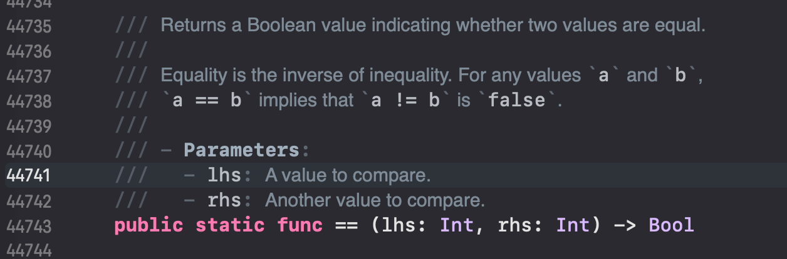

tags:: [[Swift Type]]
---

- ## Identity Operators
	- `Identity Operators` 包含:
		- Identical to : `===`
		- Not identical to : `!==`
	- 比较两个 变量/常量 是否 **引用 (refer to)** 同一个 **实例 (instance)**
- ## Equivalence Operators
	- `Equivalence Operator` 包含:
		- equal to Operator : `==`
		- not equal to operator : `!=`
	- 默认情况下, 我们自定义的 `Class` 和  `Structure` , 是没有 `Equivalence Operator` 的实现的.
		- 我们通常会自己实现 `==` , 并使用 `!=` 的默认实现 (即, 对 `==` 的运算结果取反)
		- 具体如何实现, 参见: [[Swift - Operator Method]]
	- 而 Swift 标准库中的 `Int` , `String` 等类型, 已有对 `Equivalence Operators` 的实现.
		- 如 `Int` 类型:
		- {:height 220, :width 487}
- ## 参考
	- [Structures and Classes#Identity Operators](https://docs.swift.org/swift-book/documentation/the-swift-programming-language/classesandstructures/#Identity-Operators)
	  logseq.order-list-type:: number
	- [Advanced Operators#Equivalence Operators](https://docs.swift.org/swift-book/documentation/the-swift-programming-language/advancedoperators/#Equivalence-Operators)
	  logseq.order-list-type:: number
-