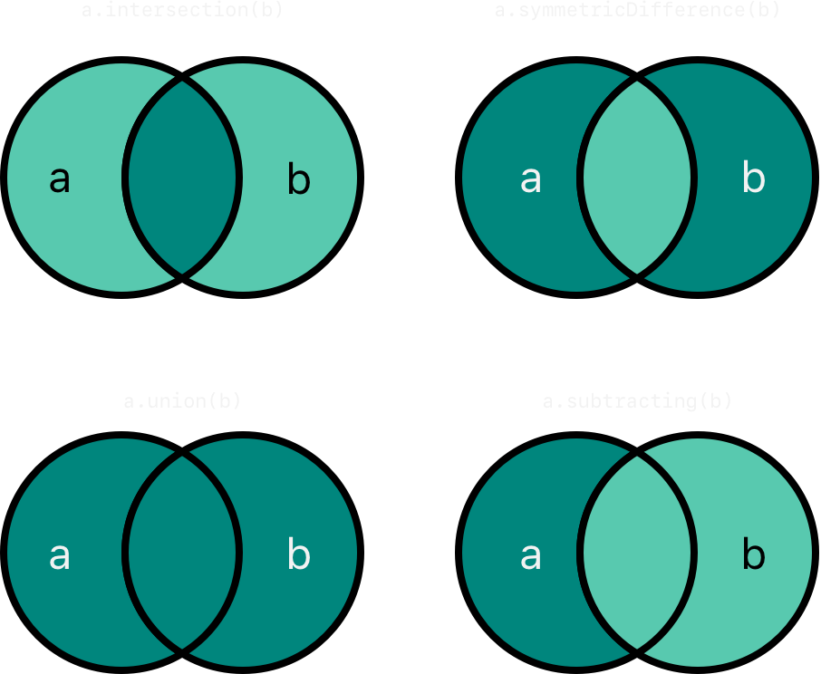

tags:: [[Swift Type]], [[Swift Collection]] 
---

- ## Set Type Annotation
	- `Set` 的完整 `Type Annotation` 是 `Set<Element>` , 与 `Array` 不同, `Set` 类型没有简写  .
		- ``` swift
		  let set: Set<String>;
		  ```
	- 其中, `Element` 必须遵循 `Hashable` .
		- 具体参见: [[Swift - Equatable & Hashable]]
- ## Creating A Set
	- ### 创建一个空 Set
		- ``` swift
		  var letters1: Set<Character> = Set<Character>();
		  var letters2: Set<Character> = [];
		  ```
		- 可以用空数组字面量 `[]` 给 `Set` 变量/常量 赋值.
	- ### 使用数组字面量创建 Set
		- ``` swift
		  var favoriteGenres: Set<String> = ["Rock", "Classical", "Hip hop"]
		  
		  var favoriteGenres: Set = ["Rock", "Classical", "Hip hop"]
		  ```
		- 由于数组字面量无法直接推断为 `Set` 类型, 所以必须声明 Set 类型
		- 但因为可以推断出元素的类型, 所以可以不给类型参数 (即 泛型).
- ## Accessing and Modifying a Set
	- ### Set 元素个数: 只读 `count` 属性
		- ``` swift
		  print("I have \(favoriteGenres.count) favorite music genres.")
		  ```
		- `count` 值为 `0` 表示 Set 为空.
	- ### Set 是否为空: `isEmpty` 属性
		- ``` swift
		  if favoriteGenres.isEmpty {
		      print("As far as music goes, I'm not picky.")
		  } else {
		      print("I have particular music preferences.")
		  }
		  ```
	- ### 添加元素: `insert(_:)` 方法
		- ``` swift
		  favoriteGenres.insert("Jazz")
		  ```
	- ### 移除元素: `remove(_:)` 方法 和 `removeAll()` 方法
		- `remove(_:)` 方法: 移除指定元素, 并返回这个元素的值.
		- `removeAll()` 方法 : 移除所有元素
		- ``` swift
		  if let removedGenre = favoriteGenres.remove("Rock") {
		      print("\(removedGenre)? I'm over it.")
		  } else {
		      print("I never much cared for that.")
		  }
		  
		  favoriteGenres.removeAll();
		  ```
	- ### 是否包含元素: `contains(_:)` 方法
		- ``` swift
		  if favoriteGenres.contains("Funk") {
		      print("I get up on the good foot.")
		  } else {
		      print("It's too funky in here.")
		  }
		  ```
	- ### 遍历 Set: `for-in`
		- ``` swift
		  for genre in favoriteGenres {
		      print("\(genre)")
		  }
		  ```
	- ### 遍历 Set: `for-in` + Set 的 `sorted()` 方法
		- `sorted()` 方法: 返回一个按 `<` 运算符排序的 Array .
		- ``` swift
		  for genre in favoriteGenres.sorted() {
		      print("\(genre)")
		  }
		  ```
- ## Performing Set Operations
	- ### Fundamental Set Operations
		- {:height 352, :width 410}
		- `intersection(_:)` : 创建一个新集合, 内容为两个集合的 **交集**.
		- `symmetricDifference(_:)` : 创建一个新集合, 内容为两个集合的 **差集**.
		- `union(_:)` : 创建一个新集合, 内容为两个集合的 **并集**.
		- `subtracting(_:)` : 创建一个新集合, 内容为 **在左边集合, 但不在右边集合的值** .
	- ### Set Membership and Equality
		- `==` 运算符: 判断两个集合是否 **所有的值都相同** .
		- `isSubset(of:)` 方法: 判断左边的集合是否是右边的集合的子集.
		- `isStrictSubset(of:)` 方法: 判断左边的集合是否是右边的集合的子集, 且两个集合不相等.
		- `isSuperset(of:)` 方法: 判断左边的集合是否是右边的集合的超集.
		- `isStrictSuperset(of:)` 方法: 判断左边的集合是否是右边的集合的超集, 且两个集合不相等.
		- `isDisjoint(with:)` 方法: 判断两个集合是否 **没有共同值** .
- ## 参考
	- [Collection Types#Sets](https://docs.swift.org/swift-book/documentation/the-swift-programming-language/collectiontypes/#Sets)
	  logseq.order-list-type:: number