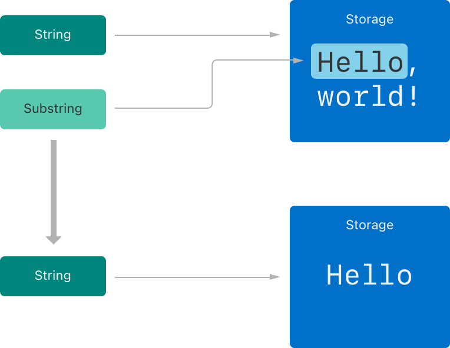

tags:: [[Swift Type]]
---

- ## 获取 Substring
	- 使用 `subscript (下标)` 或 `prefix(_:)` 方法可以获得一个 `String` 的子字符串.
	- 这个子字符串不是 `String` 类型, 而是 `Substring` 类型 (在 `String` 中有个别名 `SubSequence` ).
		- ``` swift
		  let greeting: String = "Hello, world!"
		  
		  let index: String.Index = greeting.firstIndex(of: ",") ?? greeting.endIndex
		  
		  let beginning: String.SubSequence = greeting[..<index]
		  print(beginning); // Hello
		  
		  let beginning2: Substring = greeting.prefix(5);
		  print(beginning2) // Hello
		  ```
- ## 使用 Substring
	- `Substring` 的大多数方法与 `String` 相同, 因此大多数时候, 可以像使用 `String` 一样使用 `Substring` .
	- 但是, 由于两者终究不是一个 `Type` , 所以, 有时候还是需要将 `Substring` 转为 `String` 类型:
		- ``` swift
		  let newString = String(substring)
		  ```
- ## Substring 的性能优化
	- `Substring` 可能会重用 `原始 String` 的部分内存 或 `另一个 Substring` 的部分内存.
		- {:height 276, :width 379}
	- 所以, `Substring` 不适合用于长期储存 **子字符串** (可以将其转为 `String` 类型) .
		- 因为, 它可能会导致 `原始 String` 占用的内存长期无法被释放.
- ## 遵循 StringProtocol
	- `Substring` 和 `String` 都遵循 `StringProtocol` 协议.
	- 所以, 字符串操作函数可以接收 `StringProtocol` 类型, 以支持 `Substring` 和 `String` 两种入参.
- ## 参考
	- [Swift Language Guide - Strings and Characters](https://docs.swift.org/swift-book/documentation/the-swift-programming-language/stringsandcharacters)
	  logseq.order-list-type:: number
	-