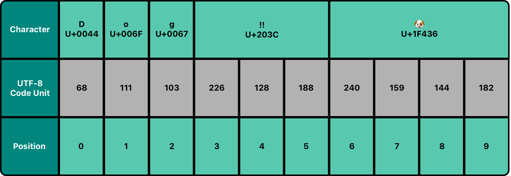
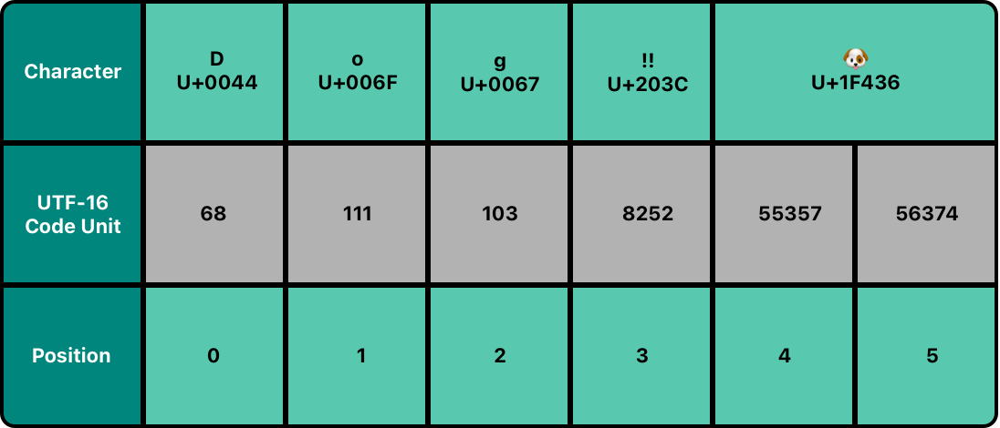
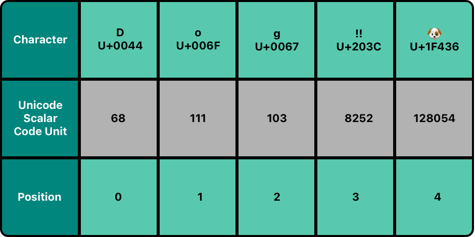

tags:: [[Swift Type]]
---

- ## 前置知识
	- 通读 [[Unicode Concept]]
- ## 多种 Unicode 表示
	- 在 Swift 中, 一个字符串, 有多种 Unicode 表示:
		- 一个 UTF-8 码元集合: `utf8` 属性.
		  logseq.order-list-type:: number
		- 一个 UTF-16 码元集合: `utf16` 属性.
		  logseq.order-list-type:: number
		- 一个 UTF-32 码元集合 (其实就是 `21-bit` 标量值集合): `unicodeScalars` 属性.
		  logseq.order-list-type:: number
- ## UTF-8 表示
	- {:height 312, :width 683}
	- `utf8` 属性属于 `String.UTF8View` 类型, 是 `UInt8` 类型的集合
	- 遍历 `utf8` 属性的值:
		- ``` swift
		  let dogString = "Dog‼🐶"
		  for codeUnit in dogString.utf8 {
		      print("\(codeUnit) ", terminator: "") // 68 111 103 226 128 188 240 159 144 182 
		  }
		  ```
- ## UTF-16 表示
	- {:height 257, :width 548}
	- `utf16` 属性属于 `String.UTF16View` 类型, 是 `UInt16` 类型的集合.
	- 遍历 `utf16` 属性的值:
		- ``` swift
		  let dogString = "Dog‼🐶"
		  for codeUnit in dogString.utf16 {
		      print("\(codeUnit) ", terminator: "") // 68 111 103 8252 55357 56374 
		  }
		  ```
- ## UTF-32 表示 (Unicode 标量表示)
	- {:height 255, :width 496}
	- `unicodeScalars` 属性属于 `String.UnicodeScalarView` 类型, 是 `UnicodeScalar` ( `Unicode.Scalar` 的别名)类型的集合.
		- 每个 `UnicodeScalar` 都有一个 `value` 属性, 存放 `21-bit`  标量值, 使用 `UInt32` 类型存储.
	- 遍历 `unicodeScalars` 属性的值:
		- ``` swift
		  let dogString = "Dog‼🐶"
		  for scalar in dogString.unicodeScalars {
		      print("\(scalar.value) ", terminator: "") // 68 111 103 8252 128054 
		  }
		  ```
	- 可以通过字符串插值, 将 `UnicodeScalar` 构造成字符串:
		- ``` swift
		  for scalar in dogString.unicodeScalars {
		      print("\(scalar) ")
		  }
		  // D
		  // o
		  // g
		  // ‼
		  // 🐶
		  ```
- ## 参考
	- [Swift Language Guide - Strings and Characters](https://docs.swift.org/swift-book/documentation/the-swift-programming-language/stringsandcharacters)
	  logseq.order-list-type:: number
-