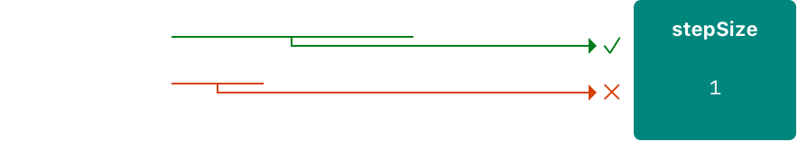

tags:: [[Swift Syntax]]
---

- ## Access to Memory (内存访问)
	- 在执行 **设置变量的值** 或 **向函数传递实参** 等操作时, 就会发生 **Access to Memory (内存访问)** .
		- 分为 **Write Access (写访问)** 和 **Read Access (读访问)** .
		- ``` swift
		  // A write access to the memory where one is stored.
		  var one = 1
		  
		  // A read access from the memory where one is stored.
		  print("We're number \(one)!")
		  ```
- ## Conflicting Access to Memory (内存访问冲突)
	- ### 什么是内存访问冲突
		- 当 **代码中的不同部分** 试图 **同时访问** **内存中同一位置** 时, 就会发生 **Conflicting Access to Memory (内存访问冲突)** .
			- 这可能会导致一些 **不可预测** 或 **不一致** 的行为.
	- ### 单线程与多线程
		- 这里说的 **内存访问冲突** , 并不特指 **多线程** 环境, **单线程** 环境也可能发生 **内存访问冲突** .
			- 比如, 修改值的代码跨越多行, 在这期间, 代码可以多次访问这个值.
		- 如果在 **单线程** 内, 发生了 **内存访问冲突** , 程序将会在 **编译时** 或 **运行时** 报错.
		- 如果在 **多线程** 中, 发生了 **内存访问冲突** , 则需要用到 [[Xcode Thread Sanitizer]] 来帮助检测.
- ==下面所有对 内存访问 的讨论, 都是针对 单线程 的情况==
- ## Characteristics of Memory Access (内存访问的特性)
	- 在 **冲突访问** 的上下文中, 需要考虑 **内存访问** 的如下特性:
		- 是 **读访问** 还是 **写访问** .
		  logseq.order-list-type:: number
		- 访问的 **内存位置** .
		  logseq.order-list-type:: number
		- 访问的 **持续时间** .
		  logseq.order-list-type:: number
- ## Condition of Conflicting (冲突的条件)
	- 当两个访问满足如下所有条件时, 就会发生 **内存访问冲突** :
		- `访问类型` : 两个访问, 并非都是 **读访问** .
		  logseq.order-list-type:: number
			- **写访问** 会 修改内存位置存储的值 (change/modify the location in memory) , 而 **读访问** 不会.
				- **Location in memory** 就是指 **内存位置存储的值** , 如 **变量** , **常量** , **属性** 等.
		- `访问的内存位置` : 两个访问, 访问的时内存中的 **同一位置** .
		  logseq.order-list-type:: number
			- 如 同一变量, 同一常量, 同一属性.
		- `访问的持续时间` : 两个访问, 持续时间存在重叠 .
		  logseq.order-list-type:: number
			- 如果在访问 **开始之后, 结束之前** , 其他代码无法执行, 则这个访问是 **瞬时的 (instantaneous)** .
			  logseq.order-list-type:: number
				- 由此定义可知, 两个 **瞬时访问** 不可能同时发生. ==注意, 这里说的是单线程执行的情况==
				- 大多数 **内存访问** 都是 **瞬时访问** .
					- 如下都是 **瞬时访问** .
					- ``` swift
					  func oneMore(than number: Int) -> Int {
					      return number + 1
					  }
					  
					  // 对 myNumber 的写访问
					  var myNumber = 1
					  // 调用 oneMore : 对 myNumber 的读访问
					  // 给 myNumber 赋值: 对 myNumber 的写访问
					  myNumber = oneMore(than: myNumber)
					  // 对 myNumber 的读访问
					  print(myNumber)
					  // Prints "2".
					  ```
			- 如果在访问 **开始之后, 结束之前** , 其他代码可以执行, 则这个访问是 **长期的 (long-term)** .
			  logseq.order-list-type:: number
				- 这就可能会发生访问的 **重叠 (overlap)** .
				- 一个 **长期访问** 可以与 另一个 **长期访问** 或 **瞬时访问** 发生 **重叠** .
				- **重叠** 主要出现在:
					- 在 函数 或 方法 中, 使用 in-out parameters
					  logseq.order-list-type:: number
					- 使用 结构体 的  `mutating` 方法.
					  logseq.order-list-type:: number
		- `访问的原子性` : 两个访问, 并非都具 **原子性 (atomic)** . ( ==其实, 这本质上就是在说两个访问的 **持续时间不能存在重叠**==)
		  logseq.order-list-type:: number
			- 原子操作包括:
				- Swift 中 `Atomic` 或 `AtomicLazyReference` 的原子操作. (参见: [[Swift API - Synchronization]] )
				  logseq.order-list-type:: number
				- C 语言中的原子操作. (参见 `stdatomic(3)` 手册)
				  logseq.order-list-type:: number
- ## Conflicting Access to In-Out Parameters
	- ### 访问 In-Out Parameter 的特性
		- 一个函数, 拥有对其 **In-Out Parameter** 的 **长期写访问 (long-term write access)** 权限.
			- 这个持续时间是:
				- 从所有 **非 In-Out Parameter** 的 **实参表达式** 求值完成开始.
				- 到 **函数调用完成** 结束.
		- 如果存在多个 **In-Out Parameter** , 则对 **In-Out Parameter** 的 **写访问** 权限, 按  **In-Out Parameter** 出现的顺序, 依次启动.
		- ==注意, 这里说的函数, 包括 **运算符函数** .==
	- ### 禁止: 在函数中使用 In-Out Parameter 的原实参变量
		- 如果一个 **变量** , 在调用函数时, 已作为 **In-Out Parameter** 的实参传入了函数:
			- 则即便这个 **原变量** 在函数中可以访问, 也不可以访问, 会发生 **编译错误** .
			- 因为, 由于内存优化 (参见: [[Swift Function - In-Out Parameter]] ) , **函数中接收的参数** 和 **原变量** 访问的将是同一个 **内存地址** .
				- 核对上述 **冲突条件** , 会发现, 这将会导致 **访问冲突** .
		- 示例:
			- ``` swift
			  var stepSize = 1
			  
			  func increment(_ number: inout Int) {
			      number += stepSize
			  }
			  
			  increment(&stepSize)
			  // Error: Conflicting accesses to stepSize.
			  ```
			- {:height 102, :width 628}
			- 可以考虑复制原变量来避免冲突:
				- ``` swift
				  // Make an explicit copy.
				  var copyOfStepSize = stepSize
				  increment(&copyOfStepSize)
				  
				  // Update the original.
				  stepSize = copyOfStepSize
				  // stepSize is now 2
				  ```
	- ### 禁止: 将单个变量作为多个 In-Out Parameter 的实参传入
		- 同一个 **变量** , 在调用函数时, 不能作为作为多个 **In-Out Parameter** 的实参传入函数.
			- 这会发生 **编译错误** .
		- 示例:
			- ``` swift
			  func balance(_ x: inout Int, _ y: inout Int) {
			      let sum = x + y
			      x = sum / 2
			      y = sum - x
			  }
			  var playerOneScore = 42
			  var playerTwoScore = 30
			  balance(&playerOneScore, &playerTwoScore)  // OK
			  balance(&playerOneScore, &playerOneScore)
			  // Error: Conflicting accesses to playerOneScore.
			  ```
- ## Exclusive Access
	-
-