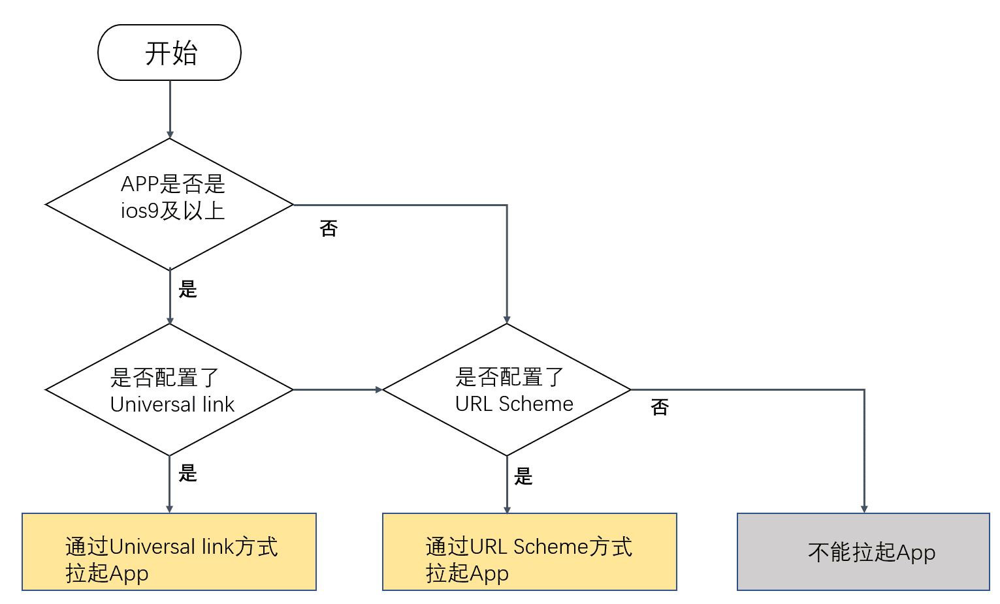

tags:: [[U-Link]]
---

- ## 提供的能力
	- Web -> App 跳转
	  logseq.order-list-type:: number
		- 如果用户已安装 App, 则可以从 Web 直接跳转到 App 指定页面.
		- 如果用户未安装 App, 则引导用户安装, 安装后打开 App, 仍然能跳转到指定页面.
	- Web -> App 归因
	  logseq.order-list-type:: number
		- 从 Web 跳转到 App 指定页面后,  App 能获取到 Web 页面的参数, 进行归因统计
- ## App 跳转原理
	- ### iOS
		- {:height 576, :width 643}
		- 图源: [Deeplink设置](https://developer.umeng.com/docs/191212/detail/186035)
	- ### Android
		- 目前 (2026-01-23) Android 只支持 URL Scheme
- ## 归因原理
	- 参见:
		- [剪切板使用说明](https://developer.umeng.com/docs/191212/detail/213205)
		- [[AZ002]如何统计到拉新/模糊匹配原理是什么](https://developer.umeng.com/docs/191212/detail/256494)
		- [跨端打通模糊匹配技术说明](https://developer.umeng.com/docs/191212/detail/326332)
- ## 参考
	- [U-Link](https://developer.umeng.com/docs/191212/detail/212402)
	  logseq.order-list-type:: number
-