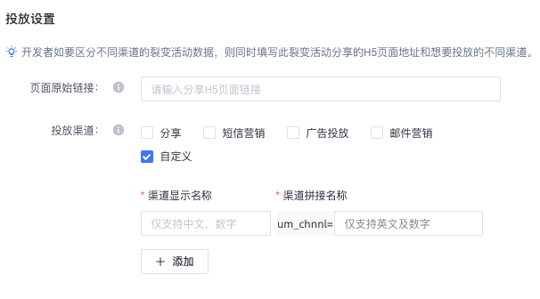

tags:: [[U-Link]]
---

- ## 如何创建裂变活动
	- 进入 [U-Share&Link](https://share.umeng.com/apps/overview) -> 左上角下拉列表选择指定应用 -> 左侧边栏点击 "智能超链 下的 裂变营销"
	- 可配置项:
		- App 跳转 Path :
		  logseq.order-list-type:: number
		- App 页面传参 :
		  logseq.order-list-type:: number
		- 首次安装传参 :
		  logseq.order-list-type:: number
		- 页面原始链接:
		  logseq.order-list-type:: number
			- 营销网页的原始链接.
		- 投放渠道 :
		  logseq.order-list-type:: number
			-
- ## 裂变活动场景
	- 建议一个营销活动只对应一个 H5 页面.
	- 针对 "唤起 App 指定页面" 场景:
		- 比如: 希望用户打开每一个商品 H5 页面唤起 App 后, 能够进入到指定商品页面.
			- 只创建一个活动 .
			  logseq.order-list-type:: number
			- 所有的 H5 页面, 在集成 JSSDK 时, 都埋入同一个 `LinkID` .
			  logseq.order-list-type:: number
			- 每一个 H5 页面, 传递不同的 `data` 自定义参数.
			  logseq.order-list-type:: number
				- 例如: 可以传递商品 id , 用户 "唤起APP/安装APP" 后可以获取到此商品 id , 就能实现跳转到指定页面了.
	- 针对 **某个营销活动的地推** 场景:
		- 可以只创建一个 **裂变活动** , 但为每一个 **地推人员** 创建一个专属的 **投放渠道** .
		- {:height 208, :width 436}
- ## 结合 U-Share
	- 参考: [准备H5页面](https://developer.umeng.com/docs/191212/detail/193297#h1--h5-2)
	- 如需查看 [[U-Share]] 相关统计, 需要在营销活动最终的 URL 后拼接当前应用的 `Appkey`
	- 格式为: `um_from_appkey=xxx` .
	- 比如:
		- 在创建裂变活动时, 勾选了分享渠道, 生成了分享渠道的专属链接:
			- `https://test.com/?id=123&um_chnnl=share`
		- 我们需要在后面再拼上当前应用的 `Appkey`, 就变成了:
			- `https://test.com/?id=123&um_chnnl=share&um_from_appkey=xxxxx`
	-
- ## 参考
	- [裂变营销](https://developer.umeng.com/docs/191212/detail/196072)
	  logseq.order-list-type:: number