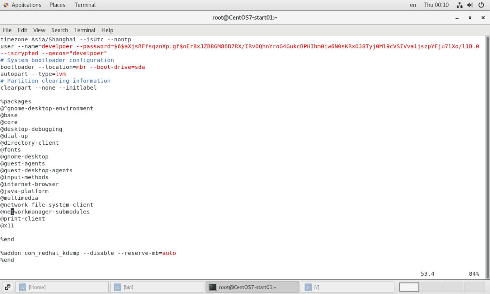
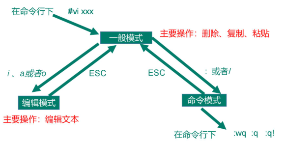

tags:: [[Editor]], [[Unix]]
---

- ## 什么是 VIM
	- VIM 编辑器发展自 VI ，VIM 与 VI 编辑器完全兼容。
	- VI 是 Unix 操作系统和类 Unix 操作系统中最通用的文本编辑器。
	- VIM 有语法高亮，而 VI 没有。
	- 在 `/bin` 目录下，我们可以看到 `VI` 和 `VIM` 同时存在。
## VIM 界面
	- 右下角三个字符分别表示 **行数** **列数**  **滚动条滑过的百分比** (未滑动过，则显示 **TOP** ；滑到底，则显示 **BOT** )
	- 
## 三种模式
	- ### 图示
		- 
	- ### 键盘图
		- 
	- ### 一般模式
		- #### 光标移动
			- | 快捷键             | 描述                                                         |
			  | ------------------ | ------------------------------------------------------------ |
			  | `方向键`           | 上下左右                                                     |
			  | `shift + 6 (^)`    | 移动到行头                                                   |
			  | `shift + 4 ($)`    | 移动到行尾                                                   |
			  | `w`                | 移动到下一个词的第一个字符                                   |
			  | `b`                | 移动到当前词的词头（继续使用会跳到上一词词头）               |
			  | `e`                | 移动到当前词的词尾（继续使用会跳到下一词词尾）               |
			  | `g + g`            | 移动到 **文档** 第一行行头                                   |
			  | `shift + g`        | 移动到 **文档** 最后一行行尾                                 |
			  | `shift + h`        | 移动到 **视窗** 第一行行头                                   |
			  | `shift + l`        | 移动到 **视窗** 最后一行行尾                                 |
			  | `数字 + shift + g` | 移动到指定行数的行头（命令行模式，执行 `set nu` 可以显示行数；执行 `set nonu` 可以去掉行数显示） |
		- #### 复制
			- | 快捷键                          | 描述                                         |
			  | ------------------------------- | -------------------------------------------- |
			  | `y + y`                         | 复制一行（光标所在行）                       |
			  | `数字 + y + y` / `y + 数字 + y` | 复制多行（光标所在行往下的多行）             |
			  | `y + shift + 6 (^)`             | 复制到行头（从行头到光标所在字母）           |
			  | `y + shift + 4 ($)`             | 复制到行尾（从光标所在字母到行尾）           |
			  | `y + w`                         | 复制到词尾（从光标所在位置到词尾，包括空格） |
		- #### 粘贴
			- | 快捷键     | 描述     |
			  | ---------- | -------- |
			  | `p`        | 粘贴     |
			  | `数字 + p` | 粘贴多份 |
		- #### 替换
			- | 快捷键             | 描述                                                         |
			  | ------------------ | ------------------------------------------------------------ |
			  | `r + 更改后的字符` | 替换光标所在字符                                             |
			  | `shift + r`        | 进入替换模式（可以依次输入字符替换， 类似于 Windows 中的 insert 模式） |
		- #### 删除
			- | 快捷键                          | 描述                                         |
			  | ------------------------------- | -------------------------------------------- |
			  | `d + d`                         | 删除一行（光标所在行）                       |
			  | `数字 + d + d` / `d + 数字 + d` | 删除多行（光标所在行往下的多行）             |
			  | `d + shift + 6 (^)`             | 删除到行头（从行头到光标所在字母）           |
			  | `d + shift + 4 ($)`             | 删除到行尾（从光标所在字母到行尾）           |
			  | `d + w`                         | 删除到词尾（从光标所在位置到词尾，包括空格） |
		- #### 剪切
			- | 快捷键      | 描述                                     |
			  | ----------- | ---------------------------------------- |
			  | `x`         | 剪切一个字符（光标所在字符）             |
			  | `shift + x` | 剪切一个字符（光标所在字符的前一个字符） |
		- #### 撤回
			- | 快捷键 | 描述                                      |
			  | ------ | ----------------------------------------- |
			  | `u`    | 撤回（保存后，只要没退出VIM，也可以撤回） |
	- ### 编辑模式
		- #### 进入编辑模式
			- 从 **一般模式** 进入
			- | 快捷键      | 描述                                                         |
			  | ----------- | ------------------------------------------------------------ |
			  | `i`         | 进入编辑模式（光标不移动）                                   |
			  | `shift + i` | 进入编辑模式（并且光标移动到 当前光标所在行 的行头）         |
			  | `a`         | 进入编辑模式（并且光标移动到 当前光标所在位置 的下一个字符） |
			  | `shift + a` | 进入编辑模式（并且光标移动到 当前光标所在位置 的最后一个字符的后面） |
			  | `o`         | 进入编辑模式（并且光标移动到 当前光标所在行 的下一行，这个是新创建的一行） |
			  | `shift + o` | 进入编辑模式（并且光标移动到 当前光标所在行 的上一行，这个是新创建的一行） |
		- #### 编辑
			- 使用方向键移动光标，输入字符进行编辑。
		- #### 退出编辑模式
			- 按下 `ESC` ，退出 **编辑模式** ，并进入 **一般模式** 。
	- ### 命令模式
		- 可以认为是一般模式下的特殊操作
		- #### 进入命令模式
			- 在一般模式直接按 `:`
			- 在编辑模式按 `ESC + :` (即按 `ESC` 进入 **一般模式后** ，按 `:` 进入命令模式)
		- #### 行号
			- | 命令        | 执行后效果                   |
			  | ----------- | ---------------------------- |
			  | `:set nou`  | 进入一般模式，并显示行数     |
			  | `:set nonu` | 进入一般模式，并去掉行数显示 |
		- #### 保存与退出
			- | 命令   | 执行后效果                                                   |
			  | ------ | ------------------------------------------------------------ |
			  | `:w`   | 保存，并进入一般模式                                         |
			  | `:q`   | 退出 VIM 编辑器，回到 Linux 的 shell                         |
			  | `:wq`  | 保存并退出 VIM 编辑器，回到 Linux 的 shell                   |
			  | `:wq!` | 强制 **只读文件** 保存并退出 VIM 编辑器，回到 Linux 的 shell |
			  | `:q!`  | 不保存，而强制退出 VIM 编辑器，回到 Linux 的 shell           |
		- #### 查找
			- | 命令               | 执行后效果                                                   |
			  | ------------------ | ------------------------------------------------------------ |
			  | `/ 需要查找的内容` | 从光标位置 **往后查找** ，并 **高亮显示** ; 按 `n` 可跳到下一个匹配的位置，按 `shift + n` 可跳到上一个匹配的位置。 |
			  | `? 需要查找的内容` | 从光标位置 **往前查找** ，并 **高亮显示** ; **按** `n` 可跳到上一个匹配的位置，按 `shift + n` 可跳到下一个匹配的位置。 |
			  | `:noh`             | 取消查找后的 **高亮显示**                                    |
		- #### 替换
			- | 命令            | 执行后效果                                  |
			  | --------------- | ------------------------------------------- |
			  | `:s/old/new`    | 将光标所在行匹配到的第一个 old 替换为 new   |
			  | `:s/old/new/g`  | 将光标所在行匹配到的所有 old 替换为 new     |
			  | `:%s/old/new`   | 将文档中每一行匹配到的第一个 old 替换为 new |
			  | `:%s/old/new/g` | 将文档中匹配到的所有 old 替换为 new         |