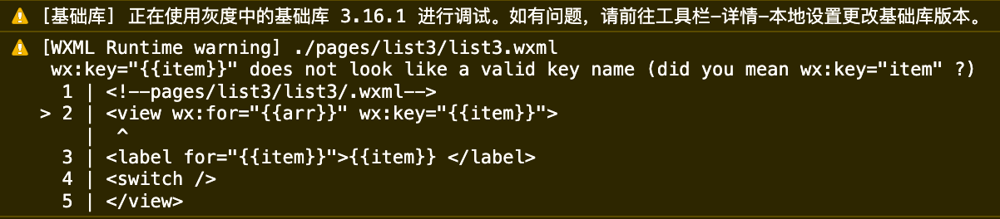
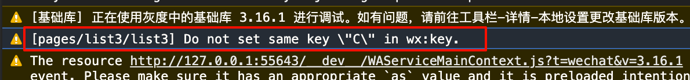
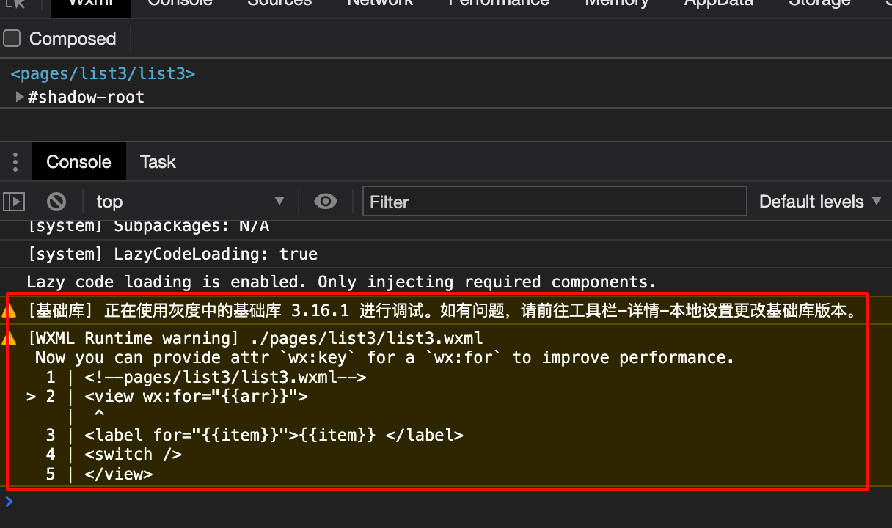

tags:: [[WXML]]
---

- ## 为什么需要 wx:key
	- ==如下只是简单描述 key 相关内容, 要了解细节, 参见: [[Reconciliation]]==
	- ### 框架如何更新列表
		- 当使用 `wx:key` 绑定的数据, 发生 `增, 删, 改, 排序` 变化时, 小程序框架需要通过一定的算法来判断:
			- 哪些数据已经存在页面节点?
			  logseq.order-list-type:: number
				- 它们的位置是否改变?
				  logseq.order-list-type:: number
				- 它们的内容是否改变?
				  logseq.order-list-type:: number
			- 哪些数据不存在页面节点, 且需要新增?
			  logseq.order-list-type:: number
			- 哪些数据已存在页面节点, 且需要删除?
			  logseq.order-list-type:: number
		- 所以, 需要有个 **唯一标识** 可以唯一区分每条数据, 然后通过这个标识, 将 **数据** 和 **页面节点** 关联.
			- 这样的话, **数据** 和 **页面节点** 的关联就会从头至尾保持一致, 而不会因为数据更新就被搞乱.
		- 这就需要用到 `wx:key` 属性了, 如果不设置, 小程序框架会默认使用 **数组的索引** 作为 **唯一标识** .
	- ### 数组索引作为唯一标识的问题
		- 试想, 有个数组, 初始数据为: `['A', 'B', 'C']`
			- 我们将它绑定在三个 `<switch>` 上, 每个 `<switch>` 分别关联的唯一标识是索引: 0, 1, 2
		- 假设, 用户将 `B` 设置为了开启状态.
			- 相当于 `索引 1` 与 `B` 这个节点进行了一个关联.
		- 此时, 往数组头部添加一个新元素 `X` , 变为: `['X', 'A', 'B', 'C']`
			- 现在, 小程序框架要重新渲染页面.
			- 它遍历数组:
				- `索引 0` 有节点, 值改为 `X` , 开关保持为 off
				  logseq.order-list-type:: number
				- `索引 1` 有节点, 值改为 `A` , 开关保持为 on
				  logseq.order-list-type:: number
				- `索引 2` 有节点, 值改为 `B` , 开关保持为 off
				  logseq.order-list-type:: number
				- `索引 3` 无节点, 新增一个节点, 值为 `C` , 开关默认为 off
				  logseq.order-list-type:: number
		- 所以, 这就出现一个严重的问题:
			- 本来 `B` 才是 `on` 的状态.
			- 插入新节点后变成了 `A` 是 `on` 的状态.
		- ``` html
		  <!--pages/list3/list3.wxml-->
		  <view wx:for="{{arr}}">
		  <label for="{{item}}">{{item}} </label>
		  <switch />
		  </view>
		  <button bind:tap="addToFront">addToFront</button>
		  ```
		- ``` js
		  // pages/list3/list3.js
		  Page({
		    data: {
		      arr: ['A', 'B', 'C']
		    },
		    addToFront: function() {
		      let newArr = ['X', ...this.data.arr];
		      this.setData({
		        arr: newArr
		      })
		    }
		  })
		  ```
	- ### 元素值作为唯一标识
		- 试想, 有个数组, 初始数据为: `['A', 'B', 'C']`
			- 我们将它绑定在三个 `<switch>` 上, 每个 `<switch>` 分别关联的唯一标识是元素值: `A`, `B` , `C`
		- 假设, 用户将 `B` 设置为了开启状态.
			- 相当于 `元素值 B` 与 `B` 这个节点进行了一个关联.
		- 此时, 往数组头部添加一个新元素 `X` , 变为: `['X', 'A', 'B', 'C']`
			- 现在, 小程序框架要重新渲染页面.
			- 它遍历数组:
				- `元素值 X` 无节点, 新增一个节点, 值为 `X` , 开关默认为 off
				  logseq.order-list-type:: number
				- `元素值 A` 有节点, 值保持为 `X` , 开关保持为 off
				  logseq.order-list-type:: number
				- `元素值 B` 有节点, 值保持为 `B` , 开关保持为 on
				  logseq.order-list-type:: number
				- `元素值 C` 有节点, 值保持为 `X` , 开关保持为 off
				  logseq.order-list-type:: number
		- 这就避免了上述的问题.
		- 那么, 如何使用指定唯一标识呢,使用 `wx:key` .
- ## 什么时候必须使用 wx:key
	- 如果列表中的 **元素顺序** 可能发现改变 (只从 **头部或中间** **增减元素** / 会调换已有元素的位置)
	  logseq.order-list-type:: number
		- 需要保持各组件的状态 (比如 `input` 的输入内容, `switch` 的开关状态)
		  logseq.order-list-type:: number
			- ==必须使用 `wx:key` ==
		- 无需保持各组件的状态 (比如, 只是纯 `text` 的展示, 没有额外的操作)
		  logseq.order-list-type:: number
			- ==无须使用 `wx:key` ==
	- 如果列表中的 **元素顺序** 不会发现改变 (从不增减元素, 且从不调换已有元素的位置 (静态列表) / 只从 **尾部** **增减元素** )
	  logseq.order-list-type:: number
		- ==无须使用 `wx:key` ==
- ## wx:key 的作用
	- `wx:key` 的作用:
		- 保持组件的状态.
		  logseq.order-list-type:: number
		- 提高渲染效率.
		  logseq.order-list-type:: number
			- 因为, 默认采用 **索引** 作为唯一标识时, 会发生大量的 **修改节点内容** 的操作, 会比较耗时.
- ## wx:key 可取值
	- ### 关键字 `*this`
		- `*this` , 代表列表元素自身.
		- 需要保证:
			- 元素是 **字符串** 或 **数字** 类型.
			  logseq.order-list-type:: number
			- 元素值是唯一的.
			  logseq.order-list-type:: number
			- 元素值不可改变.
			  logseq.order-list-type:: number
				- 值改变了, 组件就丢失了原来的状态.
		- ``` html
		  <view wx:for="{{arr}}" wx:key="*this">
		  <label for="{{item}}">{{item}} </label>
		  <switch />
		  </view>
		  <button bind:tap="addToFront">addToFront</button>
		  ```
		- 注意, 使用 `item` 无效:
			- 使用 `wx:key="{{item}}"` 无效, 会有告警.
				- {:height 144, :width 783}
			- 使用 `wx:key="item"` 无效, 会被识别为元素的 `item` 属性 .
	- ### 元素的属性
		- 直接填写 **元素属性名** .
		- 需要保证:
			- 属性是 **字符串** 或 **数字** 类型.
			  logseq.order-list-type:: number
			- 属性值是唯一的.
			  logseq.order-list-type:: number
			- 属性值不可改变.
			  logseq.order-list-type:: number
				- 值改变了, 组件就丢失了原来的状态.
		- ``` html
		  <!--pages/list3/list3/.wxml-->
		  <view wx:for="{{arr}}" wx:key="uuid">
		  <label for="{{item.name}}">{{item.name}} </label>
		  <switch />
		  </view>
		  <button bind:tap="addToFront">addToFront</button>
		  ```
		- ``` js
		  // pages/list3/list3.js
		  Page({
		    data: {
		      arr: [
		        {uuid: "0001", name: "Tom", age: 21},
		        {uuid: "0002", name: "Lisa", age: 20},
		        {uuid: "0003", name: "Bob", age: 22}
		      ]
		    },
		    addToFront: function() {
		      let newPerson =  {uuid: "0004", name: "Jack", age: 19}
		      let newArr = [newPerson, ...this.data.arr];
		      this.setData({
		        arr: newArr
		      })
		    }
		  })
		  ```
	-
- ## wx:key 必须保证值唯一
	- `wx:key` 必须保证值唯一: 虽然不会导致页面崩溃, 但可能会出现异常的行为.
	- 同时, 在列表更新时, 如果发现有重复的值, 会有如下警告:
		- `Do not set same key \"C\" in wx:key.`
		- {:height 75, :width 802}
- ## 最佳实践: 任何时候都配用 wx:key
	- 使用 `wx:for` 时, 如果不同时配置 `wx:key` , 将会在控制台看到 **警告** .
		- {:height 362, :width 577}
	- 如果列表数据有唯一标识 (元素自身 或 元素的某个属性 唯一):
		- 考虑到 `wx:key` 能 **提升渲染效率** , 无论如何都应该配置上  `wx:key` .
	- 如果列表数据没有唯一标识 (元素自身也不唯一):
		- AI 建议: 配置 `wx:key="index"` 以消除警告.
		- 经过测试, 发现 `wx:key="index"` 会被识别为列表元素的 `index` 属性, 而非列表的索引.
			- 测试方式: 在数据列表中添加 `index` 属性, 然后通过按钮触发: 给列表添加一个列表中已经存在的 `index` 值, 调用 `this.setData` 刷新页面.
			- 此时观察控制台, 会发现告警: `Do not set same key "XXX" in wx:key` .
			- 所以可以猜测,  `wx:key="index"`  的含义, 就是取列表数据的 `index` 属性作为唯一标识.
		- 所以, 这个建议:
			- 本质上, 就是瞎写一个不存在的属性.
			- 效果与不配置 `wx:key` 一致.
- ## 参考
	- [wx:key](https://developers.weixin.qq.com/miniprogram/dev/reference/wxml/list.html#wx-key)
	  logseq.order-list-type:: number
	- AI
	  logseq.order-list-type:: number