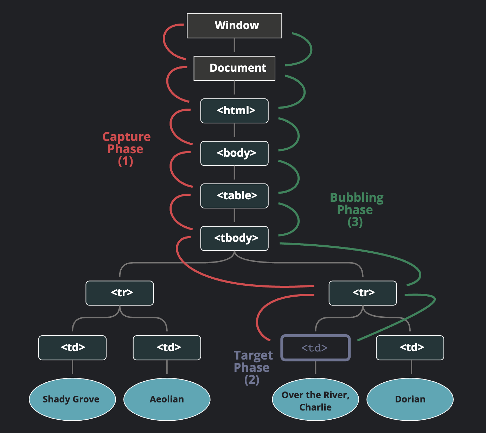

tags:: [[Web Event]], [[JavaScript]] 
---

- ## Event Phases
	- 当一个 Event 触发时, 有如下三个阶段的流程:
		- Capturing Phase (捕获阶段)
		  logseq.order-list-type:: number
			- 事件从 Window 向下传播, 靠近触发事件的元素.
		- Target Phase (目标阶段)
		  logseq.order-list-type:: number
			- 事件传播到达触发事件的元素.
		- Bubbling Phase (冒泡阶段)
		  logseq.order-list-type:: number
			- 事件从触发事件的元素向上传播, 到达 Window.
	- 事件传播到哪个元素, 哪个元素就要执行所注册的当前阶段的  **Event Handler** .
	- 虽说是有三个阶段, 但其实可以把 **Target Phase** 的 **Event Handler** 划分到 **Capturing Phase** 和 **Bubbling Phase** .
	- {:height 515, :width 629}
	- 图片来源: [JavaScript.Info - 冒泡和捕获](https://zh.javascript.info/bubbling-and-capturing)
- ## Event Phase 相关属性
	- ### target 与 currentTarget
		- `event.target` 表示触发事件的元素.
		- `event.currentTarget` 表示 **Event Handler** 所关联的元素.
			- 另外,  **Event Handler** 函数中, `this` 和  `event.currentTarget` 是一样的.
		- 在事件传播的过程中 `target` 保持不变, 而  `currentTarget` 会一直变化.
	- ### eventPhase
		- `event.eventPhase` 表示当前所处阶段.
			- capturing=1，target=2，bubbling=3
- ## Event Bubbling
	- ``` html
	  <!DOCTYPE html>
	  <html lang="en">
	  
	  <head>
	    <meta charset="UTF-8">
	    <meta name="viewport" content="width=device-width, initial-scale=1.0">
	    <title>Document</title>
	  </head>
	  
	  <body>
	    <div id="container">
	      <button>Click me!</button>
	    </div>
	    <pre id="output"></pre>
	  
	    <script>
	      const output = document.querySelector("#output");
	      function handleClick(e) {
	        output.textContent += `You clicked on a ${e.currentTarget.tagName} element\n`;
	      }
	  
	      const container = document.querySelector("#container");
	      const button = document.querySelector("button");
	  
	      document.body.addEventListener("click", handleClick);
	      container.addEventListener("click", handleClick);
	      button.addEventListener("click", handleClick);
	    </script>
	  </body>
	  
	  </html>
	  ```
	- 如上代码, `<button>` 的点击事件, 会向上传播到 `<div>` , 再向上传播到 `<body>` , 这被描述为 **bubbles up** 。
	- 点击按钮，会在页面呈现：
		- ``` js
		  You clicked on a DIV element
		  You clicked on a BUTTON element
		  You clicked on a BODY element
		  ```
- ## Event Capturing
	- 与 **Event Bubbling** 相反, **Event Capture** 的事件, 是从最外层的元素, 传播到最里层的元素.
	- **Event Capture** 默认是禁用的, 需要在调用 `addEventListener()` 方法时, 设置 `options.capture` 为 `true` .
		- 参见:  [EventTarget: addEventListener()](https://developer.mozilla.org/en-US/docs/Web/API/EventTarget/addEventListener#parameters)
		- ==注意: 使用 `useCapture` 和 `options.capture` 参数的作用是一样的, 前者是旧的使用方式, 尽量不使用.==
	- ``` html
	  <!DOCTYPE html>
	  <html lang="en">
	  
	  <head>
	    <meta charset="UTF-8">
	    <meta name="viewport" content="width=device-width, initial-scale=1.0">
	    <title>Document</title>
	  </head>
	  
	  <body>
	    <div id="container">
	      <button>Click me!</button>
	    </div>
	    <pre id="output"></pre>
	  
	    <script>
	      const output = document.querySelector("#output");
	  
	      function handleClick(e) {
	        output.textContent += `You clicked on a ${e.currentTarget.tagName} element\n`;
	      }
	  
	      const container = document.querySelector("#container");
	      const button = document.querySelector("button");
	  
	      document.body.addEventListener("click", handleClick);
	      container.addEventListener("click", handleClick, {
	        capture: true
	      });
	      button.addEventListener("click", handleClick);
	    </script>
	  </body>
	  
	  </html>
	  ```
	- 点击按钮, 会在页面呈现：
		- ``` js
		  You clicked on a DIV element
		  You clicked on a BUTTON element
		  You clicked on a BODY element
		  ```
- ## Event Handler 的执行顺序
	- 事件触发时, `Event Handler` 的执行顺序是这样的：
		- 从外层元素往内层元素遍历, 针对每个元素: 
		  logseq.order-list-type:: number
			- 遍历当前元素针对此事件注册的所有 **Event Handler**  , 针对每个 **Event Handler**  :
				- 若 `options.capture`为 `true` , 则执行 **Event Handler** , 否则不执行.
		- 然后从内层元素往外层元素遍历, 针对每个元素:
		  logseq.order-list-type:: number
			- 执行当前元素针对此事件注册的所有 **Event Handler** (即按 **Event Bubbling** 的顺序执行), 执行过的就不用执行了.
		- ==注意: 如果某个元素在同一阶段有多个 `Event Handler` , 则按其注册的顺序依次执行.==
- ## 为什么 Event Bubbling 与 Event Capturing 同时存在
	- 因为在史前时代, Netscape 只使用事件捕获, 而 Internet Explorer 只使用事件冒泡.
	- 后来, W3C 在指定标准时, 决定两者共存。
- ## 阻止事件传播
	- ### stopPropagation()
		- ``` js
		  <button>Display video</button>
		  
		  <div class="hidden">
		    <video>
		      <source
		        src="https://interactive-examples.mdn.mozilla.net/media/cc0-videos/flower.webm"
		        type="video/webm" />
		      <p>
		        Your browser doesn't support HTML video. Here is a
		        <a href="rabbit320.mp4">link to the video</a> instead.
		      </p>
		    </video>
		  </div>
		  
		  const btn = document.querySelector("button");
		  const box = document.querySelector("div");
		  const video = document.querySelector("video");
		  
		  btn.addEventListener("click", () => box.classList.remove("hidden"));
		  
		  video.addEventListener("click", (event) => {
		    event.stopPropagation();
		    video.play();
		  });
		  
		  box.addEventListener("click", () => box.classList.add("hidden"));
		  ```
		- 如上代码, 通过调用 `stopPropagation()` 可以阻止事件继续向后传播 (不管当前处于哪个阶段).
		- 参见: [Event: stopPropagation() method](https://developer.mozilla.org/en-US/docs/Web/API/Event/stopPropagation)
		- `stopPropagation()` 只能阻止事件传播, 并不能阻止当前元素的其他 **Event Handler** 执行.
			- 举个例子, 如果一个元素有 A, B, C 三个  **Event Handler**  需要依次执行.
				- A 中调用了 `stopPropagation()` , 只能阻止事件向后面传播, 并不能阻止 B, C 两个  **Event Handler**  的执行.
		- `stopPropagation()` 不能阻止事件的默认行为.
			- 比如, 点击链接仍然会跳转.
	- ### stopImmediatePropagation()
		- `stopImmediatePropagation()` 方法, 不仅能阻止事件传播, 还能阻止当前元素的其他 **Event Handler** 执行.
	- ### 最佳实践
		- 如果没有必要, 不要阻止事件传播, 因为有时候, 我们需要用到这个特性.
		- 比如, 我们想分析用户页面点击的情况, 我们不可能给每个元素都注册点击事件, 去处理相应的逻辑.
			- 我们可以利用事件冒泡的特性, 给 `document` 对象注册点击事件就可以了.
			- 但是, 如果有某个元素阻止了事件传播, 那么那个元素及其子元素的点击情况, 我们就无法知道了.
- ## Event delegation
	- 有时候, 我们需要给大量子元素都添加 **Event Handler** , 这会比较繁琐;
	- 此时, 我们可以利用 **Event Bubbling** 的性质, 将事件委托给父元素进行处理 (即 Event delegation).
	- ``` html
	  <!DOCTYPE html>
	  <html lang="en">
	  
	  <head>
	    <meta charset="UTF-8">
	    <meta name="viewport" content="width=device-width, initial-scale=1.0">
	    <title>Document</title>
	    <style>
	      #container {
	        display: grid;
	        grid-template-columns: repeat(4, 1fr);
	        grid-auto-rows: 100px;
	      }
	    </style>
	  </head>
	  
	  <body>
	    <div id="container">
	      <div class="tile"></div>
	      <div class="tile"></div>
	      <div class="tile"></div>
	      <div class="tile"></div>
	      <div class="tile"></div>
	      <div class="tile"></div>
	      <div class="tile"></div>
	      <div class="tile"></div>
	      <div class="tile"></div>
	      <div class="tile"></div>
	      <div class="tile"></div>
	      <div class="tile"></div>
	      <div class="tile"></div>
	      <div class="tile"></div>
	      <div class="tile"></div>
	      <div class="tile"></div>
	    </div>
	  
	    <script>
	      function random(number) {
	        return Math.floor(Math.random() * number);
	      }
	  
	      function bgChange() {
	        const rndCol = `rgb(${random(255)} ${random(255)} ${random(255)})`;
	        return rndCol;
	      }
	  
	      const container = document.querySelector("#container");
	  
	      container.addEventListener("click", (event) => {
	        event.target.style.backgroundColor = bgChange();
	      });
	    </script>
	  </body>
	  
	  </html>
	  ```
- ## Reference
	- [DOM Event 可视化工具](https://domevents.dev/)
	-
- ---
- ## 参考
	- [MDN - Event Bubbling](https://developer.mozilla.org/en-US/docs/Learn_web_development/Core/Scripting/Event_bubbling)
	  logseq.order-list-type:: number
	- [JavaScript.Info - 冒泡和捕获](https://zh.javascript.info/bubbling-and-capturing)
	  logseq.order-list-type:: number
	-
	- logseq.order-list-type:: number