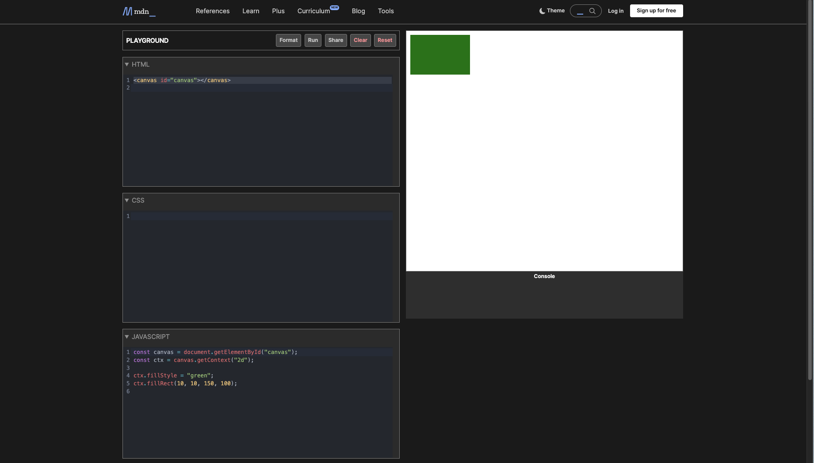
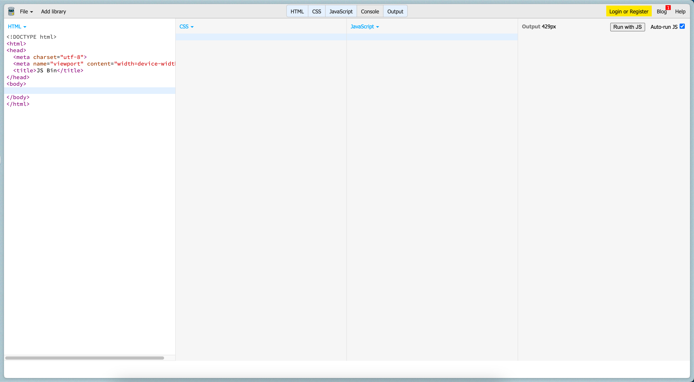
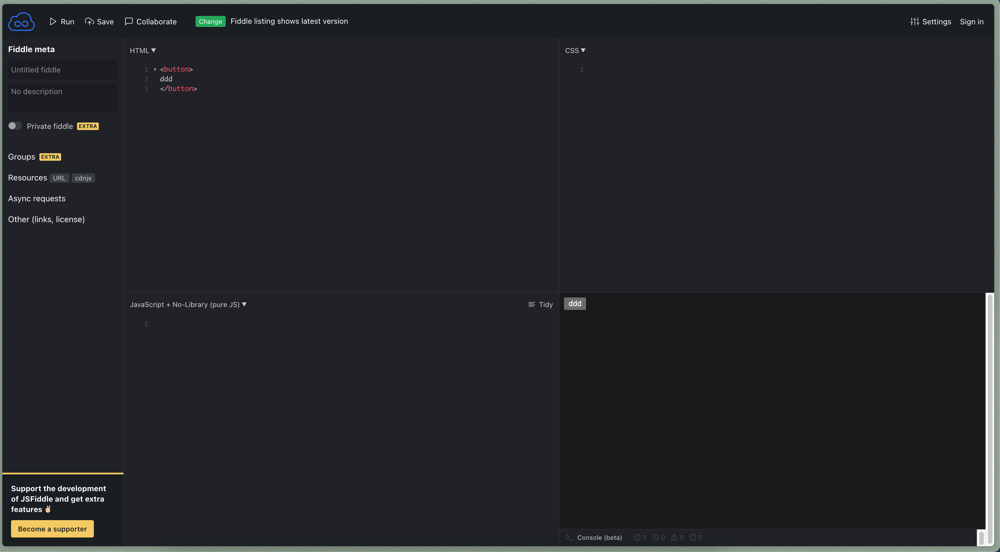
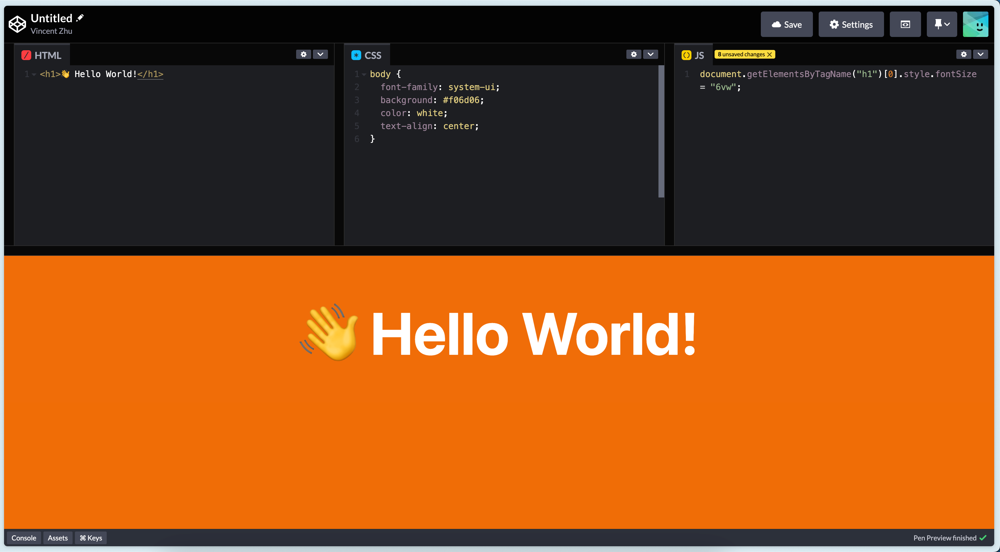
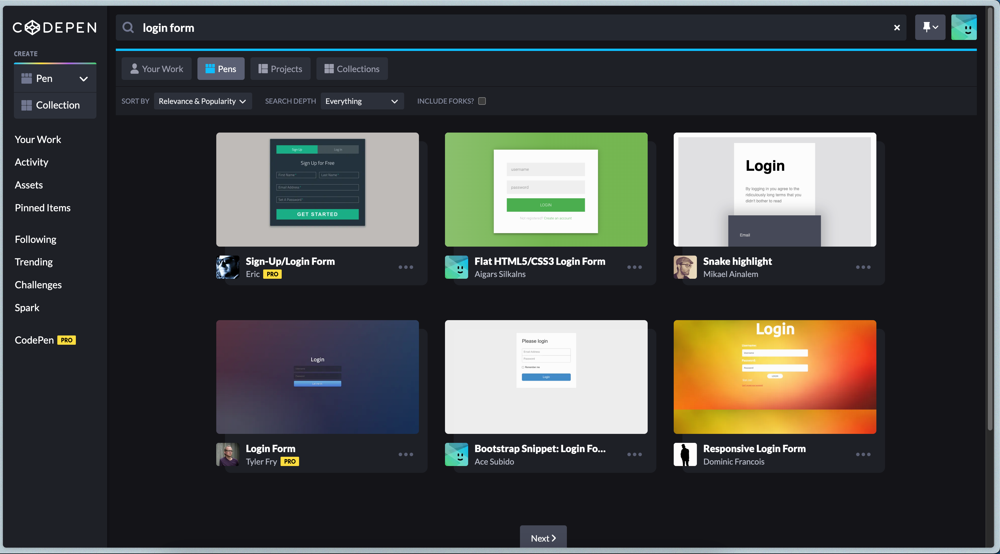
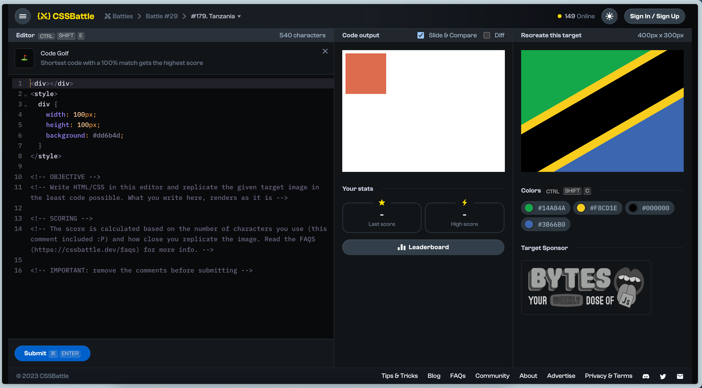

tags:: [[Web]]
---

- ## 通用在线代码编辑器
	- [[Online Code Editor]]
- ## MDN Playground
	- [MDN Playground](https://developer.mozilla.org/en-US/play)
	- 
- ## JS Bin
	- [JS Bin](https://jsbin.com/?html,css,js,output)
	- 前端 Playground, 同时可以引入一些常用库
	- 
- ## JS Fiddle
	- [JS Fiddle](https://jsfiddle.net/)
	- 前端 Playground, 同时可以引入一些常用库
	- 
- ## Code Pen
	- [Code Pen](https://codepen.io)
	- 前端 Playground , 同时可以搜索和查看别人的作品。
	- 
	- 
- ## CSS Battle
	- [CSS Battle](https://cssbattle.dev/)
	- 针对 CSS 的一些挑战题。
	- 