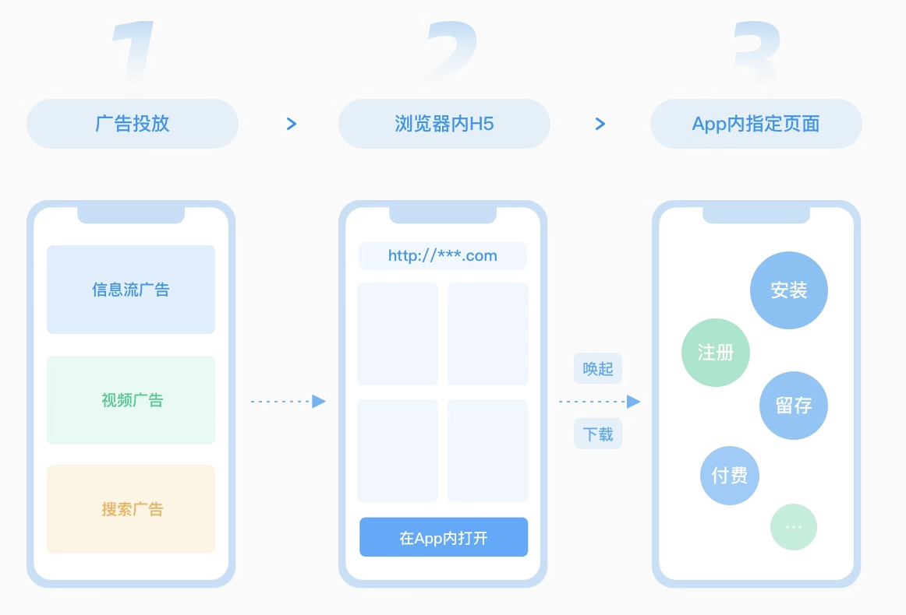
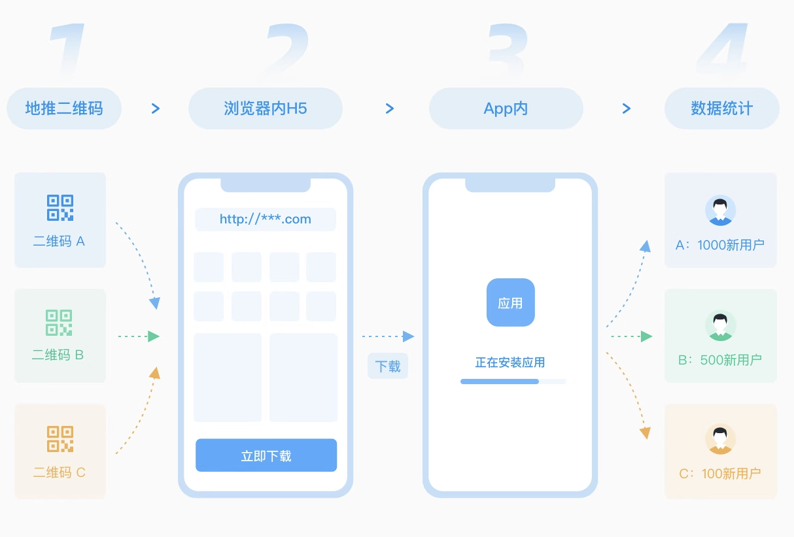
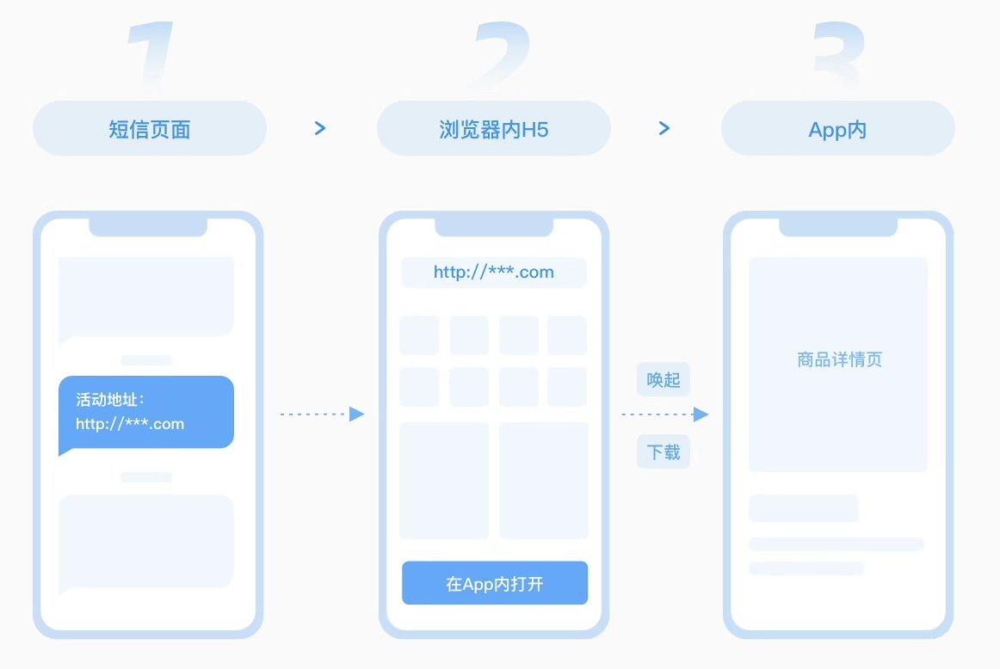

tags:: [[Attribution]]
---

- ## 典型场景
	- 广告投放
	  logseq.order-list-type:: number
		- {:height 324, :width 442}
	- 推广拉新
	  logseq.order-list-type:: number
		- {:height 324, :width 442}
	- 短信召回
	  logseq.order-list-type:: number
		- {:height 324, :width 442}
- ## 归因链路
	- Web -> App 归因链路:
		- 用户进入 **Web 落地页** (地址带有 "归因参数") .
		  logseq.order-list-type:: number
		- 用户触发 "打开 App" 之类的操作.
		  logseq.order-list-type:: number
		- **Web 落地页** 进行跳转处理.
		  logseq.order-list-type:: number
			- 如果已安装 App , 则直接进入 App 指定页面, App 拿到 "归因参数" , 进行后续流程.
			- 如果未安装 App , 则进入 **安装页面** 安装 App, 而后再打开 App , App 拿到 "归因参数" , 跳转到指定页面, 进行后续流程.
- ## 访问 Web 落地页方式
	- 链接.
	  logseq.order-list-type:: number
		- 用户 点击链接 / 输入链接 , 通过 Web 容器访问 Web 落地页.
	- 二维码.
	  logseq.order-list-type:: number
		- 用户 扫描二维码 , 通过 Web 容器访问 Web 落地页.
	- ==不管用户通过何种方式, 最终都需要在 Web 容器中打开 Web 落地页.==
- ## Web 跳转或安装 App
	- 参见: [[移动端网页跳转或安装 App]]
- ## Web -> App 参数传递
	- 已安装 App :
		- 如果可以直接通过 [[Deep Linking]] 打开 App , 则直接在 URL 中带上参数即可.
		  logseq.order-list-type:: number
		- 如果需要跳到应用商店才能打开 App, 则可以使用 归因服务 (因为跳到应用商店无法带参数, 或许有例外的应用商店?)
		  logseq.order-list-type:: number
	- 未安装 App :
		- 如果可以直接在当前页面下载安装, 并直接通过 [[Deep Linking]] 打开 App , 则直接在 URL 中带上参数即可.
		  logseq.order-list-type:: number
		- 如果需要跳到应用商店才能安装 App, 则可以使用 归因服务 (因为跳到应用商店无法带参数, 或许有例外的应用商店?)
		  logseq.order-list-type:: number
- ## Web -> App 归因原理
	- 本质上:
		- 就是用户从 Web 页面跳转到 App , 无法直接传递 **归因参数** (特别是需要安装的情况) .
		- 所以需要有一种机制, 可以对 Web 页面的 **归因参数** 和 **安装 App 的设备** 做一个映射.
			- 这样, App 开发者就能知道: ==某一次 安装/打开 , 是由哪个链接带来的.==
	- 有如下几种方案:
		- Install Referrer 
		  logseq.order-list-type:: number
			- ==目前仅限 Google Play==
			- 当用户通过带参数的链接进入 Google Play , 安装完成后, 商店会将参数直接传递给 App。
		- 设备指纹
		  logseq.order-list-type:: number
			- 设备指纹 即 (App 标识 + IP + 设备型号 + 操作系统) 等 可以标识设备的参数.
			- Web 端上传 **设备指纹** , **时间** 和 **归因参数** 到服务端, App 端根据 **设备指纹** 和 **时间** 匹配到最符合的记录, 拿到 **归因参数** .
			- 缺点: 只是模糊匹配.
		- 剪切板
		  logseq.order-list-type:: number
			- Web 端在本地剪切板复制 **归因参数** , App 端读取剪切板的 **归因参数** .
			- 这个 **归因参数** 不一定是 **Web 页面原始归因参数** 本身, 可能是 Web 页面请求服务端获得的一个 `Token` .
			- 缺点: 剪切板可能被覆盖.
				- ==为了避免用户误操作导致的剪切板覆盖, 可以在 Web 页面提示用户：“点击下载并**复制邀请码**”, 以提示用户你复制了一个很重要的信息==
		- 账号体系
		  logseq.order-list-type:: number
			- 用户在 Web 页面输入自己将来注册用的账号信息 (比如手机号):
				- Web 端将账号信息和 **归因参数** 发送到服务端储存.
				- App 端在 注册/登录 时, 输入同一个账号, 拿到其最后关联的参数.
			- ==如果使用手机号作为账号, 可以考虑使用使用运营商提供的 Web 页面一键登录能力.==
		- 无法使用 `IDFA / OAID 设备标识符` 方案, 因为它们无法在 Web 页面获取.
- ## 如何实现
	- App 端:
		- 集成第三方归因能力 (自己实现有难度).
		  logseq.order-list-type:: number
		- App 内页面, 需要在获取到 "归因参数" 后 (调用归因服务 SDK), 根据业务逻辑进行处理.
		  logseq.order-list-type:: number
	- Web 端:
		- 集成第三方归因能力 (自己实现有难度).
		  logseq.order-list-type:: number
		- 实现 "wakeupOrInstall (唤醒或安装)" 能力, 有两个实现方向:
		  logseq.order-list-type:: number
			- 直接使用归因服务提供的 "wakeupOrInstall" 能力 (可能会不够灵活, 且不完善, 需要找到合适的厂商)
			  logseq.order-list-type:: number
			- 自己实现.
			  logseq.order-list-type:: number
	- 服务端:
		- 实现指定页面在拿到 "归因参数" 后的业务逻辑.
- ## 参考
	- [友盟+ U-Link](https://zebra.umeng.com/wow/z/umsite/tube/ulink)
	  logseq.order-list-type:: number