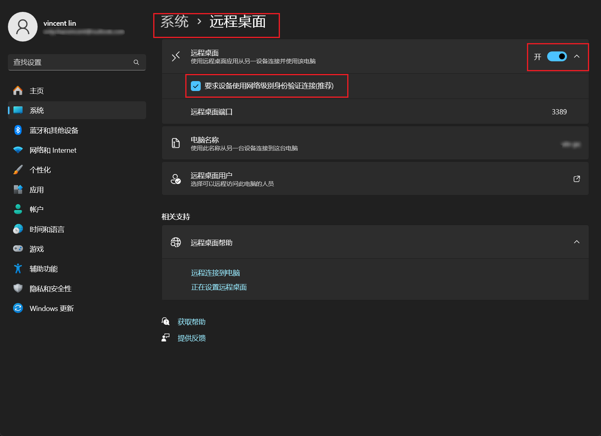
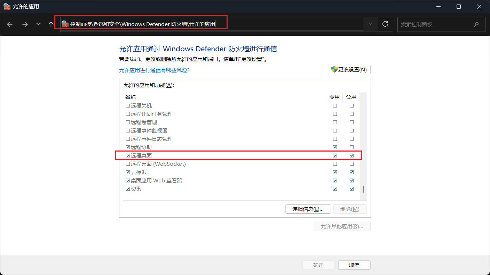
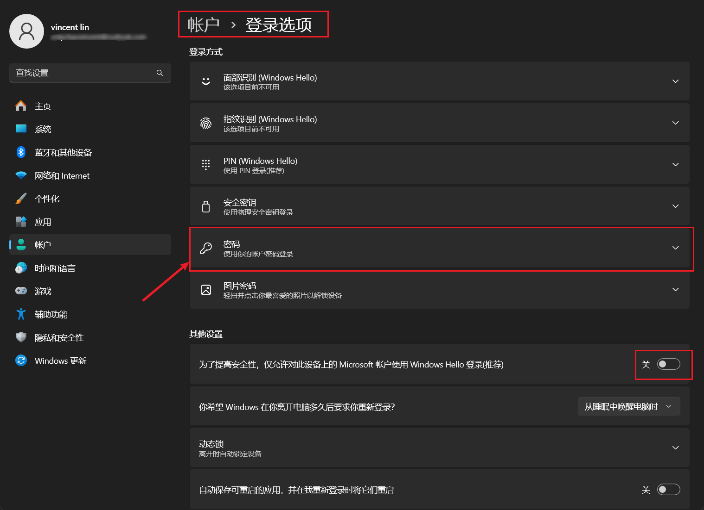
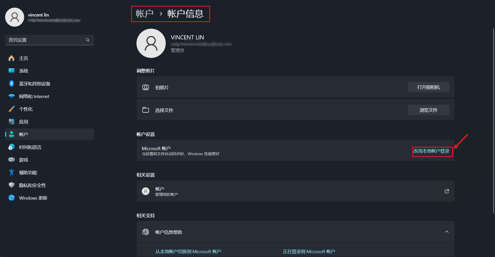
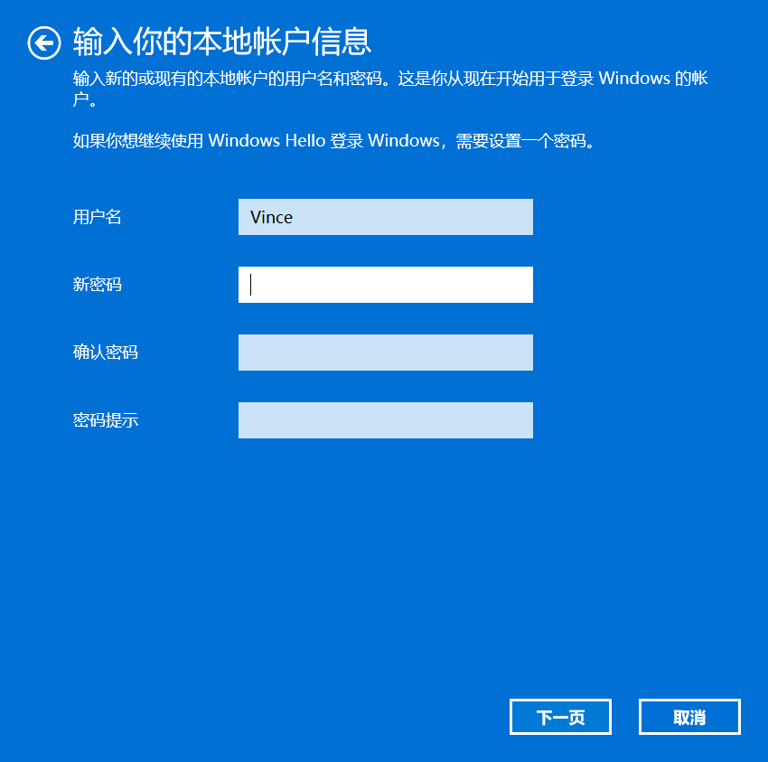

tags:: [[Windows]]
---

- ## 是否支持远程桌面
	- Windows 家庭版是没有 `远程桌面` 功能的.
	- 解决办法参见: [[Windows 家庭版不支持远程桌面的解决办法]]
- ## 开启被连主机的远程桌面功能
	- 设置界面搜索 `远程桌面` 或 点击 `系统 > 远程桌面` , 开启 `远程桌面` 功能.
	  logseq.order-list-type:: number
		- 
	- 防火墙设置: 进入 `控制面板>系统和安全>Windows Defender 防火墙>允许的应用` , 勾选 `远程桌面` .
	  logseq.order-list-type:: number
		- 
- ## 关于 Windows 账户
	- 参见: [[Windows 账户管理]]
- ## 使用 Microsoft 账户远程登录 (不推荐)
	- 进入设置界面的 `账户 > 登录选项` , 关闭 `仅允许对此设备上的 Microsoft 账户使用 Windows Hello 登录 (推荐)` .
	  logseq.order-list-type:: number
		- 只有关闭后, `登录方式` 中才会出现 `密码` .
		- 
	- 进入 锁屏 界面, 选择 `登录选项` > `Microsoft 账户密码` 重新登录.
	  logseq.order-list-type:: number
	- 在远程桌面客户端, 输入 `主机地址` 和 `Microsoft 账户密码` 即可远程连接 (一般来说都是使用 outlook 邮箱注册的账号) .
	  logseq.order-list-type:: number
		- 某些古老的客户端, 账号需要添加前缀, 比如 `MicrosoftAccount\yourname@outlook.com`
	- ==但这种方式不推荐, 因为 Microsoft 认为不安全==
- ## 使用本地账户登录
	- 进入设置界面的 `账户 > 账户信息` , 点击 `改用本地账户登录` .
	  logseq.order-list-type:: number
		- 
	- 设置账号密码.
	  logseq.order-list-type:: number
		- 设置完成后, 会要我们重新登录, 此时就是使用本地账号登录的了.
		- {:height 450, :width 437}
	- 在远程桌面客户端, 输入 `主机地址` 和 `本地账户密码` 即可远程连接.
	  logseq.order-list-type:: number
- ## 最佳实践
	- Windows 使用本地账户登录时, 无法使用 Microsoft 账户远程连接.
	- Windows 在添加了本地账户之后, 使用 Microsoft 账户登录, 可以使用 本地账户 远程连接.
	- 所以, Windows 保持使用 Microsoft 账户登录, 并开启  `仅允许对此设备上的 Microsoft 账户使用 Windows Hello 登录 (推荐)` 以保障安全, 远程连接时, 使用添加的本地账户.
- ## 参考
	- [在使用微软账号初始化的设备上启用远程桌面](https://blog.mitsea.com/v6ttrr8bddryj2831b6wtp/)
	  logseq.order-list-type:: number
	- logseq.order-list-type:: number