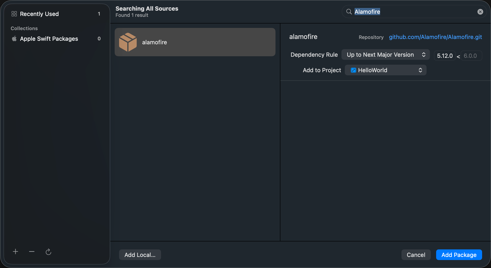
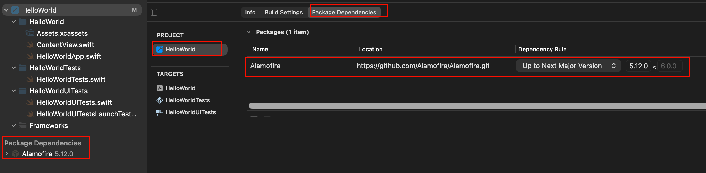
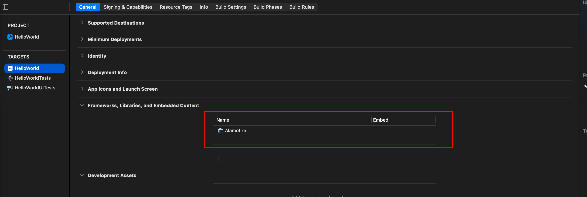

tags:: [[Xcode Project]], [[SwiftPM]], [[CocoaPods]] 
---

- ## 依赖管理: SwiftPM
	- ### Xcode 项目与 SwiftPM
		- 一般来说, Xcode 项目本身, 不会是一个 SwiftPM Package , 它本身的构建运行也不依靠 SwiftPM .
			- 因此, 没有 `Package.swift` 文件.
		- 但是, Xcode 项目, 可以使用 [[SwiftPM]] 来管理依赖.
	- ### 给项目添加 SwiftPM 依赖
		- 可以点击 `File -> Add Package Dependencies` 添加 SwiftPM 依赖:
			- {:height 380, :width 633}
		- 添加后, 会新增如下内容:
			- `HelloWorld.xcodeproj/project.xcworkspace/xcshareddata/swiftpm` 目录下新增 `Package.resolved` 文件, 或 `Package.resolved` 文件中新增依赖相关内容.
			  logseq.order-list-type:: number
			- `HelloWorld.xcodeproj/project.pbxproj` 文件中新增依赖相关内容.
			  logseq.order-list-type:: number
		- 如下两处可以看到项目的依赖:
			- 
	- ### 给指定 Target 添加 SwiftPM 依赖
		- 给项目添加 SwiftPM 依赖后, 还要给需要用到此依赖的 Target 添加依赖.
			- 或者, 在给项目添加依赖时, 就给 Target 添加了.
		- 
- ## 依赖管理: CocoaPods
	-
- ## 问题
	- Xcode 工程 与 SwiftPM 和 CocoaPods 的关系? 两个可以同时存在?
	  logseq.order-list-type:: number
	- logseq.order-list-type:: number
- ## 参考
	- AI
	  logseq.order-list-type:: number